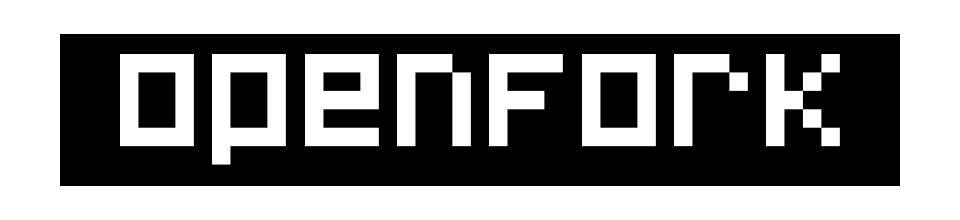
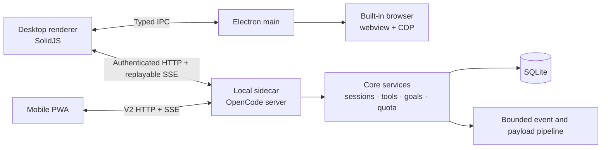

<div align="center">



**A desktop-first, performance-focused fork of OpenCode.**

OpenFork keeps the OpenCode foundation, then pushes harder on desktop UX, concurrent-session performance, browser integration, model and quota workflows, mobile access, and agent quality-of-life features.

[](https://github.com/thelabcorner/openfork/actions/workflows/ci.yml)
[](LICENSE)
[](https://github.com/thelabcorner/openfork/commits/main)
[](https://github.com/thelabcorner/openfork/stargazers)
[](https://bun.sh)
[](https://www.electronjs.org)
[](https://github.com/anomalyco/opencode)

[Why OpenFork](#why-openfork) · [Performance](#performance) · [Architecture](#architecture) · [Features](#feature-map) · [Build](#run-from-source) · [Fork sync](#upstream-sync) · [Contributing](#contributing)

</div>

> [!IMPORTANT]
> OpenFork is an independently maintained branch-fork of [OpenCode](https://github.com/anomalyco/opencode). It is not an official OpenCode distribution. OpenFork preserves upstream licensing and attribution while maintaining a substantial fork-owned desktop and server architecture.

## Why OpenFork

OpenFork is not a theme, wrapper, or small patch set. It changes how the desktop app behaves under load and adds product surfaces that are intentionally owned by the fork.

The project has three priorities:

1. **Keep the app responsive under real multi-session work.** Shared resources are bounded, expensive work is scoped, and token-rate updates avoid full-history recomputation.
2. **Make the desktop app feel like a complete development environment.** Tabs, session groups, project navigation, a built-in browser, richer context controls, quota visibility, and dense model workflows live in one interface.
3. **Keep upstream compatibility explicit.** OpenFork tracks OpenCode release tags through a machine-checked sync process instead of drifting through ad hoc merges.

### What OpenFork changes

Relative to the OpenCode release baseline that it tracks, OpenFork owns or substantially extends these areas:

| Area | OpenFork direction |
| --- | --- |
| **Performance and concurrency** | Bounded event queues, replay-aware SSE, exact event routing, incremental session projections, cooperative large-payload work, bounded filesystem fanout, and renderer hot paths designed around local updates instead of global recomputation. |
| **Desktop workspace** | Tabbed sessions, tab previews, session groups, project explorer workflows, Context surfaces, pause/resume and retitle flows, dense command and mention UX, and desktop-first interaction polish. |
| **Built-in browser** | A first-class Electron browser surface with logical tab ownership in the main process, `<webview>` presentation, CDP automation, agent/user control arbitration, annotations, viewport tooling, screenshots, recording, and lifecycle race hardening. |
| **Models, usage, and limits** | Provider quota adapters, multi-account routing, Usage and Limits surfaces, provider/model analytics, live account labels, progressive DOM admission, and a heavily optimized model selector. |
| **Agent workflow** | Goal Mode, semantic auditing, prompt revision, integrated questions, checkpoints, conversation control, SPAD supervision, background work primitives, and richer session automation. |
| **Tools** | Fork-owned project, symbols, test, typecheck, refactor, patch, archive, background, swarm, browser, checkpoint, reload, SQLite, JSON, Git, SymPy, and related tools, with lazy admission for low-frequency surfaces. |
| **Mobile / PWA** | A dedicated mobile client with replay-first reconnect, one capability-selected event feed, bounded renderer queues, incremental streaming projection, virtualized deep lists, push navigation, and shared model-selection semantics. |
| **Fork maintenance** | Curated KEEP/DROP ownership, release-tag sync, generated-code regeneration rules, semantic verification, and automatic pruning of upstream surfaces that are outside the OpenFork product scope. |

For the canonical ownership map, see [`FORK.md`](FORK.md).

### Concrete fork delta

The current branch is built from OpenCode release tags. Against the tracked `v1.18.30` release baseline, these major OpenFork subsystems are fork additions rather than upstream surfaces:

| Subsystem | OpenCode `v1.18.30` | OpenFork |
| --- | --- | --- |
| Built-in desktop browser | Not present | Main-process tab authority, `<webview>` presentation, CDP automation, annotations, recording, viewport tools, and Chrome bridge |
| Mobile / PWA package | Not present | Dedicated mobile client with replay-first transport and bounded renderer work |
| Goal Mode | Not present | Durable goals, worker focus, continuation reservations, semantic auditor |
| Quota subsystem | Not present | Provider quota adapters, Limits UI, account-aware usage and routing |
| Session groups | Not present | Durable grouping, locked membership, subagent auto-grouping, tree UI |
| SPAD supervision | Not present | Bounded supervision and degeneration handling |
| Checkpoint tool | Not present | Agent-accessible recovery checkpoints |

This table is intentionally tied to the release baseline that OpenFork actually merged. `upstream/dev` can change independently between releases.

## Performance

Performance work in OpenFork is architectural. The project tries to remove unnecessary work before reaching for animation delays, throttles, or cosmetic loading states.

Core rules include:

- token-rate work should scale with the active message, not total history;
- one busy session should not monopolize unrelated sessions;
- queues need count and byte bounds, not just item counts;
- hidden UI should not keep doing expensive visible-UI work;
- reconnect should replay first and repair only when the stream proves a gap;
- large payloads should not hold scarce SQLite writer time while doing O(payload) work;
- search, filesystem, browser, tab-preview, and quota fanout should have explicit concurrency limits;
- correctness barriers win over unsafe coalescing.

### Selected benchmark evidence

These numbers are local benchmark evidence from the current fork. They are not cross-machine guarantees and are not presented as synthetic marketing scores.

| Surface | Measured result |
| --- | ---: |
| 320-turn timeline, 160 streaming deltas, production Chromium at 1x CPU | **49.21 delta/s**, rAF P95 **16.7 ms**, **0 long tasks** |
| Same workload at 4x CPU throttle | **47.03 delta/s**, bounded completion, rAF P95 **33.4 ms** |
| 5,000-message runner history | **142.79 ms cold**, **7.72 us warm** |
| 50,000-node Explorer search | **17 cooperative slices**, max measured slice **13.37 ms** |
| 100 queued tab-preview hydrations | observed max concurrency **4** |
| 644-model selector | **185.1 ms cold**, **57.1 ms warm**, **21 mounted options**, **0 quota requests caused by open** |
| Limits pane, 50 providers x 6 windows | **8 provider cards initially mounted**, about **133.9 ms open**, **0 extra provider/quota requests on open** |
| Browser surface-store deletion microbenchmark | keyed delete **31.02 ms** vs prior full-map clone **2,656.46 ms** across 5,000 synthetic cycles |

Detailed evidence and methodology live in:

- [`docs/handoff/CLOSEOUT-concurrent-session-contention-2026-09-13.md`](docs/handoff/CLOSEOUT-concurrent-session-contention-2026-09-13.md)
- [`docs/handoff/CLOSEOUT-pwa-mobile-contention-2026-09-14.md`](docs/handoff/CLOSEOUT-pwa-mobile-contention-2026-09-14.md)
- [`docs/handoff/CLOSEOUT-usage-limits-model-selector-performance-2026-09-14.md`](docs/handoff/CLOSEOUT-usage-limits-model-selector-performance-2026-09-14.md)
- [`docs/handoff/AUDIT-event-loop-concurrency.md`](docs/handoff/AUDIT-event-loop-concurrency.md)

## Architecture

For a repository-wide orientation map covering V1 vs V2/current, GUI/TUI/server
surfaces, package ownership, execution flow, and the upstream-vs-fork boundary, start
with [`docs/map/README.md`](docs/map/README.md).

OpenFork keeps the OpenCode local-server model and builds a richer desktop runtime around it.



### Runtime split

| Runtime | Responsibility |
| --- | --- |
| **Electron renderer** | SolidJS app, session timeline, project explorer, model UI, Context, browser presentation, local interaction state. |
| **Electron main** | Native window lifecycle, browser authority, CDP, IPC, desktop integration, logging, sidecar lifecycle. |
| **Local sidecar** | Agent server, sessions, tools, providers, quota, events, persistence, HTTP APIs. The desktop sidecar is Bun-built and Node-run. |
| **Mobile PWA** | Remote client for the same server model, with its own bounded renderer and reconnect policy. |

The desktop renderer is sandboxed Chromium. Native access goes through the preload IPC surface. The built-in browser uses renderer-composited `<webview>` content, while logical browser-tab authority and automation live in the Electron main process.

For the deeper runtime map, see [`docs/architecture/desktop-build-and-architecture.md`](docs/architecture/desktop-build-and-architecture.md). For browser lifecycle design, see [`docs/handoff/AUDIT-browser-webview-v3-architecture-2026-09-13.md`](docs/handoff/AUDIT-browser-webview-v3-architecture-2026-09-13.md).

## Feature map

### Desktop workspace

- **Tabbed sessions** with previews, project-aware state, and bounded preview hydration.
- **Session groups** with locked membership, subagent auto-grouping, tree presentation, and group-aware navigation.
- **Project Explorer** with bounded directory fanout, generation-cancelled search, editor buffer policies, and watcher-aware refresh behavior.
- **Context surfaces** for usage, limits, historical context, raw views, and conversation-control workflows.
- **Pause, resume, and retitle** flows integrated with the fork server surface.
- **Dense composer UX** with mentions, commands, Goal controls, revision guidance, integrated questions, model selection, and provider state.

### Built-in browser

The browser is a real fork-owned subsystem, not a link launcher.

- persistent logical browser tabs owned by Electron main;
- renderer `<webview>` presentation with lifecycle generations and stale-event rejection;
- Chrome DevTools Protocol automation;
- agent and human ownership arbitration;
- annotation overlays, element badges, cursor presentation, screenshots, and recording;
- first-party visual capture, deterministic diffing, baseline review, and motion recording powered by [SnapEye](https://github.com/zumerlab/snapeye), with [SnapDOM](https://github.com/zumerlab/snapdom) and [SnapDiff](https://github.com/zumerlab/snapdiff) from [Zumerlab](https://github.com/zumerlab);
- viewport sizing and device-style presentation controls;
- exact-presentation fast paths and indexed host state;
- reduced idle CDP work and listener admission;
- a separate bridge for controlling an existing Chrome instance when that workflow is preferred.

### Models, usage, and quotas

OpenFork treats provider limits and model selection as first-class operational data.

- provider quota adapters and account-aware routing;
- OpenCode Go / Zen and additional provider usage surfaces;
- multi-account model variants and live account labels;
- Usage dashboards with model, session, and maintenance-agent views;
- Limits projections with shared snapshots, active lifecycle gates, and progressive rendering;
- model ranking that combines provider metadata, pricing, usage history, cache behavior, and account state;
- bounded model-selector rendering and cached warm-open ordering;
- request fanout controls so opening UI does not create avoidable quota traffic.

### Agent workflow and tools

OpenFork adds higher-level agent control around the core OpenCode loop.

- **Goal Mode** with durable goal state, worker focus inheritance, crash-safe continuation reservations, and an independent semantic auditor gate.
- **Prompt Revisor** using the shared special-agent completion protocol.
- **Integrated questions** that render and answer inside the main composer workflow.
- **Conversation Control** for effective-context editing without rewriting historical spend.
- **Checkpoints** for recoverable agent work.
- **SPAD supervision** for bounded degeneration and completion oversight.
- **Background jobs and monitors** with unified lifecycle handling.
- **Expanded native tool surface** for code navigation, testing, patching, archives, browser work, structured data, symbolic math, and project inspection.

### Mobile / PWA

The mobile client is designed to coexist with the desktop server without multiplying shared-server work.

- one event feed selected by server capability;
- Last-Event-ID replay before repair;
- explicit `server.stream.gap` repair semantics;
- count and byte bounded renderer queues;
- session-local token projection with indexed message and part lookups;
- incremental Markdown streaming;
- deep-list virtualization only above measured thresholds;
- bounded jumbo tool previews before expensive parsing;
- single-flight permission and question repair;
- push and deep-link navigation through the real session-selection path.

## Run from source

### Requirements

- Git
- [Bun](https://bun.sh) **1.3.14**
- platform build tools only if you plan to package Electron

### Desktop development

```bash
git clone https://github.com/thelabcorner/openfork.git
cd openfork
bun install
bun run dev:desktop
```

This starts the Electron desktop app against the current source with renderer hot reload and the local sidecar development flow.

### Other development surfaces

```bash
# OpenCode CLI / local server source
bun run dev

# Shared web app
bun run dev:web

# Mobile PWA
bun --cwd packages/mobile dev
```

### Build the desktop app

```bash
bun run --cwd packages/desktop build

# Choose one platform package
bun run --cwd packages/desktop package:win
bun run --cwd packages/desktop package:mac
bun run --cwd packages/desktop package:linux
```

> [!NOTE]
> OpenFork is source-first. A packaged application contains the code that existed when that package was built. When debugging desktop behavior, verify the running build against the current source and sidecar bundle.

## Repository layout

| Path | Purpose |
| --- | --- |
| [`packages/desktop`](packages/desktop) | Electron main process, preload, sidecar host, browser authority, packaging. |
| [`packages/app`](packages/app) | Desktop/web SolidJS application and most fork-owned workspace UX. |
| [`packages/mobile`](packages/mobile) | Mobile PWA. |
| [`packages/opencode`](packages/opencode) | Agent runtime, tools, providers, quotas, session behavior, local HTTP surface. |
| [`packages/core`](packages/core) | Shared persistence, sessions, goals, events, search, checkpoints, concurrency primitives. |
| [`packages/server`](packages/server) | Native server and event transport surfaces. |
| [`packages/protocol`](packages/protocol) | Protocol schemas and transport contracts. |
| [`packages/session-ui`](packages/session-ui) | Streaming message, Markdown, and tool rendering. |
| [`packages/ui`](packages/ui) | Shared UI system. |
| [`packages/schema`](packages/schema) | Shared domain schemas and model-selection logic. |
| [`packages/client`](packages/client), [`packages/sdk/js`](packages/sdk/js) | Generated and hand-written client surfaces. |
| [`script/fork-sync.ts`](script/fork-sync.ts) | Upstream release-tag merge automation and semantic verification. |
| [`FORK.md`](FORK.md) | Canonical fork ownership, KEEP/DROP rules, conflict classes, and merge checklist. |

## Development principles

OpenFork changes shared infrastructure only when the mechanism is understood and testable.

- **Profile before patching.** Performance claims should have a workload and a measurement.
- **Bound shared resources.** Queues, caches, fanout, previews, workers, and history windows need explicit limits.
- **Keep hot work local.** One token, file event, tab hover, or quota tick should not wake unrelated state.
- **Prefer repairable failure over silent loss.** Replay gaps and overflow conditions should become explicit repair boundaries.
- **Preserve upstream semantics intentionally.** Fork-owned, union-owned, generated, and pruned paths have different merge rules.
- **Do not trade correctness for benchmark numbers.** Fallback paths stay authoritative when incremental assumptions are not proven.

## Validation

The monorepo is intentionally package-oriented. The root `bun test` command is disabled so a contributor does not accidentally run an uncontrolled cross-workspace test sweep.

Common checks:

```bash
# Lint the workspace
bun run lint

# Typecheck the workspace
bun run typecheck

# Run tests in the package you changed
bun test src
```

Some packages have narrower commands and browser fixtures. Use the closest test surface for the code you changed, then expand outward when needed.

The fork CI definition lives in [`.github/workflows/ci.yml`](.github/workflows/ci.yml).

## Upstream sync

OpenFork tracks **OpenCode release tags**, not a floating `upstream/dev` branch.

```text
origin    https://github.com/thelabcorner/openfork.git
upstream  https://github.com/anomalyco/opencode.git
```

The supported merge flow is:

```bash
bun run fork:sync preflight <tag>
git merge <tag>
bun run fork:sync resolve
bun install
bun run fork:sync verify --tag <tag>
```

`fork:sync` owns the mechanical policy for pruned workspaces, generated code, package manifests, the lockfile, fork-owned paths, and semantic verification. Do not replace it with an ad hoc merge script.

Read [`FORK.md`](FORK.md) before resolving an upstream conflict.

## Contributing

Contributions are welcome, especially for:

- measured performance improvements;
- concurrency and transport correctness;
- desktop and mobile quality-of-life work;
- browser lifecycle and automation reliability;
- provider, quota, and model workflow improvements;
- tests for race conditions and large-workload behavior;
- documentation that makes fork-owned architecture easier to understand.

Before changing a shared or upstream-owned seam:

1. read [`FORK.md`](FORK.md);
2. identify whether the path is fork-owned, union-owned, generated, or pruned;
3. keep the change focused;
4. include the closest relevant tests or benchmark evidence;
5. avoid rewriting unrelated concurrent work.

See [`CONTRIBUTING.md`](CONTRIBUTING.md) for the inherited development workflow and [`docs/handoff/AGENTS.md`](docs/handoff/AGENTS.md) for repository-specific agent rules.

## Security

> [!WARNING]
> OpenFork, like upstream OpenCode, gives coding agents access to powerful local tools. The permission system is not a security sandbox. Use a VM or container if you need strong isolation.

Review [`SECURITY.md`](SECURITY.md) before reporting a security issue or exposing the server outside your local machine.

## Scope

OpenFork is intentionally curated around the desktop application, its local sidecar, shared UI/runtime packages, and the mobile PWA. Upstream SaaS, infrastructure, statistics, enterprise, Slack, and related product surfaces are pruned from the fork branch when they are outside this product scope.

The exact machine-readable workspace and ownership rules are maintained in [`keep-manifest.json`](keep-manifest.json) and [`FORK.md`](FORK.md).

## License and attribution

OpenFork is licensed under the [MIT License](LICENSE).

OpenFork is derived from [OpenCode](https://github.com/anomalyco/opencode) and retains the upstream copyright and license notices. Portions of the quota system are derived from [OpenChamber](https://github.com/openchamber/openchamber), also under MIT terms.

OpenFork's first-party browser visual-observation workflow is built on [SnapEye](https://github.com/zumerlab/snapeye), [SnapDOM](https://github.com/zumerlab/snapdom), and [SnapDiff](https://github.com/zumerlab/snapdiff) from [Zumerlab](https://github.com/zumerlab), created and maintained by Juan and the Zumerlab project. Their work provides the deterministic DOM capture and visual-diff foundation that OpenFork integrates into its built-in browser and Chrome extension. Distribution-specific third-party notices are preserved in [`packages/browser-visual/THIRD_PARTY_NOTICES.txt`](packages/browser-visual/THIRD_PARTY_NOTICES.txt).

<div align="center">

**OpenFork** · desktop-first OpenCode, tuned for heavier workflows

</div>
