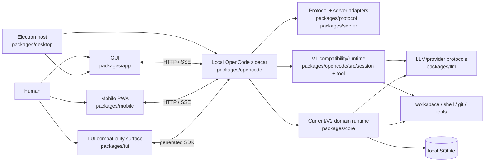

# OpenFork codebase map

This is the canonical orientation layer for the OpenFork repository. It answers:

- what runs where;
- what “V1” and “V2” mean in different parts of the tree;
- how GUI, TUI, desktop, mobile, and the local server relate;
- which package owns which responsibility;
- which upstream OpenCode infrastructure is deliberately absent;
- which parts of the repository are fork-owned versus upstream-compatible.

## Product boundary in one sentence

**OpenFork is a client-side product with a local runtime/server, not an OpenCode
hosted-backend fork.**

That wording is intentional. The desktop/web/mobile clients require a local OpenCode
HTTP/runtime sidecar for sessions, providers, tools, persistence, and workspace
execution. That local server is part of the client architecture. Upstream's hosted
SaaS/control-plane product infrastructure is deliberately pruned from this branch.

OpenFork's compatibility goal is to retain **1:1 fidelity with upstream OpenCode's
local infrastructure and behavior where applicable, or improve it without breaking
the contract**. Fork features should extend or harden the local architecture rather
than create an unrelated backend platform.

## Atlas

- [Architecture and control/data flow](./architecture.md)
- [V1 vs V2/current](./v1-v2.md)
- [Runtime and product surfaces](./surfaces.md)
- [Workspace packages and dependency roles](./packages.md)
- [Upstream vs OpenFork](./upstream-fork.md)
- [Source-tree lookup](./source-tree.md)

## High-level runtime

The TUI box above is a compatibility/runtime dependency, **not an OpenFork product
surface**. See [surfaces.md](./surfaces.md).

## Authority hierarchy

The map is descriptive. When documents disagree, use this order:

1. executable source and tests;
2. repository/package `AGENTS.md` architecture contracts;
3. [`FORK.md`](../../FORK.md) and `keep-manifest.json` for sync/prune ownership;
4. durable docs in `docs/architecture` and `docs/specs`;
5. this map;
6. plans, research ledgers, audits, and handoffs.

If source has intentionally moved ahead of a durable document, update the durable
document rather than preserving the discrepancy.
