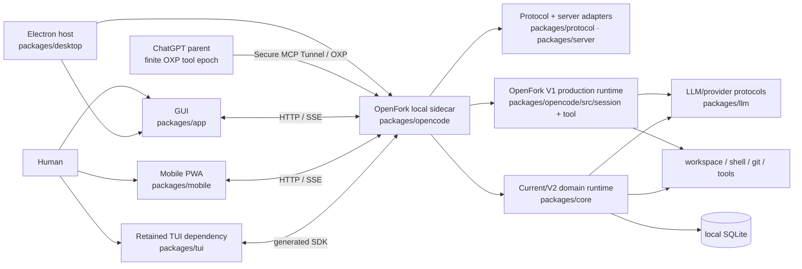

# OpenFork codebase map

This is the canonical orientation layer for the OpenFork repository. It answers:

- what runs where;
- what “V1” and “V2” mean in different parts of the tree;
- how GUI, TUI, desktop, mobile, and the local server relate;
- which package owns which responsibility;
- which upstream OpenCode infrastructure is deliberately absent;
- where OpenFork intentionally diverges from upstream;
- which remote upstream contracts OpenFork must still obey.

## Product boundary in one sentence

**OpenFork is an independent local product/runtime descended from OpenCode. It is
not an OpenCode-compatible distribution and it does not contain OpenCode's hosted
backend.**

That wording is intentional. The desktop/web/mobile clients use an **OpenFork-owned
local sidecar** for sessions, providers, tools, persistence, and workspace execution.
It was forked from OpenCode, but its local API and behavior are not an OpenCode
compatibility promise. Upstream's hosted backend implementation is deliberately
pruned from this repository.

The strict compatibility boundary is instead the **upstream-operated remote OpenCode
services that OpenFork consumes**. Those deployed services cannot be changed by this
fork, so their wire and behavioral contracts must remain compatible. See
[the compatibility boundary](../architecture/compatibility-boundary.md).

One lifecycle policy intentionally differs from upstream: **OpenFork is not trying
to migrate off V1 merely because upstream is moving toward current/V2.** V1 is an
active production architecture in this fork. OpenFork repairs and extends it, and
current/V2 is frequently a semantic/reference implementation from which behavior
and features should be selectively backported into V1. Local parity with upstream
is not the objective.

That applies to the execution runtime **and the local client API strategy**, **not
to UI generation**.
OpenFork does not have a product goal to finish upstream's migration onto the
current Protocol/`/api/*` client APIs. V1 is the target; current/V2 client
surfaces are donor/reference or transitional seams. This is separate from the
OpenCode-hosted Zen/Go model-provider API and any other upstream-operated remote
services OpenFork actually consumes. Those are the compatibility-critical boundary.

The presentation direction is intentionally different: **the V2/new-layout UI is
the primary OpenFork product UI and should continue evolving**. A V2 UI surface can
sit on top of V1/fork runtime and local API contracts when those are the correct
backend contracts.

## Atlas

- [OpenFork compatibility boundary](../architecture/compatibility-boundary.md)
- [OXP parent-tool epoch and durable continuation](../architecture/oxp-parent-tool-epoch.md)
- [OXP upstream authentication boundary](../specs/oxp-upstream-auth-boundary.md)
- [Architecture and control/data flow](./architecture.md)
- [V1 vs V2/current](./v1-v2.md)
- [Runtime and product surfaces](./surfaces.md)
- [Workspace packages and dependency roles](./packages.md)
- [Upstream vs OpenFork](./upstream-fork.md)
- [Source-tree lookup](./source-tree.md)

## High-level runtime

```mermaid
flowchart LR
  Human --> GUI["GUI<br/>packages/app"]
  Human --> Mobile["Mobile PWA<br/>packages/mobile"]
  Human --> TUI["Retained TUI dependency<br/>packages/tui"]

  Desktop["Electron host<br/>packages/desktop"] --> GUI
  Desktop --> Sidecar["OpenFork local sidecar<br/>packages/opencode"]
  ChatGPT["ChatGPT parent<br/>finite OXP tool epoch"] -->|Secure MCP Tunnel / OXP| Sidecar
  GUI <-->|HTTP / SSE| Sidecar
  Mobile <-->|HTTP / SSE| Sidecar
  TUI <-->|generated SDK| Sidecar

  Sidecar --> Protocol["Protocol + server adapters<br/>packages/protocol · packages/server"]
  Sidecar --> V1["OpenFork V1 production runtime<br/>packages/opencode/src/session + tool"]
  Sidecar --> Core["Current/V2 domain runtime<br/>packages/core"]
  V1 --> LLM["LLM/provider protocols<br/>packages/llm"]
  Core --> LLM
  V1 --> Host["workspace / shell / git / tools"]
  Core --> Host
  Core --> DB[("local SQLite")]
```

The TUI box above is a retained runtime/coupling dependency, **not an OpenFork
product surface or OpenCode compatibility promise**. See [surfaces.md](./surfaces.md).

## Authority hierarchy

The map is descriptive. When documents disagree, use this order:

1. executable source and tests;
2. repository/package `AGENTS.md` architecture contracts;
3. [`FORK.md`](../../FORK.md) and `keep-manifest.json` for sync/prune ownership;
4. durable docs in `docs/architecture` and `docs/specs`;
5. this map;
6. plans, research ledgers, audits, and handoffs.

If source has intentionally moved ahead of a durable document, update the durable
document rather than preserving the discrepancy.
