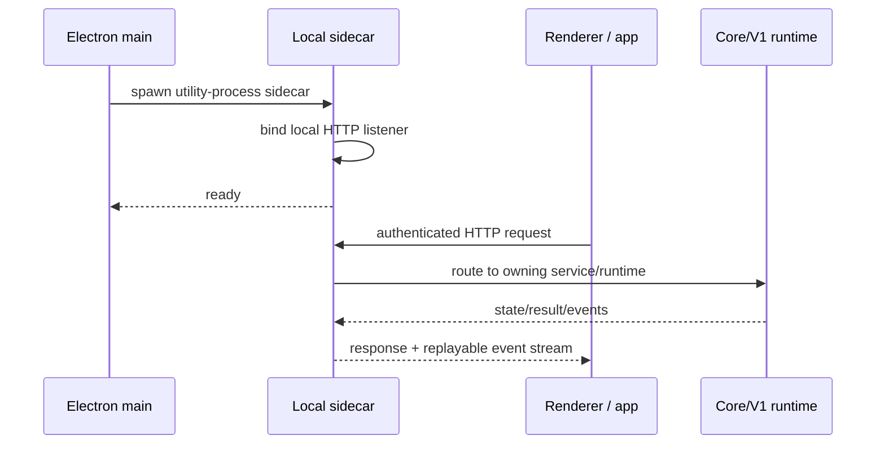

# Architecture and execution flow

## 1. Architectural layers

OpenFork is a local-first, multi-surface client architecture. The important boundary
is not “frontend vs backend”; it is **presentation vs local domain/runtime ownership
vs hosted infrastructure**.

```text
Presentation / interaction
  packages/app
  packages/mobile
  packages/tui (compatibility, not OpenFork product)
  packages/session-ui
  packages/ui
            |
            v
Browser-safe contracts / clients
  packages/schema
  packages/protocol
  packages/client
  packages/sdk/js
            |
            v
Local HTTP/runtime host
  packages/opencode
  packages/server
            |
            +----------------------+
            |                      |
            v                      v
Legacy/V1 runtime           Current/V2 domain runtime
packages/opencode/src       packages/core/src
session · tool · provider   session · tool · event · DB
            |                      |
            +-----------+----------+
                        v
                 packages/llm
                 provider protocols
                        |
                        v
          local workspace / model providers
```

The repository contract in `AGENTS.md` sets the intended dependency direction:
Schema -> Core/Protocol -> Server/OpenCode, with browser clients consuming browser-safe
Schema/Protocol contracts rather than importing host/runtime implementation details.
The current tree still contains transitional Core imports in client-facing packages;
those are migration debt, not a new ownership rule.

## 2. Desktop process model

`packages/desktop` is an Electron shell with three materially different trust and
runtime zones:

1. **Electron main** (`src/main`) owns windows, native OS integration, IPC handlers,
   browser authority, process lifecycle, and local sidecar lifecycle.
2. **Preload** (`src/preload`) exposes the typed `window.api` bridge. Renderer code
   should not bypass it for native behavior.
3. **Renderer** (`src/renderer`) hosts the Solid GUI from `packages/app`.

The desktop main process starts the local OpenCode server as an Electron utility
process. The renderer then communicates with that server over authenticated loopback
HTTP/SSE. Native desktop operations travel over preload IPC instead.



## 3. Server/API composition

`packages/opencode/src/server/routes/instance/httpapi/api.ts` composes the full
`OpenCodeHttpApi` from:

- the current Protocol `ServerApi`;
- root/global APIs;
- event, pairing, device, PTY-connect, and instance-scoped APIs;
- fork-owned groups such as Goal, quota, session groups, control surfaces, and
  scheduled tasks.

The route tree is deliberately split by ownership. Root/global operations are expected
to remain bootstrap-free where their semantics are process/global or durable-state
only. Instance-scoped operations may acquire location/workspace runtime services.

The root and `packages/opencode/AGENTS.md` files define four ownership tiers:

- **Tier 0:** process/global;
- **Tier 1:** durable location metadata;
- **Tier 2:** workspace configuration/catalog;
- **Tier 3:** execution/runtime.

Do not use “the server” as one undifferentiated layer. An endpoint that only reads
global metadata must not accidentally materialize a workspace execution instance.

## 4. Session execution

Two execution generations coexist.

### Legacy/V1 path

The V1 production/compatibility stack is centered in:

- `packages/opencode/src/session/prompt.ts`
- `packages/opencode/src/session/processor.ts`
- `packages/opencode/src/session/session.ts`
- `packages/opencode/src/tool/registry.ts`
- `packages/opencode/src/tool/*`

This path remains important because much of the mature local OpenCode execution
behavior and fork tooling still runs through it. It is not “dead code”.

### Current/V2 path

The current Effect-native domain is centered in:

- `packages/core/src/session/*`
- `packages/core/src/session/runner/*`
- `packages/core/src/session/execution/*`
- `packages/core/src/tool/*`
- `packages/core/src/event/*`
- `packages/core/src/database/*`

The current session model separates durable input admission from visible conversation
projection. `session_input` is the durable inbox; execution promotes admitted input
through the serialized runner and event/projector pipeline.

The architectural direction is **semantic convergence**, not two independently
invented systems. V1 compatibility should use V2/current semantics as the oracle for
provenance, ownership, authority, and lifecycle behavior where the models overlap.

See [v1-v2.md](./v1-v2.md).

## 5. Provider and model boundary

`packages/llm` owns low-level model-provider protocols and request/response
adaptation: Anthropic Messages, OpenAI Chat/Responses, Gemini, Bedrock, compatible
providers, and provider-specific adapters.

Higher layers decide *what* session/tool work should happen. The LLM layer decides
*how* that semantic request is represented for a particular provider/runtime.

This is especially important for System-message authority: provider wire roles are a
projection of semantic authority and capability, not the canonical ownership model.

## 6. Tool architecture

There are two corresponding tool surfaces:

- V1/fork-rich tools: `packages/opencode/src/tool/*`;
- current/V2 built-ins: `packages/core/src/tool/*`.

The V1 surface currently contains the broader fork tool inventory: shell/background,
git, project, symbols, typecheck, test, JSON, patch, archive, browser, swarm/session
control, checkpoints, and other OpenFork additions.

Tool behavior that exists in both generations should converge on shared lower-level
services or contracts rather than drift through duplicated policy.

## 7. Persistence and projections

Core owns durable domain state and database migrations. Drizzle schemas live under
`packages/core/src/**/*.sql.ts`; generated migration/schema artifacts remain in Core.

Dense GUI surfaces should consume compact producer-owned projections rather than
rehydrating complete message histories. Session telemetry, usage, execution phase,
model identity, and other list/sidebar facts should be materialized or incrementally
projected at the domain boundary.

The canonical demand direction is:

```text
producer/storage
  -> domain service
  -> route + middleware
  -> transport
  -> client cache/store
  -> component
```

and architectural review should trace the reverse demand path back to the authoritative
producer before adding a fetch or frontend derivation.

## 8. Generated API paths

OpenFork has two generated-client families:

```text
packages/protocol ServerApi
  -> packages/client

packages/opencode OpenCodeHttpApi
  -> packages/sdk/js (unified SDK)
```

The unified SDK includes the Protocol surface **plus** OpenCode-owned route groups.
Changing Protocol and changing the full OpenCode route tree therefore have different
generation commands and outputs.

See [packages.md](./packages.md) and the root `AGENTS.md` API-surface rules.
