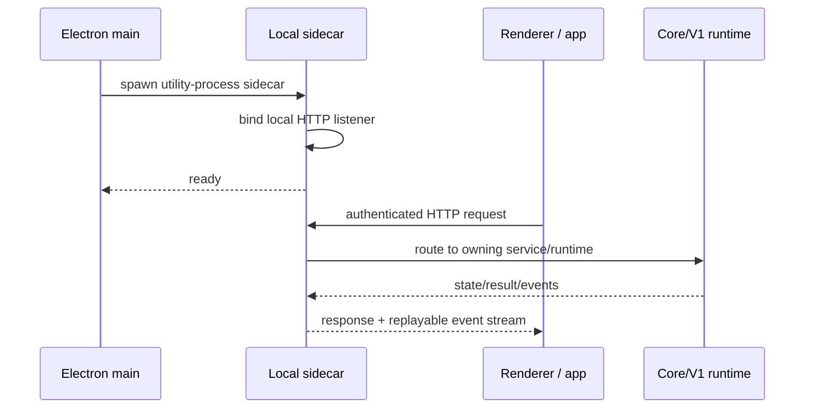

# Architecture and execution flow

## 1. Architectural layers

OpenFork is a local-first, multi-surface independent product architecture. The
important boundary is not “frontend vs backend”; it is **fork-owned local
presentation/runtime vs remote infrastructure outside the fork's control**.

```text
Presentation / interaction
  packages/app (V2/new-layout primary)
  packages/mobile
  packages/tui (retained coupling, not OpenFork product)
  packages/session-ui (V2 presentation first-class)
  packages/ui
            |
            v
Browser-safe contracts / clients
  packages/schema
  V1/fork contracts + packages/sdk/js
  packages/protocol + packages/client (current donor/transitional)
            |
            v
Local HTTP/runtime host
  packages/opencode
  packages/server
            |
            +----------------------+
            |                      |
            v                      v
Legacy/V1 runtime           Current/V2 domain runtime
packages/opencode/src       packages/core/src
session · tool · provider   session · tool · event · DB
            |                      |
            +-----------+----------+
                        v
                 packages/llm
                 provider protocols
                        |
                        v
          local workspace / model providers
```

The local layers above are OpenFork-owned even when their package names and source
originate in OpenCode. Their APIs are not required to remain compatible with
upstream. The strict external boundary is any upstream-operated remote service
OpenFork elects to consume.

The presentation layer deliberately does **not** follow the V1-first runtime rule:
V2/new-layout UI is the primary product direction. The generation split is allowed
and expected: newer V2 presentation can consume V1/fork execution and local API
contracts.

The repository contract in `AGENTS.md` still requires browser clients to consume
browser-safe contracts rather than host/runtime implementation details. That does
**not** make the upstream-current Protocol/client family OpenFork's destination.
V1/fork browser-safe contracts are the product target; Protocol/client are
transitional/reference surfaces where already useful. The current tree also contains
Core imports in client-facing packages; those are layering debt, not a new ownership
rule.

## 2. Desktop process model

`packages/desktop` is an Electron shell with three materially different trust and
runtime zones:

1. **Electron main** (`src/main`) owns windows, native OS integration, IPC handlers,
   browser authority, process lifecycle, and local sidecar lifecycle.
2. **Preload** (`src/preload`) exposes the typed `window.api` bridge. Renderer code
   should not bypass it for native behavior.
3. **Renderer** (`src/renderer`) hosts the Solid GUI from `packages/app`.

The desktop main process starts the OpenFork local server as an Electron utility
process. The renderer then communicates with that server over authenticated loopback
HTTP/SSE. Native desktop operations travel over preload IPC instead.


```mermaid
sequenceDiagram
  participant M as Electron main
  participant S as Local sidecar
  participant R as Renderer / app
  participant C as Core/V1 runtime

  M->>S: spawn utility-process sidecar
  S->>S: bind local HTTP listener
  S-->>M: ready
  R->>S: authenticated HTTP request
  S->>C: route to owning service/runtime
  C-->>S: state/result/events
  S-->>R: response + replayable event stream
```

### 2.1 OXP external-agent path and parent tool epochs

OXP is a separate first-party external-agent surface hosted by the same sidecar.
Electron main owns native tunnel/process/secure-credential lifecycle; the sidecar
owns the OXP MCP endpoint, authority composition, capability adapters, Session
supervision, and durable worker delegation.

```text
ChatGPT parent
  -> OpenAI Secure MCP Tunnel
  -> dedicated OXP loopback MCP endpoint in sidecar
  -> OXP adapter
  -> authoritative Core/V1 owners
```

The ChatGPT parent does **not** receive a backing OpenFork Session. Its current
ability to invoke OXP is additionally bounded by a host-side, non-renewing
25-minute **parent tool epoch**. OXP calls inside that epoch do not
extend it.

The sidecar therefore tracks a small process-local epoch record per stable
ChatGPT parent-session correlation key. The first observed call anchors
`epochObservedAt`; at the first call at/after 20 minutes, the common OXP response
boundary appends a durable-handoff reminder. At 25 minutes the observed epoch is
treated as dead. A later successful OXP call for the same parent proves that the
user/host reopened tool access and begins a new observed epoch.

This tracker is transport-liveness state, **not an authority plane** and not
durable correctness state. It uses request-time observation rather than periodic
polling. The durable escape hatch is `openfork_worker`: unfinished work should be
delegated into a real native worker Session before parent OXP access expires, and
that worker can continue without the ChatGPT parent.

See [OXP parent-tool epoch and durable continuation](../architecture/oxp-parent-tool-epoch.md).

## 3. Server/API composition

`packages/opencode/src/server/routes/instance/httpapi/api.ts` composes the full
`OpenCodeHttpApi` from:

- the current Protocol `ServerApi`;
- root/global APIs;
- event, pairing, device, PTY-connect, and instance-scoped APIs;
- fork-owned groups such as Goal, quota, session groups, control surfaces, and
  scheduled tasks;
- first-party native Swarm as a Tier-0 durable collaboration domain with
  execution adapters owned separately at Tier 3.

The route tree is deliberately split by ownership. Root/global operations are expected
to remain bootstrap-free where their semantics are process/global or durable-state
only. Instance-scoped operations may acquire location/workspace runtime services.

The root and `packages/opencode/AGENTS.md` files define four ownership tiers:

- **Tier 0:** process/global;
- **Tier 1:** durable location metadata;
- **Tier 2:** workspace configuration/catalog;
- **Tier 3:** execution/runtime.

Do not use “the server” as one undifferentiated layer. An endpoint that only reads
global metadata must not accidentally materialize a workspace execution instance.

The presence of `ServerApi` in the composed host is **descriptive current state**,
not an OpenFork requirement to support the upstream-current client API indefinitely
or accept arbitrary OpenCode clients/plugins.
Do not add or migrate routes solely for current Protocol parity. Existing current
routes can remain until a V1-oriented simplification is deliberate and proven safe.

## 4. Session execution

Two execution generations coexist.

### Legacy/V1 path

The V1 production stack and its internal backward-bridge seams are centered in:

- `packages/opencode/src/session/prompt.ts`
- `packages/opencode/src/session/processor.ts`
- `packages/opencode/src/session/session.ts`
- `packages/opencode/src/tool/registry.ts`
- `packages/opencode/src/tool/*`

This path remains important because much of the mature local OpenFork execution
behavior and fork tooling still runs through it. It is not “dead code”.

OpenFork also backports upstream Code Mode into this V1 production path. Code Mode
is the default MCP exposure strategy: native OpenFork tools stay direct while MCP
tools are orchestrated through the confined `execute` tool. See
[`docs/architecture/code-mode.md`](../architecture/code-mode.md).

### Current/V2 path

The current Effect-native domain is centered in:

- `packages/core/src/session/*`
- `packages/core/src/session/runner/*`
- `packages/core/src/session/execution/*`
- `packages/core/src/tool/*`
- `packages/core/src/event/*`
- `packages/core/src/database/*`

The current session model separates durable input admission from visible conversation
projection. `session_input` is the durable inbox; execution promotes admitted input
through the serialized runner and event/projector pipeline.

The architectural direction is **semantic convergence**, not two independently
invented systems. V1 internal adaptation should use V2/current semantics as the
oracle for provenance, ownership, authority, and lifecycle behavior where the
models overlap.

See [v1-v2.md](./v1-v2.md).

### 4.1 Native Swarm

Native Swarm is an OpenFork-owned collaboration aggregate over ordinary root
Sessions. It is **not** the OpenSwarm plugin embedded into the product.

Ownership is deliberately split:

- `packages/schema/src/swarm.ts` and
  `packages/core/src/swarm/*` own durable identity, membership, tasks/DAG,
  leases/runs, peer mail/receipts, blackboard, claims, deliverables, fencing,
  compact projections, and EventV2 facts;
- `packages/opencode/src/swarm/*` owns disposable/process-global dispatch,
  deadlines, managed-member Session materialization, recovery, and thin
  execution adapters;
- root `/swarm` HTTP routes expose bounded Tier-0 projections and authenticated
  operator intent without becoming execution owners;
- the generated SDK is the browser/client contract;
- SessionGroup `kind:"swarm"` is a read-only navigation projection, never
  membership authority;
- `packages/app/src/pages/swarm/*` consumes compact Swarm projections plus
  SessionTelemetry/Permission/Question overlays. It does not reconstruct Swarm
  state from transcripts.

Conversational provenance is semantic and producer-stamped:
`swarm.assignment`, `swarm.peer`, `swarm.continuation`,
`swarm.recovery`, and `swarm.notice` are host-owned synthetic sources.
Provider wire role does not grant user authority.

Legacy OpenSwarm files/source may be inspected by a future bounded importer, but
the plugin is not a runtime, storage, API, tool, or UI dependency of native
Swarm.

## 5. Provider and model boundary

`packages/llm` owns low-level model-provider protocols and request/response
adaptation: Anthropic Messages, OpenAI Chat/Responses, Gemini, Bedrock, compatible
providers, and provider-specific adapters.

Higher layers decide *what* session/tool work should happen. The LLM layer decides
*how* that semantic request is represented for a particular provider/runtime.

This is especially important for System-message authority: provider wire roles are a
projection of semantic authority and capability, not the canonical ownership model.

### Model primitives and semantic inference

The catalog distinguishes the model's computational primitive from its provider wire
adapter. `language` is the compatibility default; `system-one` identifies typed
non-generative semantic inference. An OpenAI-compatible catalog entry therefore does
not imply that the model is a conversational language model.

Primitive ownership is bottom-up:

```text
packages/schema Model.Primitive
  -> models.dev/config projection
  -> provider host primitive guard
  -> primitive-specific transport
  -> local API / generated SDK
  -> presentation selection
```

Conversation-facing resolution (`getLanguage`, default/small-model selection, the
desktop/session composer, legacy run/TUI picker, ACP model/config options, OXP Session
selection, and the ordinary model picker/store) admits only `language`. System One
models remain visible in provider/catalog inventory but cannot silently become chat,
title, summary, or housekeeping models.

`packages/llm/src/system-one.ts` owns only the TypeSafe/System One wire contract and
typed response validation. `packages/opencode/src/system-one` owns host concerns:
provider/model resolution, credentials, OpenCode-hosted Zen/Go request identity,
catalog cost, and telemetry. The Tier-2 `POST /system-one/infer` route is explicitly
workspace-scoped but does **not** create or mutate a durable Session.

`affinityID` is caller-owned semantic routing/cache affinity, not Session ownership.
For OpenCode-hosted Zen or Go it is deterministically lowered to a non-persisted `ses_…`
transport token; omitted affinity receives a one-shot token. Raw provider
probabilities/scores are preserved. System One opts out of shared chat retry backoff
so the first typed provider failure (`RateLimit`, `QuotaExceeded`, authentication,
timeout, or upstream failure) remains observable to the control-plane caller.

OpenCode Go does not currently advertise a Jev model in its public catalog. OpenFork
must not synthesize one. The shared compatibility classifier recognizes an existing
`opencode-go/jev-*` row as `system-one`, however, so a future Go catalog addition
automatically uses the Go base URL (`/zen/go/v1/systemone`) instead of entering chat.

See `docs/architecture/jev-system-one.md` for the upstream donor findings, remote
Zen/Go compatibility record, error semantics, verification matrix, and ProofGate
integration handoff.

## 6. Tool architecture

There are two corresponding tool surfaces:

- V1/fork-rich tools: `packages/opencode/src/tool/*`;
- current/V2 built-ins: `packages/core/src/tool/*`.

The V1 surface currently contains the broader fork tool inventory: shell/background,
git, project, symbols, typecheck, test, JSON, patch, archive, browser, swarm/session
control, checkpoints, and other OpenFork additions.

Tool behavior that exists in both generations should converge on shared lower-level
services or contracts rather than drift through duplicated policy.

## 7. Persistence and projections

Core owns durable domain state and database migrations. Drizzle schemas live under
`packages/core/src/**/*.sql.ts`; generated migration/schema artifacts remain in Core.

Dense GUI surfaces should consume compact producer-owned projections rather than
rehydrating complete message histories. Session telemetry, usage, execution phase,
model identity, and other list/sidebar facts should be materialized or incrementally
projected at the domain boundary.

The canonical demand direction is:

```text
producer/storage
  -> domain service
  -> route + middleware
  -> transport
  -> client cache/store
  -> component
```

and architectural review should trace the reverse demand path back to the authoritative
producer before adding a fetch or frontend derivation.

## 8. Generated API paths

OpenFork has two generated-client families:

```text
packages/protocol ServerApi
  -> packages/client

packages/opencode OpenCodeHttpApi
  -> packages/sdk/js (unified SDK)
```

The unified SDK includes the Protocol surface **plus** OpenCode-owned route groups.
Changing Protocol and changing the full OpenCode route tree therefore have different
generation commands and outputs.

For OpenFork, this describes the hybrid tree rather than two equally supported
product contracts. The V1/fork local client contract is the target; Protocol/client
generation is maintained only where retained code still depends on it.

See [packages.md](./packages.md) and the root `AGENTS.md` API-surface rules.
