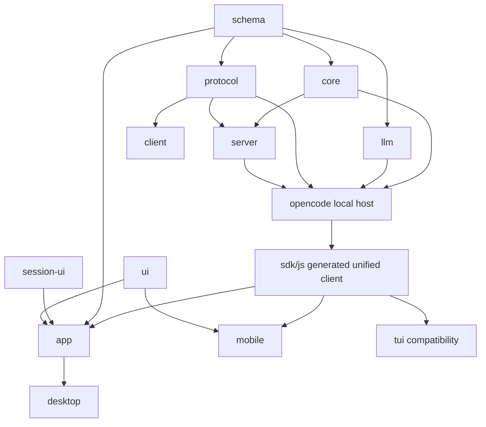

# Workspace package map

## Dependency spine



This diagram shows architectural intent and primary edges, not every current
`package.json` dependency. Transitional client-to-Core imports still exist and are
called out below.

## Package inventory

| Package | Role |
| --- | --- |
| `packages/app` | Main Solid GUI. Browser-capable and embedded by desktop. Currently hybrid because upstream migration work is already present; OpenFork is not committed to completing that migration. |
| `packages/browser-visual` | Fork-owned browser visual capture/runtime support shared with desktop browser features. |
| `packages/mobile` | Fork-owned mobile PWA client. |
| `packages/client` | Generated client for the upstream-current Protocol `ServerApi`; transitional/reference surface for OpenFork unless explicitly retained by a fork feature. |
| `packages/codemode` | Code-mode support package. |
| `packages/core` | Durable domain state, current/V2 session runtime, event/projector services, persistence, location services, shared process/runtime primitives. |
| `packages/desktop` | Electron main/preload/renderer host, native integration, browser authority, sidecar lifecycle. |
| `packages/effect-drizzle-sqlite` | Effect/Drizzle SQLite integration support. |
| `packages/effect-sqlite-node` | Node SQLite Effect integration support. |
| `packages/http-recorder` | HTTP recording/test support used by provider/runtime tests. |
| `packages/httpapi-codegen` | Code generation support for HTTP APIs. |
| `packages/llm` | Provider protocol and model-wire adapters. |
| `packages/opencode` | Local OpenCode host/sidecar, mature V1 OpenFork production runtime, CLI compatibility host, full HTTP API composition, fork-rich tool/runtime integrations. V1 is repaired/extended here and receives selective current/V2 backports. |
| `packages/plugin` | Plugin contracts/runtime integration helpers. |
| `packages/protocol` | Browser-safe upstream-current API contract built on Schema. Useful as a donor/shared contract surface, but not an OpenFork product compatibility target by itself. |
| `packages/schema` | Shared browser-safe domain/wire schemas and branded IDs. |
| `packages/script` | Shared script/build utilities. |
| `packages/sdk/js` | Generated unified SDK for the complete `OpenCodeHttpApi`. |
| `packages/server` | Shared server middleware/handlers/location infrastructure used by the local host. |
| `packages/session-ui` | Shared session/message GUI components, including newer V2 presentation components. |
| `packages/tui` | Upstream-coupled TUI compatibility package; retained but not an OpenFork product. |
| `packages/ui` | Shared low-level UI system/primitives. |

## Contract packages vs implementation packages

### Browser-safe contracts

- `packages/schema`
- V1 browser-safe contracts retained by the local product;
- `packages/protocol` and `packages/client` where the existing hybrid tree or a
  deliberate fork feature still consumes them;
- generated surfaces in `packages/sdk/js` where required by the V1/fork local host.

Client/runtime separation remains required, but **current Protocol is not the
required destination**. Prefer a stable V1/fork browser-safe contract rather than
coupling presentation directly to Core/Server internals.

### Domain/runtime implementation

- `packages/core`
- `packages/opencode`
- `packages/server`
- `packages/llm`

These packages may own local persistence, execution, provider protocols, process
state, or workspace services and therefore should not leak implementation types into
browser code as the long-term design.

### Presentation

- `packages/app`
- `packages/mobile`
- `packages/session-ui`
- `packages/ui`
- `packages/tui` (compatibility-only in OpenFork product terms)

## Current transitional dependency debt

The root architecture contract says client runtime code may depend on Schema and
Protocol but should not depend on Core or Server implementation.

Current manifests/source still include Core dependencies/imports in:

- `packages/app`;
- `packages/session-ui`;
- `packages/tui`.

This map records that as **layering debt**, not evidence that OpenFork should finish
the upstream current-client migration. Do not use the existing imports as precedent
for adding more client-to-Core coupling. Prefer moving browser-safe types/projections
into Schema or a V1/fork-owned browser-safe API boundary; use Protocol only when it
is deliberately retained rather than by default.

## API generation ownership

### Protocol client

```text
packages/protocol
  ServerApi
    -> packages/client
```

This is upstream's current-client generation path. In OpenFork it is **not a product
target or parity requirement**. Regenerate it when retained code actually changes
Protocol; do not migrate V1 callers onto it merely to advance upstream's migration.

### Unified SDK

```text
packages/opencode
  OpenCodeHttpApi
    = Protocol ServerApi
    + root/global APIs
    + local instance/runtime APIs
    + fork-owned route groups
      -> packages/sdk/js
```

The unified SDK remains relevant to the hybrid local host and fork-owned routes.
Its current/v2-generated namespaces are implementation details, not a mandate to
adopt the current client API architecture.

## Repository-level support directories

| Path | Role |
| --- | --- |
| `script/` | Fork sync/prune, generation, release, translation, probes, and repository automation. |
| `patches/` | Dependency patches applied by the workspace. |
| `extensions/` | Client-side extensions such as the Chrome integration. |
| `benchmarks/` | Repository-level benchmark harnesses. |
| `experiments/` | Prototypes and measured experiments that are not production packages. |
| `.opencode/` | Repository-local OpenCode agents, commands, tools, themes, and config. |
| `docs/` | Architecture, maps, plans, specs, handoffs, and evidence. |
