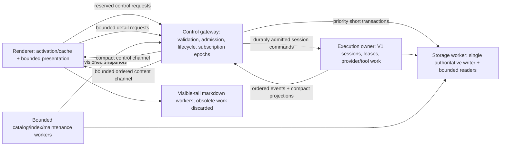

# OpenFork performance regression investigation and priority architecture

Date: October 1, 2026. Investigation window: September 24–October 1, with September 20–22 changes included where they establish the affected architecture. Times in prose are America/Chicago (UTC−5); artifact timestamps use UTC.

Status: **implementation goal remains active; renderer and full-application gates remain open**. The October 2 current-source closeout below supersedes historical pending checks only for the listed slices. The running development application has not been refreshed by this campaign. Whole-renderer closure still requires reconciling the earlier multi-second native layout observations separately from the corrected HTTP/1.1 fixture starvation.

### Handoff reconciliation

The latest handoff reports green Core/App/Desktop/Opencode typechecks and the focused source aggregate recorded below. Inspection confirms the native gate now uses `createDesktopFetch` through preload IPC and separate production admission/control Electron sessions, and that heavy analytics use the Database-scoped lazy `scanDb()` owner. The diagnostic module-probe error window is no longer present; the current probe script passes `node --check`. No running application or swarm was stopped or restarted during reconciliation.

Qualification: the native gate records frame gaps and tail convergence, but does not currently assert a bounded background DOM/layout commit. Its corrected transport topology resolves the sixth-admission socket-pool failure; that alone cannot establish that the earlier 2.8–4.1-second native renderer layout stalls are eliminated. The completed-history DOM identity and reserved Shiki-lane tests establish useful structural invariants for streaming updates, while initial large-history DOM materialization remains a separate evidence question.

Source audit confirms that question is still open: a cold `Markdown` mount calls `initialResult` -> whole-string `fallback(text)` -> full HTML insertion before visibility can gate work. The native fixture mounts the 8 MiB completed history in an opacity-zero element. Worker reprioritization does not bound that initial conversion or DOM/style/layout work. The renderer slice is reopened for bounded initial/offscreen DOM and cooperative visible commits; the other current-source gate results remain valid. No post-transport run is claimed to have reconfirmed the historical LoAF durations.

Further acquisition audit found that a failed/interrupted `scanDb()` initialization could retain its partially opened worker in the Database lifetime until teardown. Acquisition now stages each candidate in a child scope, closes that scope on failure/interruption, and transfers successful cleanup to the Database owner. Fresh reader/scan checks pass **4 tests / 29 assertions**, including six concurrent cold requests returning the same connection and surviving short caller scopes. The live-port isolation helper now explicitly rejects port 5173 even if an ephemeral reservation returns it; its actual Vite binding/cache test passes **1 test / 8 assertions**.

Fresh reconciliation checks: Core typecheck now passes after explicitly classifying `session.next.input.completed` as input-owner state with no conversation-history mutation; focused input/history checks pass 9 tests / 38 assertions. App and Opencode typechecks pass after canonical swarm model-requirements and narrow test-service dependency repairs; five targeted HTTP suites pass 55 tests / 202 assertions. The registry inventory expectation now includes the already-defined and dispatched `refactor` capability; the full registry suite passes 37 tests / 168 assertions. These results qualify, rather than overwrite, the earlier handoff.

Global bootstrap now fails at its owning global surface instead of falling back to instance APIs when global path/project endpoints fail. Its negative gates pass 25 tests / 61 assertions, proving zero fallback calls on missing metadata and 404/405/503 responses. Workspace routing decodes only encoded caller headers, preserves literal percent sequences in durable/query-decoded locations, and rejects relative directories before instance loading; routing/context suites pass 20 tests / 59 assertions. Canonical unified SDK regeneration passes. Successful scan acquisition and publication into the Database cache are interruption-atomic, while opening/configuration remain interruptible.

Electron fixture isolation is also being tightened: effective `userData`, `sessionData`, logs and crash paths must be run-owned and verified before readiness. Chromium cache belongs under `sessionData`; `cache` is not a supported Electron path name. Profile negative tests pass 2 tests / 14 assertions, and Desktop typecheck passes. SDK gate entrypoints now undergo a built-CJS syntax preflight. New renderer and full-app fixtures have not yet been launched at this entry.

Renderer acceptance review additionally found that a byte-bounded rich block is not a frame budget: several template parses or sanitize continuations could run in the same turn, and subthreshold highlighted code could synchronously materialize thousands of token nodes. Exact owner-key disposal also missed nested paragraph parse keys. Other rejected closeout conditions include silently dropping capacity subscribers after 64 waiters, empty text tasks making no progress, and rebuilding every remaining visibility observer target on each dense teardown. These are active repair requirements, with queue/source convergence and actual cold dense-code frame timing required alongside DOM identity. The full-app gate likewise requires a fresh tail marker and idle convergence for each 1/3/6 cycle; old text from an earlier scenario cannot satisfy later streaming assertions.

## October 2 continuation — implementation remains active

The goal resumed after the previous run reached its usage limit. Current source and fresh checks, rather than earlier agent completion messages, remain the evidence for acceptance.

- Selected-provider initialization now follows the location-owned Provider snapshot -> selected provider materializer -> model/SDK resolution -> prompt path. The reverse demand carries the selected provider identity; it no longer requests every plugin model/auth/custom loader or unconditional TypeSafe metadata. Baseline metadata reads the cached/bundled models.dev projection. Explicit runtime `Provider.list()` remains the all-provider operation. A per-provider permit shares successful initialization and allows retry after interruption/failure; a permanent cached interrupted exit would poison subsequent prompts. Later provider materializations revise the catalog contribution, while repeated reads do not republish unchanged state. Mandatory config/plugin construction remains shared and is still an open performance gate.
- The selected-provider negative gate passes 48 assertions across 1/3/6 requests: selected model/language resolution completes while unrelated model/auth/catalog callbacks remain uninvoked, with config name/options/variants/filter parity and one base initialization. Wider parity checks exposed and corrected detached model mutation in anonymous Zen and deferred allowlist filtering. Full-suite final rerun and interruption-specific checks remain pending at this entry; no first-prompt closure is claimed.
- Fresh final provider parity rerun: **122 passed / 373 assertions**, with the allowlist and anonymous hosted pricing cases green. Additional held-hook tests prove one initialization for 1/3/6 same-provider callers; interrupted initialization retries successfully instead of caching cancellation (2 focused tests / 16 assertions). Opencode typecheck is clean. Cold metadata-cache population and TypeSafe-specific metadata coverage remain under review; these checks do not prove the complete packaged first-prompt path.
- Further producer removal: the Provider base no longer normalizes and JSON-copies every models.dev provider before a selected prompt. Location-owned memoized projections normalize/copy only demanded providers; environment eligibility scans shallow provider metadata. A deliberately unreadable unrelated model catalog now remains unread across selected 1/3/6 requests. Wider parity rerun: **124 passed / 389 assertions**. Additional cold-selected and TypeSafe-specific tests each pass 11 assertions: disabled selection performs zero catalog fetches, six cold callers share one selected metadata resolution, unrelated execution performs zero decision-metadata reads, and TypeSafe 1/3/6 demands share one decision projection without populating the language catalog.
- ModelsDev construction now reads disk/bundle without outbound fetch. An explicit selected demand may populate an entirely empty catalog once; a miss in a nonempty catalog stays a normal miss. Cold population rechecks disk under the cross-process lock and refreshes the cached snapshot. Its successful result is memoized under one permit; interrupted/failed fetch exits are not cached permanently. Fresh owner tests: 2 passed / 15 assertions, including interrupted first request followed by successful retry; Core typecheck passes. Periodic network refresh begins after the five-minute TTL rather than service construction.
- Provider catalog contribution revisions no longer await transient event listeners in selected execution. The owner commits the redacted projection synchronously and sends coalesced location revisions through one scoped worker; snapshots/pending notifications are capped at 32 locations and revisions stay monotonic across eviction/re-entry. An actual Provider.getModel gate progresses at 1/3/6 concurrency while a catalog-update listener is blocked; the final revision converges after release. Contribution/T3 suite: 4 passed / 38 assertions. Notification interruption remains interruption, preventing teardown from recovering cancellation into more publication work.
- Active Permission/Question responses now route through an exact process-owned request/session/directory handle into the authoritative V1 owner, bypassing workspace construction. Owner state and waiting Deferred settle before transient response notifications enter a bounded scoped worker. The agent's real HTTP 1/3/6 gate reports zero InstanceStore loads, with blocked response-listener gates for both services. Durable permission-policy ordering is retained. Queue saturation can drop transient notifications and remains a reconciliation limitation. Canonical unified SDK regeneration completed successfully after a transient Windows write failure; generated session-path/SSE verification passed 18 tests / 129 assertions.
- The broader 147-test Permission/Question/session-HTTP run passed 143 and exposed four failures: two attribution tests assumed synchronous transient notification delivery (now corrected with actual event barriers), and two session creation/listing tests exposed raw directory persistence. `Session.createForLocation` now resolves the explicit location at the authoritative producer, preserving canonical directory identity previously supplied by InstanceStore. Equivalent trailing hints and the Windows global-worktree sentinel now pass their focused real HTTP checks (2 tests / 9 assertions). No implicit workspace runtime or missing-location cwd fallback was introduced. Attribution, literal-percent location, overflow recovery, and wider post-fix reruns remain in progress.

- October 2 first-project reload error: the live installed app logs identify `GlobalHttpApi.sessionStatus` failing with `Service not found: @opencode/v2/SessionExecutionOwner` (references `err_d40d8d03`, `err_b02e71c1`, `err_8b72a390`). The second failure immediately follows first initialization of webseal; the same failure occurs on other cold projects. The served HTTP app graph omitted `SessionExecutionOwner.node`, while cancellation routes and test harnesses supplied it separately. The production graph now explicitly owns that process-global service. Global status handlers capture execution/status owners during construction, making omissions fail at graph construction instead of first-project bootstrap. A standalone production-route test deliberately supplies no outer execution-owner node; global and cold-directory reads pass at concurrency 1/3/6. A separate blocked-Instance test proves all ten cold-directory requests succeed with **zero InstanceStore.load calls**. Fresh targeted result: 2 tests, 24 assertions. The installed application has not been rebuilt/restarted; these are source and isolated real-HTTP results, not a claim that the running old binary has changed.
- End-to-end error path: durable execution leases + process-global SessionStatus -> execution/status owners -> authorization-only `/session/status` -> unified SDK bootstrap request -> directory bootstrap error aggregation -> `Failed to reload <project>` toast. Reverse demand is first-project/new-session bootstrap requesting a compact working-session map; it requires no plugin/tool/provider initialization, message history, or workspace Instance. The original defect was dependency ownership, not a reason to suppress the toast or add retries. Existing handler-unit mocks had concealed the production graph omission; the new standalone graph test catches that class of defect.
- Attribution limit: the execution-owner status projection is an uncommitted working-tree addition, absent from `HEAD`'s global handler. The installed runtime error confirms that projection exists in the deployed development artifact, but Git cannot assign this wiring omission to a committed change from the earlier week. This defect is a campaign wiring regression, not evidence that all original symptoms share this cause. Fresh wider root/global/replay/fence/ownership HTTP suite: **56 passed, 224 assertions**. Its first run exposed an older fixture still mocking Session root census instead of supplying durable Database ownership; supplying the actual narrow database owner repaired the fixture without changing production census behavior.
- V1 creation has now been promoted to the urgent transport lane only after its real HTTP 1/3/6 zero-Instance admission test passed. Runtime prompt admission and retained current `/api/session` creation remain in the separate admission pool. Fresh actual Electron production IPC gate: six prompt admissions held at the peer while urgent interest completes in **6.62 ms** and V1 creation transport completes in **3.02 ms**; trust rejection and all six aborts still pass. This is actual IPC/network isolation against a private peer, paired with separate real-domain HTTP ownership proof, not an integrated native production-sidecar timing claim. App/desktop transport tests: 8 passed, 59 assertions.
- Canonical unified SDK regeneration including SessionCreateApi now passes. Two immediate format attempts hit transient Windows file-open errors; the final complete build succeeds. A new actual generated-client contract test confirms global session lookup, V1 session lookup and message-detail requests substitute session identity before reaching fetch. Package typecheck currently has only the in-progress Electron real-HTTP fixture's unknown service-environment and optional-ID diagnostics; the production graph and updated global handler harness diagnostics are resolved.
- Integrated Electron fixture now passes through actual `Session.Service` producers, EventV2Bridge and production `HttpApiApp.routes`, unified SDK/SSE, ServerSync/session stores and visible Markdown. All 1/3/6 tails converge; interest acknowledgements, offset-gap repair and zero-root teardown pass. The real test observed 18 SSE frames. Combined real-server and fake-peer Electron gates: **2 passed, 25 assertions**. The fake peer separately proves cursor reconnect and first-repair-503 recovery. This is an isolated Bun HTTP domain runtime, not the native packaged sidecar executable or provider processor. The placeholder-session request observed during bring-up was a fixture missing its seeded-ID environment variable and is resolved; the earlier speculation about client serialization was not confirmed. Fresh App and Desktop typechecks pass. Opencode typecheck passed after the fixture correction, then the next permission/question owner slice introduced temporary in-progress diagnostics; no full-campaign typecheck closeout is claimed while that slice is being completed.
- T3 account catalog parity now has a mocked Console HTTP integration through the authoritative credential resolver, shared account transforms and projection owner. Exact account aliases/defaults/connected sets/filtering/redaction, committed credential changes, withdrawal, failed-fetch partial status and bounded-backoff retry pass (26 assertions). One secret-free bounded credential change observer invalidates known location projections; full prompt execution independence remains a separate gate.
- Optional sharing now resolves model metadata in its background flush owner, with one active flush per session and convergent scope teardown. The shared-prompt test holds model lookup while two publications finish, then verifies both wire batches and no internal `model_request` leakage. Unshared session/message/part/diff observers now defer structured copying until an actual share exists; repeated live content must not pay sharing-copy cost for an unshared session. Complete suite after lazy-copy change: **10 passed, 45 assertions**.

- Reserved-tail Markdown now has an actual Electron production-component stress result: an 8 MiB background parse remains active for roughly 12–13 seconds while the selected tail commits in 4–21 ms and completes projection/parsing in 19–39 ms in 1/3/6-component scenarios. This proves one selected tail's independence; all concurrent visible tails, visibility transitions, oversized fallback and stream-store integration are being extended. The attempted 16 MiB fixture exited Electron with a generic error of unresolved origin; no full renderer closure is claimed.
- V1 abort is mounted outside InstanceContext middleware. Durable location/producer checks and execution-generation fencing precede matching local Runner cancellation. The route test verifies zero InstanceStore.load calls; RunState 1/3/6-handle and stale-generation tests pass. BackgroundJob-only cancellation and job-admission interleavings remain under correction.
- Provider GET is split from runtime actions and uses a deliberate global or explicit absolute-directory projection. It remains incomplete until configured models/defaults/connected behavior, account-model projections, and selected-provider execution initialization are validated. Session creation still crossed full Instance middleware on inspection and is now an explicit remaining admission fix.
- Fresh root checks: Core and App typechecks pass; real HTTP live-detail recovery passes (1 test, 4 assertions). Combined app session/bootstrap/child-store/catalog-event checks pass (123 tests, 324 assertions). Canonical unified SDK build passes after serial regeneration, but Opencode typecheck remains red because the provider list operation identifier currently generates a different SDK method; the owning agent is correcting the identifier while retaining a distinct route group. Two earlier build attempts encountered concurrent-generation signature patching and a transient Windows file-open error; no partial generator output is accepted as a successful build. The SSE signature patch now accepts its already-correct known form and still rejects an unknown form.
- Fresh actual Electron IPC/transport/native-worker checks pass (2 tests, 13 assertions): urgent IPC completes in 8.54 ms with six admissions still held, untrusted renderer dispatch rejected, all six held admissions aborted. Ordinary HTTP saturation leaves separate control at 8.53 ms; fake SSE 1/3/6 streams retain expected byte totals. Heavy native SQL takes 382 ms with 29 parent heartbeats. The separate native Node transaction/interruption/value fixture also passes. These fixtures use private test peers and do not prove the integrated production domain path.
- Periodic WAL checkpointing now uses a database-owned, separately acquired maintenance connection with zero busy timeout instead of the foreground connection permit. In-memory storage skips this file work. Fresh regression tests prove checkpoint completion while the foreground writer remains reserved and preserve rollback state; combined checkpoint/quiet-gate tests: 3 passed, 5 assertions. This isolates checkpoint admission, not SQLite's shared single-writer lock or every maintenance transaction.
- ShareNext's inline MessageUpdated observer previously called provider.getModel for a worker prompt even when no share existed. It now checks the share owner before that optional model projection. The actual integration test proves an unshared human prompt invokes zero model lookups; complete ShareNext suite: 9 passed, 40 assertions with the configured 30-second fixture timeout. An earlier default-five-second run timed out in the existing host-continuation test; that exact case passed in 1.24 seconds on rerun. Shared-session model sync semantics are retained; broader inline plugin/event callback CPU isolation remains open.
- Provider SDK review found a second wiring defect: the served ProviderCatalogApi was absent from canonical OpenCodeHttpApi, so a successful generator run omitted provider.list entirely. The canonical graph now includes the distinct providerCatalog group and provider.list operation; regeneration and fresh typecheck are in progress. Earlier API-drift diagnostics are not yet recorded as resolved.
- Canonical graph correction is now regenerated and verified. PublicApi OpenAPI suite: 19 passed, 230 assertions, including a new negative invariant retaining provider.list and its optional explicit-directory query. Cold schema generation takes 5.2 seconds here; the first default-five-second targeted run timed out, so that schema test uses a 30-second fixture allowance. Fresh Opencode typecheck now reports only an in-progress provider route test's unknown-to-string narrowing error; generated provider method/type drift is resolved.
- Expanded actual Electron production Markdown + createServerSession gate passes: all 1/3/6 visible tails progress while the 8 MiB background parser stays active for 13–16 seconds. Tail projection/parsing completes in 30.8/42.8/72.6 ms; maximum six-tail reserved-lane wait is 61 ms. Tests include activation without router/tab changes, six-session interest, held offset-gap repair, viewport background/tail reprioritization, obsolete generations, full oversized fallback output, and convergent teardown. Desktop typecheck and seven admission checks pass. Events/pages remain a mock V1 producer, so actual SDK SSE transport and real domain sidecar integration remain open and are the next fixture extension.
- October 2 native-sidecar closure supersedes the fixture limitation above. The gate now launches the current Node sidecar artifact and Electron renderer, but routes desktop control/admission traffic through the production `createDesktopFetch` -> preload IPC -> `createSidecarControlTransport` topology instead of raw Chromium fetch. The earlier 6-session failure was reproduced as a fixture-only HTTP/1.1 pool artifact: one long-lived SSE request plus five raw renderer POSTs exhausted Chromium's six per-origin sockets and queued the sixth POST client-side. With the production transport, 1/3/6 prompt admissions all reach the model and return 204, all tails converge in the store/DOM, exactly one SSE connection remains open, and the fixture records 10 admission-lane requests. A deliberately overlapping urgent interest POST succeeds in every scenario while admissions are active; this proves the control lane is not sharing the renderer SSE/admission socket pool. The current native gate passes 12 assertions and leaves zero model requests pending. Scratch fixture directories are ignored and still explicitly cleaned by the test.
- Cancellation closeout now generation-fences both the HTTP owner and in-process V1 stop path. A stale expected-generation abort returns `false` instead of falsely reporting accepted cancellation; the legacy compatibility adapter rejects that result, and session rollback no longer proceeds after a swallowed interrupt failure. `SessionRunState.stopCurrent` supplies its registered local generation to durable interrupt ownership. Process-local `BackgroundJob` cancellation keeps an exact session admission fence across teardown and unrelated cancellation epochs, while saved handles remain generation-fenced across ID reuse. Focused BackgroundJob validation passes 8 tests / 414 assertions; the existing Core/V2 `/api/session/:id/interrupt` handler was rechecked and already delegates to `SessionV2.interrupt`, so no duplicate path was introduced.
- Markdown closure now proves block-granular reuse directly instead of inferring it from write counts. The Electron gate captures completed-history block DOM nodes before appending live tails and verifies object identity is preserved afterward at 1/3/6 visible sessions. Each open fenced JSON tail produces exactly one successful `highlight` worker completion on reserved lane 1 per session and rendered token spans in the Shiki code DOM. Latest-generation supersession, viewport background-to-tail reprioritization, held offset-gap repair, the 8 MiB background parser, oversized plaintext fallback, and zero-root teardown all remain in the same gate. Fresh result: 1 test / 27 assertions, green.
- Node SQLite packaging exposed a separate request-path tax: the Node adapter implements each `withBackfillDb` call as a fresh worker thread + evaluated worker source + `DatabaseSync` open/configure + close/terminate. A production-shaped CJS microbenchmark measured fresh open/query/close at 32.08 ms median (44.62 ms p95) versus 0.069 ms median (0.297 ms p95) for a query on a persistent worker, roughly 463x median setup overhead. `Database.Service` now owns a lazy `scanDb()` lane for heavy read-only analytics: no third worker is created at startup; the first file-backed use builds one query-only connection in the Database service scope, concurrent acquisition is serialized, later calls reuse it, and `:memory:` aliases the primary handle without installing `query_only`. Usage summary/model-profile and Zen-free history scans use this lane; writer-oriented search repair/backfills, retention, sealing and WAL maintenance retain their deliberately separate one-shot/background connections. File-backed reader/scan tests pass 3 tests / 22 assertions, including persistence across a short caller scope, query-only enforcement, independent progress while the primary permit is held, and safe `:memory:` aliasing.
- The repeatedly observed ~7 second first provider-test result is not evidence of a production provider-specific stall. Fresh-process runs show the same cold tax on unrelated provider tests and steady-state tests in the same process fall to roughly 0.4–0.5 seconds. Attribution is the test/runtime graph: per-test Effect layer construction, a large models.dev fixture parse, fresh temp Instance state, and process/module warm-up. The desktop V1 model/provider bootstrap now uses the standalone `ProviderCatalog` operation rather than runtime `Provider.list()`. Legacy full materialization remains on lower-priority compatibility/CLI surfaces, but the cold-test number itself requires no production provider rewrite.

Aggregate source verification is now complete in the current worktree; the consolidated results are recorded in the current-source closeout section below. Deployment evidence is intentionally still separate: the installed/running development application has not been rebuilt or restarted during this campaign, so do not infer that the currently running binary contains these source fixes. Event/coalescer and WAL-maintenance audits found no new foreground blocker; SQLite's shared single-writer fairness remains an accepted lower-level residual rather than a reason to move heavy analytics back onto the interactive reader.

Automatic review rejected cleanup of eight root fixture temp directories and three renderer-agent stale fixture directories as blocked by policy; agents left them untouched. New fixture-scoped cleanup succeeded. No alternate deletion path was attempted after rejection.

## October 2 closeout evidence — current source

The continuation above has now closed the production-facing gates that were still open in the October 1/early-October-2 entries. Historical measurements remain in place above; the statements below supersede earlier "still required" language for these exact slices.

- **Desktop transport / native sidecar:** the earlier six-session native fixture failure was a harness topology error, not proof that the production desktop transport still starved. The fixture declared a desktop Platform but sent prompt admission through raw renderer fetch, so one long-lived SSE request plus five prompt POSTs exhausted Chromium's six HTTP/1.1 same-origin connections and queued the sixth request client-side. The fixture now uses the production createDesktopFetch classifier, a sandboxed preload/IPC bridge, and production createSidecarControlTransport with separate Electron admission and urgent sessions. The real Node sidecar + Electron + generated SDK/SSE + visible Markdown gate passes 1/3/6 concurrent sessions: all ten prompt_async admissions return 204, every expected model start is observed, all tails render and stores converge, one SSE connection remains live, and an urgent interest mutation completes while admissions are active. The observed run recorded 10 admission-lane requests and 7 urgent/control-lane requests with exactly one SSE open.
- **Cancellation semantics:** V1 abort now distinguishes generation-CAS success from a stale request. A delayed abort that loses to a newer generation returns false, does not cancel automation, and the V1 compatibility adapter surfaces that failure instead of treating the request as accepted. SessionRunState.stopCurrent fences its durable interrupt with the locally registered generation, preventing an old local runner from writing cancellation intent onto a newer durable owner. The page rollback/revert path no longer swallows interrupt failure and continue-mutates a still-running session. Process-local BackgroundJob cancellation also retains an exact session admission fence through teardown and unrelated cancellation epochs, with generation-fenced saved handles across ID reuse. Fresh focused checks include RunState abort 13/13, stale HTTP abort 1/1, app compatibility 21/21, and BackgroundJob 8/8 with 414 assertions.
- **Provider cold-path attribution:** the historical ~6-8 second isolated Provider setup observations do not reproduce as a production provider-specific cost on current source. Fresh first-test runs show a process/test-layer warm-up premium plus repeated per-test Layer/temporary-directory/catalog fixture construction; the historical hosted-provider case now completes in subsecond time. The desktop/app model-picker path already reads the bootstrap-free ProviderCatalog (/provider on V1, current Catalog service on current protocol) rather than Provider.Service.list(). Full-materialization config.providers remains for retained TUI/ACP/CLI semantics and is a migration/parity follow-up, not a desktop startup blocker. Fresh selected-execution closure passes 3/3 tests / 64 assertions: unrelated cached catalogs remain unmaterialized, one/three/six selected callers coalesce on one held hook, and selected resolution does not wait for blocked unrelated provider setup. The focused ProviderCatalog suite passes 4/4 / 38 assertions. No broad Provider.list() rewrite is justified by the old test timing.
- **Markdown/render closure:** the production Markdown Electron gate now renders 27 top-level history blocks per visible session, includes fenced JSON/Shiki work, and runs 1/3/6 simultaneously visible tails while an 8 MiB background parse occupies the background worker. Every live fence dispatches one highlight job on reserved lane 1 (1/3/6 respectively); actual Shiki-styled spans are present; stale generations, interest/gap repair, viewport reprioritization, oversized plaintext fallback, and teardown remain covered. The gate captures the initial completed-block DOM nodes and proves object identity is preserved after the live suffix update, so completed history is not rewritten. Latest run: 1 test / 27 assertions passed in Electron 42.3.3; six-tail DOM commits were about 12 ms on that run while the background parse remained active. Timing remains evidence, not a brittle pass threshold.
- **SQLite analytical reads:** Node's worker-backed SQLite adapter was measured directly under a production-like Node CJS call shape. Twenty fresh worker/open/SELECT 1/close iterations had median **32.08 ms** and p95 **44.62 ms**; the same query on an already-open worker had median **0.069 ms**, about **463x** lower at the transport layer before query work. Usage.summary, Usage.modelProfile, and Zen-free snapshot scans no longer create a fresh withBackfillDb worker on each cache miss. Database now owns a lazy persistent, query-only scanDb lane: it allocates zero extra worker at startup, deduplicates first acquisition, isolates heavy scans from the latency-sensitive readDb, binds the native connection to the Database service lifetime via Layer.buildWithScope, and aliases :memory: to the primary handle without installing query_only. Fresh database reader/scan validation passes 3/3 with 22 assertions, including progress while the primary permit is held; Usage/Zen-free focused suites are green. The cross-process usage-watermark cache also passes 12/12 tests / 54 assertions, and Core package typecheck is green.
- **Verification qualification:** the current Core, App, Desktop, and Opencode package typechecks all pass on the shared live worktree after campaign-owned scratch probes and test-harness errors were removed/fixed. The final focused aggregate is also green: Core campaign suites 23/23 / 490 assertions, RunState cancellation 13/13, stale-abort HTTP 1/1 / 7 assertions, V1 compatibility 21/21 / 48 assertions, selected-provider execution 3/3 / 64 assertions, ProviderCatalog 4/4 / 38 assertions, native sidecar/Electron 1/1 / 12 assertions, and Markdown Electron 1/1 / 27 assertions. The stale-abort integration race has a scoped 15-second Effect-test allowance because cold fixture construction can exceed the generic five-second harness budget under concurrent load; its internal race joins remain independently bounded at two seconds. This verifies the current source, not every unrelated behavioral change in the heavily modified repository.

The implementation campaign still shares a heavily modified live worktree with other active projects, so this is a closure of the performance/correctness regression slices above, not a claim that every unrelated repository change is release-ready or that the user's installed app has been rebuilt/restarted.

## Active implementation goal — October 1, 2026

The user requested a new goal to comprehensively solve the identified regressions. The new persistent goal covers narrow catalog ownership, priority admission/activation/cancellation, ordered content and recovery, sidecar/storage isolation, producer publication, markdown/render work, and representative real Electron validation. Preserve V1/fork execution/API and V2 presentation; preserve unrelated dirty source. The earlier investigation goal was completed; this implementation goal remains active until the full fixes and verification are finished.

| Owner | Current implementation assignment | Status/evidence |
|---|---|---|
| `/root/control_priority` (GPT-6 Luna) | Latest-desired interest, critical activation/teardown admission, generation headers/POST, autonomous repair and hydration fallback | In progress; owns app context/helper/test files |
| `/root/server_ownership` (GPT-6 Luna) | Narrow Tier-2 catalog source/service/V1 adapter instead of broad runtime acquisition | In progress; owns catalog/service/routes/tests; preserve auth/account semantics |
| `/root/renderer_markdown` (GPT-6 Luna) | Shared markdown worker admission, visible-tail priority, supersession and bounded render work | In progress; owns session-ui workers/transports/tests |
| `/root` | Server interest generations, producer deadline, integration/storage/process isolation, verification and ledger | Initial server+producer patches below; isolation and Electron gates remain open |

Initial concrete changes:

- Shared stream-interest registry now accepts an optional monotonic generation, rejects old revisions and conflicting same-revision updates, preserves idempotent retries, and seeds reconnect registration from a generation header. The V1/fork interest endpoint returns current applied generation. This is a registry acknowledgement, **not** a content cursor/reconciliation barrier.
- V1 provider event consumption now arms a scoped flush alarm only while unpublished deltas exist. A silent provider cannot retain a small fragment indefinitely. Provider events and alarm flushes have one serial consumer, and interruption/completion flushes pending content and tears down the alarm.
- First targeted results: stream deadline tests 3 passed; interest registry tests 9 passed (including out-of-order/reconnect/idempotency/malformed-revision invariants). Unified SDK regenerated through its canonical build command. Processor integration suite is running; its first cold fixture hit its default five-second timeout, while subsequent cases passed. Attribution/rerun remains pending, not dismissed.

Further implementation progress:

- Client control patch and [control implementation ledger](./investigation-2026-10-01/implementation-control-ledger.md): critical activation/release, latest-desired transport, generation POST/header, and optional session hydration capability guard. Initial targeted app suite: 143 passed; app typecheck passed. Parent review found a superseded-generation retry could resend the same generation indefinitely; a correction/test is in progress before acceptance.
- Markdown patch and [renderer implementation ledger](./investigation-2026-10-01/implementation-renderer-ledger.md): one admission owner across parse/project/highlight/dispose and two affinity workers, shared viewport observer, live-tail priority, fairness and queue byte/count bounds. Initial session-ui suite: 256 passed; typecheck passed. Parent review flags lower-priority capacity eviction and oversized-visible-job handling as open correctness checks.
- Node SQLite adapter now delegates native open/prepare/execute/checkpoint/close to one worker per existing connection. The ordinary connection permit is scoped through asynchronous execution; transaction permit/ordering is preserved, and dispatched SQL settles before interruption may trigger rollback. Query CPU/lock waits no longer execute on the sidecar JS thread. The unused Node synchronous Drizzle layer was removed after source search found no consumer; EffectDrizzle remains authoritative. Worker RPC keeps the prepared-statement cache and BigInt/array/blob semantics, bounds outstanding requests, and closes idempotently. A separate reviewer is adding native Node transaction/interruption/heartbeat tests; this change is not yet accepted or packaged/Electron verified.
- Processor suite: 23 passed and one cold-fixture timeout at default five seconds; the exact failing case passed with the configured 30-second package timeout (6.33 seconds in the case). No processor assertion failed. Deadline mechanism tests remain 3 passed.
- Server typecheck passed. Core/opencode checks currently report a pre-existing `oxp-activity/retention.ts:82` generic error; opencode also reported incomplete Root API harnesses during catalog-group integration, being repaired by the owning agent. These checks are not recorded as passing.

Latest verification and review corrections:

- The latest-desired controller now rebases a rejected generation against the server acknowledgement instead of retrying the same revision. The focused app checks pass. Markdown admission now rejects a lower-priority incoming job instead of evicting queued live-tail work; oversized plaintext fallback yields between bounded escaping chunks.
- Desktop control requests now use an independently validated main-process IPC bridge and a separate ephemeral Electron network session. Ordinary renderer reads and remote-server traffic retain their existing transport. Transport tests and desktop typecheck pass; actual Electron isolation verification is in progress. See [transport ledger](./investigation-2026-10-01/implementation-transport-ledger.md).
- Native SQLite worker verification now passes under Node: parent heartbeat during heavy SQL, exact integer/blob/array values, shared close, transaction isolation/rollback, and interruption without leaking a write. Combined coalescer/native-worker suite: 17 passed, 313 assertions. The retention type error was repaired by retaining the existing branded invocation ID; Core typecheck passes. Actual Electron native-worker packaging remains to verify.
- The producer deadline and complete processor suite now pass together: **27 tests, 117 assertions**, using the package's configured 30-second fixture timeout. A gated provider remains silent after 50 fragments until publication is observed; that test proves deadline publication while the attempt is still running, observes the live producer prefix, and verifies transient-part teardown after completion.
- Live V1 text deltas are not durable until a part boundary. Recovery previously read only stored parts, so a still-running provider could have an absent prefix. A process-global borrowed-part registry now exposes detached producer snapshots only to explicit detail reads; provider input/export/history owners retain durable semantics. Offset-bearing deltas use UTF-16 positions, skip already-covered snapshot content, and trigger repair on gaps. Server and client coalescers preserve earliest offsets and treat gaps/mixed versions as barriers. Detail-route integration and final graph wiring remain under verification.
- Detail-route graph wiring is now fixed and the real HTTP recovery test passes: live producer prefix returned, durable history unchanged, and registry release restores stored-part reads. The app store test proves an offset gap autonomously repairs an already-visible session without tab activation, ignores already-covered snapshot overlap, and appends the next fragment once. Combined app session/catalog-revision checks: 100 passed, 227 assertions; app typecheck passes.
- Actual isolated Electron gate now passes (Electron 42.3.3 / Node 24.15 / Chromium 148): control fetch 8.08 ms with six ordinary requests still held, cancellation observed at the fake peer, mock stream bytes delivered at concurrency 1/3/6, and a 305.94 ms native SQLite query with 24 main-process heartbeats. This validates Electron transport/native-worker mechanisms, not real sidecar middleware, production IPC registration, actual model execution, or visible Markdown DOM. Visible renderer validation remains open.
- Catalog ownership review found a second startup gate in the client: directory provider queries were disabled until **all** auxiliary runtime/config requests finished. They now have independent explicit catalog demand and can start while path/LSP/reference work remains gated. A picker can request one directory catalog without bootstrapping its session index. Explicit directory catalogs no longer fall back to another global catalog when empty. Enrichment invalidates one scope/location query, coalesces revisions, survives a cold-fetch race, and permits retry after a failed refresh. Backend provider projection is still in progress, so this slice is not ready for a performance closeout.

Remaining major gates: full provider catalog narrowing; server control capacity and cancellation ownership; detail recovery route integration; priority writer admission and broader process isolation with leases/transactions preserved; markdown granularity under real visible load; actual Electron transport/native-worker and 1/3/6+ active-session comparisons. Unit mechanism tests do not close these gates. The live app/server has not been restarted.

## Active goal and investigation ledger

Updated at the user's request on October 1, 2026:

**Investigate the past week's OpenFork performance and correctness regressions comprehensively, identify measured causes and the changes that introduced them where evidence permits, and design an end-to-end priority architecture that prevents unrelated background work from blocking session admission, activation, cancellation, live streaming, and visible rendering. Use this document as the authoritative evidence, progress, and follow-up ledger.**

Acceptance criteria:

- Separate confirmed runtime measurements, reproducible source mechanisms, and unresolved hypotheses; distinguish installed artifacts from the dirty checkout.
- Trace each symptom from authoritative producer/storage through service, middleware, transport, client cache, and presentation, including the reverse demand path.
- Explain every relevant shared resource and where existing priority protection ends; identify work that should be removed before adding scheduling.
- Specify concrete control/execution/background owners and isolation at transport, server event loop, storage, event delivery, worker queues, and rendering.
- Require session-critical operations to progress while unrelated catalog/index/maintenance work is deliberately stalled. Include subscription acknowledgement and autonomous recovery without tab switching.
- Define 1/3/6+ active-session Electron verification and negative ownership invariants; do not close the regression using idle/unit results alone.

Progress: initial live evidence, retained-log analysis, scheduler reproduction, focused test results, installed-asset fingerprints/excerpts, three reviewed GPT-6 Luna audits, and architecture proposal are recorded below. Outstanding: attribute the 94–101 second service stalls to individual stages, map/bisect the actual dirty build, and reproduce active session/markdown symptoms with production Electron traces. Implementation and full performance closure have not been claimed.

The available goal tool supports status changes only, so this ledger records the revised investigation objective. Completion of this investigation deliverable is separate from implementing its architecture or closing the performance incident.

### Delegation and recollection ledger

All three audits used GPT-6 Luna at the user's request. They made no production changes or app/server restarts. Their conclusions have been reviewed against source and live evidence; the main ledger owns the final qualifications.

| Agent | Audit artifact | Reviewed finding / remaining limit |
|---|---|---|
| `/root/server_ownership` | [Server ownership audit](./investigation-2026-10-01/server-ownership-audit.md) | Catalog reads cross broad ownership boundaries; previous V1 agent endpoint also used instance middleware, so relative regression cost remains unproven. SQLite handles share the sidecar event loop. |
| `/root/control_priority` | [Control priority audit](./investigation-2026-10-01/control-priority-audit.md) | Queued obsolete interest blocks new activation; no generation/cursor acknowledgement. Subsequent installed excerpts confirm these mechanisms and the repair retry code are shipped. Cached history must paint before live readiness is established. |
| `/root/renderer_markdown` | [Renderer/markdown audit](./investigation-2026-10-01/renderer-markdown-audit.md) | Independent transport queues share two CPU workers; current dense indicators differ from historical spinners. Corrected historical count to 12 animated rectangles per spinner, 24 per duplicated session; active current rendering remains unmeasured. |

Final review by `/root/control_priority`: [completion review](./investigation-2026-10-01/completion-review.md). Integrated cancellation accepted/completed semantics and a controlled cold/warm comparison of both catalog paths. Active-session interest-to-paint tracing remains a specified follow-up, not an executed closeout.

### Investigation delivery audit

| Requested outcome | Current evidence | Verdict |
|---|---|---|
| Create a persistent goal and use GPT-6 Luna subagents | Persistent goal record; three named audits and final review above | Delivered |
| Use this document as evidence/progress/delegation recollection ledger | Artifact index, delegation table, reviewed corrections, measurements and explicit follow-ups | Delivered |
| Comprehensive investigation of startup, session visibility, streaming, markdown and sidecar regressions | Sections 1–6: installed/live/log/source evidence and reproduced mechanisms; exact initial stall and active rendering attribution explicitly unresolved | Investigation delivered; incident not closed |
| Explain missing priority and propose the best architecture across the real path | Section 7: narrow owners, three work classes, gateway/execution/storage topology, transport reservations, epochs/cursors, cancellation semantics, fairness and renderer boundaries | Proposal delivered; not implemented |
| Make unresolved attribution and verification concrete | Section 7a discriminating experiments; section 8 implementation gates and actual-load negative invariants | Follow-up protocol delivered; experiments not represented as passing |

No request to patch/deploy the proposed architecture is inferred from this investigation request. The implementation sequence is proposed future work. In particular, the captured hidden window does not prove active-session performance, the three hydration failures remain failures, and no report section asserts that the user's symptoms have been fixed.

## Findings that matter first

The complaint has measurable support. The running installed build retained startup requests lasting **94–101 seconds**, and its own request scheduler recorded **74–97 seconds of queue wait** for unrelated background work. Session stream-interest bookkeeping waited **80.3 seconds**, then completed in at most **298 ms**. Cheap work is becoming slow because it waits behind slow work.

There is a renderer priority scheduler, but there is **no demonstrated end-to-end priority boundary**. It reserves capacity for requests classified `critical`; visible stream activation is classified `interactive`, and clearing stream interest is `background`. Its test explicitly requires that classification. Server execution, synchronous SQLite, graph initialization, transport delivery, and rendering have other shared resources the renderer scheduler cannot reserve.

Startup switches from the V1 agent catalog to `/api/agent` even when protocol detection selects V1; installed excerpts confirm that path. The current route constructs the broad location service graph to answer a catalog read. Today's `/api/agent` request took **93.6 seconds**. The previous V1 endpoint also crossed instance middleware. This establishes a slow affected path and a broad ownership boundary, but does **not** prove that the switch introduced a more expensive tier or identify which service consumed those 93.6 seconds.

Separate problems also exist: recurrent bootstrap/stream failures, a previously measured sidecar CPU hang, previously measured compositor saturation under large fan-out, recovery coupled to activation/hydration, and markdown work competing on the renderer. A single queue-size adjustment cannot repair all of them.

## 1. Evidence and scope

### Running build versus checkout

- Checkout HEAD: `b7930a2920`, September 29, 23:11 local. Most recent commits concern T3 compatibility and WakaTime; broader session/runtime/UI changes landed September 20–22.
- Initial diff summary: **527 files, 77,554 insertions, 40,607 deletions**. A later status snapshot counted 539 tracked dirty entries. These are snapshots of a shared changing checkout, not immutable build manifests.
- Running application: installed `OpenFork Dev.exe`, version `1.18.30`, packaged, main PID 1000, renderer PID 55784, sidecar utility PID 55828, sidecar `127.0.0.1:12328`.
- Installed `resources/app.asar`: September 30, 15:45:42 local. This is a filesystem timestamp, not proof of its Git revision or exact source contents.
- Development handshake named another launch/PIDs that had exited. It was not used to select the live backend. The installed app's initialization bridge supplied the connection for authenticated probes, with credentials kept inside the renderer.
- The running window was **hidden, with zero mounted timeline rows**, during the snapshot. It had 1,519 elements, 12 sidebar rows, zero spinners, and four animations. This is not the user's active streaming workload.

Evidence captured in [investigation-2026-10-01](./investigation-2026-10-01/):

| Artifact | What it establishes |
|---|---|
| `live-snapshot.json` / `.js` | Actual renderer resource durations, request scheduler counters, stream counters, and DOM/visibility census |
| `global-probe.json` / `.js` | Nine authenticated, direct Tier 0 reads against the actual sidecar |
| `log-summary.json` / `.mjs` | Counts and startup markers from retained logs for 50 run directories |
| `priority-repro.json` / `.ts` | Deterministic reproduction against the actual request scheduler implementation |
| `app-tests.log` | 134 passing tests, three failing hydration tests |
| `markdown-tests.log` | 43 passing parser/worker queue/transport tests |
| `build-fingerprint.json` / `.js` | SHA-256 hashes and sizes of installed main/renderer assets; fingerprints do not identify a Git revision |
| `build-excerpts.json` / `.js` | Installed current-first agent selection, stream repair retries, queued-interest serialization/classification, and broad location graph construction |

Historical evidence: [September 28 fan-out investigation](./2026-09-28-oxp-fanout-desktop-degradation.md). Its live A/B and CPU measurements are historical evidence, not measurements repeated today.

### Measurement limits

Resource Timing exposed duration and start time but not response timing/status for the cross-origin sidecar resources. `ttfb: null` is intentional; zero exposed response fields cannot support a TTFB or successful-response claim. Scheduler `serviceMs` is elapsed time after admission, including fetch, decode, and the scheduled callback; it is not server CPU time. Counters are cumulative and do not prove every operation overlapped.

The phase trace existed but was not enabled; its zero counters are not evidence of zero markdown/reducer work. Retained log counts can include intentional shutdowns and rotated/incomplete history. They are occurrences, not distinct bugs or failure-rate denominators.

## 2. Confirmed delay propagation

### Today’s startup/resource evidence

Launch at 13:14:01.664; sidecar ready at 13:14:04.264; loading task finished at 13:14:04.405. A renderer bootstrap failure appeared at 13:15:50.658. Shell readiness therefore did not mean functional workspace readiness.

| Operation | Resource elapsed | Scheduler max queue wait | Scheduler max service time |
|---|---:|---:|---:|
| Provider list `/provider` | 101,086.6 ms | 239.1 ms | 101,187.5 ms |
| Agent list `/api/agent` | 93,566.1 ms | 0 ms | 93,567.0 ms |
| Directory config | — | 96,731.4 ms | 615.9 ms |
| Session lists | — | 96,629.7 ms | 2,421.2 ms |
| Session telemetry | — | 93,302.9 ms | 1,070.5 ms |
| MCP list | — | 81,175.0 ms | 4.3 ms |
| MCP resources | — | 81,179.3 ms | 3.5 ms |
| Stream-interest updates | — | 80,322.7 ms | 298.2 ms |
| Commands | — | 78,389.5 ms | 2,785.8 ms |
| Session message pages | — | 76,895.7 ms | 176.2 ms |
| References | — | 74,030.2 ms | 7.0 ms |

Critical requests had a maximum queue wait of 1.7 ms in this captured run. That means the critical reserve did protect the requests assigned to it; it does not mean everything necessary to show a session had the right classification.

Unscheduled/global resources were also slow during startup: `/global/preferences` reached 92.1 seconds, `/api/skill` 93.6 seconds, and `/fork/usage` 76.2 seconds. Consequently, the client queue is a demonstrated amplifier, **not a sufficient explanation of the initiating stall**. Sidecar CPU, database locks, connection contention, and shared initialization need attribution during that stall.

After it settled, direct authenticated global health, identity, and preferences reads returned 200 in **2.4–7.2 ms** across three serial rounds. There is no evidence here of a permanent uniform delay imposed on every endpoint.

### Where priority exists now

`packages/app/src/utils/server-request-scheduler.ts` owns renderer finite-request admission. `server-sdk.tsx` creates it with total concurrency five and background concurrency two. One slot is reserved from noncritical traffic; foreground pressure reduces background admission. It records queue wait separately from service time and supports keyed promotion/cancellation of queued work.

Limitations:

1. The scheduler owns only calls explicitly sent through it. It is not a server-wide policy or a dedicated transport pool.
2. It cannot preempt an already running callback, synchronous server work, a SQLite native call, or bytes already queued to a connection.
3. Visible stream interest is `interactive`; empty interest is `background` (`server-sdk.tsx:720`).
4. `remoteInterestInflight` represents both a queued update and an admitted update. A newer visible interest cannot submit a replacement while the older promise remains pending. The existing scheduled closure also captures the older session set.
5. `createDirectoryBootstrapGate` serializes an entire directory's auxiliary wave. A slow dependency can postpone every later directory's auxiliary initialization.

The reproduction holds four interactive jobs, submits a visible-stream-interest job, then submits a critical prompt-admission job. Critical admission succeeds immediately; stream activation remains queued until a hold releases. This proves the classification gap independently of machine speed.

**Required behavior:** showing a session and requesting its live content are foreground control operations. Disposing/clearing interest is also control-plane work because it releases downstream work and resources. Neither should sit behind provider discovery.

## 3. Ownership and graph initialization

### Agent catalog: a concrete recent change

Authoritative facts: workspace/global agent configuration and the domain-owned resolved catalog. This is Tier 2 configuration metadata.

Current changed path:

```text
configuration -> current AgentV2 state
-> /api/agent + LocationMiddleware
-> LocationServiceMap.get(explicit directory)
-> compile the entire locationServices group
-> catalog response -> query cache -> startup/Agent Studio/composer
```

Reverse demand: opening a workspace or needing agent choices enables `loadAgentsQuery`; the uncommitted implementation deliberately prefers the current route on V1 because it returns richer system-prompt information. Before this diff, the V1 branch called `legacy.app.agents()`.

`packages/core/src/location-services.ts` groups agents with plugins, catalog/AISDK, integrations, filesystem/index/watchers, PTY, tools, snapshot/checkpoint, session runner/model, auditors, and other services. `LayerNode.compile` flattens and composes that group, and the location map retains the graph for up to 60 minutes of idle time. Individual services may defer portions of their implementation, but the graph acquisition still covers far more than the agent catalog owner.

This violates the intended narrow catalog boundary and unnecessarily exercises the current runtime from V1 startup. Fix the owning projection: give V1 consumers the needed resolved agent facts through a narrow fork-owned Tier 2 owner. Share authoritative config/catalog logic where appropriate; do not use rich current-runtime bootstrap as the price of one extra UI field.

### Provider catalog: another blocking owner

```text
provider configuration/auth/catalog/discovery
-> Provider service
-> /provider + WorkspaceRoutingMiddleware + InstanceContextMiddleware
-> InstanceStore.load -> project discovery + InstanceBootstrap.gate
-> config + plugin initialization + tool reload
-> detached workspace warmup
-> provider response -> client catalog query -> model selectors/composer
```

Reverse demand: a consumer asks for model choices; the route's group-level middleware materializes execution ownership first. Plugin initialization can perform dependency preparation and external hook initialization. Provider loaders can perform discovery. The 101-second request demands per-stage profiling; neither a small response nor a background classification makes it cheap.

Correct boundary: scoped, resolved provider catalog owned by a Tier 2 service. Serve a truthful materialized snapshot and revision; refresh discovery as bounded owner work. Execution-only services and plugin tool/watch startup belong to an explicit Tier 3 execution request. A missing catalog entry needed for execution gets a specific resolution operation, not a forced whole-catalog refresh on every prompt.

### Remaining implicit location risk

`packages/server/src/location.ts` still falls back to `process.cwd()` when neither location query nor directory header is supplied, then calls the location service map. This is an architecture defect regardless of whether the inspected agent request supplied its directory. Today's agent request is not evidence that this particular fallback ran.

Require explicit or session-derived location for Tier 2/3 work. Tier 0/1 reads must use the durable/global owner directly. Do not probe this defect by intentionally creating more instances.

## 4. Session starts but does not appear until tab navigation

Backend truth is session execution/status plus durable messages. The producer emits lifecycle/content events; the transport filters content by foreground interest; `ServerSession` reduces admitted events; the timeline model controls activation and hydration.

```text
V1 execution/messages -> event bridge/replay -> global stream + interest control
-> SSE reader interest/visibility gate -> bounded renderer queue
-> ServerSession cache -> timeline projection -> virtualized rows -> markdown
```

Reverse demand: route activation calls `resume(sessionID)`, advertises interest, hydrates initial history if missing, and repairs a stale cache if known content was dropped. Tab switching can repeat activation or history reads, making already-produced backend output visible without proving the backend started again.

Two plausible mechanisms need separate reproduction:

- interest registration is delayed or stranded, so the producer runs while the foreground has not subscribed to its content;
- a content gap/hydration failure leaves the cache stale/suspended, and activation retries the repair.

Current uncommitted source adds repair retries with exponential backoff and activation-triggered `repairStreamContent`. Its comment describes the former failure: a failed repair left the timeline stale until a tab revisit recreated the resource. Installed asset excerpts confirm both the retry loop and activation repair are shipped. They also confirm queued-interest serialization and interactive/background classification remain. The symptom therefore cannot be explained solely by missing repair code; whether retries execute successfully under the failing workload remains unmeasured.

The current hydration tests also have three failures: split assistant turns, synthetic causal roots, and historical state-shaped rows. All throw at `typeof client.session.message` when the supplied client has no `session` object. This is a real failing fallback/capability guard in the tested current path, but the fixture shape alone does not prove that the installed generated client has that shape. Record it as an independently reproducible correctness issue, not the established cause of today's UI complaint.

Architectural repair: one activation owner with an epoch, explicit subscription acknowledgement/cursor, and snapshot reconciliation. Interest is latest-state control; history snapshots and live deltas converge through one owner. Failures must retry while the route remains active. Readiness must not depend on remounting, window focus, or another tab click.

## 5. Streaming and markdown

### Producer batching has no actual 32 ms deadline

`SessionProcessor` buffers text/reasoning deltas using `DELTA_FLUSH_MS = 32` and a size threshold of 2,048 string code units. The first delta only creates a pending buffer. The elapsed-time check runs when another delta arrives; a non-delta boundary also flushes. There is no timer guaranteeing publication 32 ms after the first fragment.

Therefore a fragment followed by a provider pause can remain unpublished until the next event. This is confirmed source behavior in both HEAD and the working tree; it is not newly introduced by today's diff and has not been reproduced against a live provider in this investigation. Keep first content responsive and use one producer-owned shared deadline mechanism for buffered sessions, with lifecycle barriers, exact ordering, and teardown. Avoid a new timer per consumer or per part.

### Renderer work is independently paced

- SSE reduction: nominal visible flush interval 16 ms, hidden interval 1,000 ms, drain budget 6 ms.
- Message display: `createPacedValue` uses a 24 ms timer and staged catch-up for backlogs over 512 characters.
- Markdown projection/parsing/highlighting: two affinity-based worker lanes, with distinct transports and per-key latest-request replacement.
- DOM sanitization, morphing, decoration, row measurement, and compositor work remain renderer responsibilities.

These are distinct stages, not a proof of a constant total latency. Background suppression is useful, but foreground needs a maximum content-age target and immediate first content. Prefer rendering the latest accepted text at bounded frame cadence over manufacturing a long animated catch-up backlog. Worker parse, projection, and highlight requests need priority for the visible tail, cancellation for obsolete keys, and coherent aggregate worker admission; separate transports each having capacity are not a single shared worker budget.

43 markdown stream/queue/transport tests pass. They establish local correctness, not production Electron latency under 1/3/6 concurrent streams. No active markdown trace was captured today; claiming the parser is the primary current bottleneck would be unsupported.

### Historical renderer saturation and what changed

September 28's investigation measured 84 working sessions appearing twice in the sidebar, with 12 animated SVG rectangles per spinner: 2,016 animations. Removing those animations in a reversible live A/B raised frame rate from 4.4 to 34.4 fps and reduced long-task occupancy from 93% to 6%. The expensive work was mainly Blink/compositor, not reducer JavaScript.

Current source uses `DenseWorkingIndicator` in the chat sidebar, a narrower indicator with visibility-dependent animation. The old spinner problem cannot simply be asserted unchanged. Verify all repeated navigation surfaces and visible/off-screen behavior in the actual installed build. Historical limits-panel remount/history-scan findings also require checking the changed limits/telemetry implementation rather than reusing the old verdict.

## 6. Sidecar hangs, startup errors, and persistence

Retained September 24–October 1 logs contain **99 bootstrap-failure lines, 221 stream-failure lines, 33 SessionBusyError occurrences, and 12 SqlError occurrences** across 50 run directories. September 30's 15:57 launch alone has 87 bootstrap-failure lines. Logging often reports only `Unexpected server error`; that prevents attribution to a route/stage/database failure.

Startup timing is variable: today's 12:57 launch reached server ready in 2.40 seconds; the 13:04 development launch took 17.74 seconds; the installed 13:14 launch took 2.60 seconds. These launches differ in build/runtime/workload and are not a controlled before/after benchmark. Some launches have no ready marker.

September 28's historical investigation separately measured a sidecar with one core pinned, flat memory, zero I/O, no heartbeat, and HTTP timeouts. It also documented an orphaned sidecar holding execution leases after a user relaunch. The exact CPU loop remains unproven. Today's healthy Tier 0 probe does not close that failure.

The Node SQLite adapter runs synchronous `statement.all` on the sidecar thread. The database service sets a writer busy timeout of 5,000 ms and a reader timeout of 250 ms. A lock wait or expensive query can therefore block the event loop hosting request and stream control. Existing separate read handles and maintenance quiet gates help ownership but do not create event-loop isolation. A FIFO single-connection semaphore is not priority-aware database admission.

The current launch also logged an mDNS service-name collision and a missing tool-hot-reload source directory. Neither is proven responsible for the 94–101 second stall. WakaTime and T3 compatibility are recent changes worth including in bisection, but there is no measured causal attribution to either.

## 7. Architecture: make session priority real at every boundary

### Operating law

**A user action that admits, activates, steers, stops, or displays a session must not wait for unrelated catalog discovery, background hydration, indexing, maintenance, or cosmetic rendering.** Background means scheduling treatment, not session ownership: an agent running in another tab still owns required provider/tool/persistence work. Do not throttle its execution merely because its presentation is hidden.

There are three workload classes, with explicit owners:

| Class | Work | Admission and isolation |
|---|---|---|
| Session control | durable prompt admission, cancel/steer, activation/interest, lifecycle/permission/status, first visible snapshot | Reserved control transport and server budget; short transactions; no catalog/discovery dependency |
| Required session execution/content | provider runs, tools, ordered deltas, active detail history, tail projection | Per-session ordering and fair execution; bounded aggregate CPU/I/O; visible content has display priority |
| Optional/background projection | unused catalogs, previews, index refresh, usage aggregation, archival/maintenance, inactive decoration | Separate bounded queues/pools; cancellable latest-state work; bounded transactions; cached materialized projections |

### A. Narrow owners before queues

1. Durable session indexes/status/telemetry are Tier 0/1 projections. No Instance or full location graph.
2. Agent/provider choices are Tier 2 configuration projections. No execution, PTY, watcher, snapshot, or tool initialization simply to list choices.
3. Execution graph acquisition is Tier 3, attributable to a specific session/location/reason. Expensive capabilities initialize when actually requested.
4. Fix graph composition so a narrow catalog route asks for the narrow graph. Replacing consumer scheduling while retaining the broad graph would preserve the initiating defect.

### B. Separate control transport capacity from bulk traffic

Keep existing V1/fork HTTP contracts. Introduce explicit control, foreground-detail, and background clients/dispatchers with independently reserved connection capacity; verify this at the actual Electron fetch boundary. Merely constructing multiple SDK objects or using a second port in the same blocked process is insufficient.

Interest updates are versioned latest-state operations. Activation, replacement, and teardown must bypass catalog queues. A newer epoch supersedes a queued older update; an obsolete acknowledgement cannot mark the new epoch ready. The server acknowledges effective interest with epoch/cursor. Initial activation should advertise interest as part of establishing the content connection where practical, reducing the race with a separate registration call.

For events, preserve one process-wide compact control subscription and at most one shared visible-content subscription per server/window. Control carries lifecycle/status/permission and producer-owned summaries. Content carries selected-session deltas exactly once. No per-row/per-session subscription multiplication and no duplicate raw stream for summary derivation. Separate bounded queues and connections prevent content bytes already queued from sitting ahead of cancellation/status. A multiplexed transport is acceptable only if measured byte scheduling/control latency gives equivalent protection.

### C. Reserve server control execution, then isolate blocking work

Route classification belongs to the server, not an arbitrary client priority header. Give control requests a separate admission queue with bounded work and deadlines. Do not hold a control slot across provider discovery, plugin loading, broad history reads, or external I/O. Durable prompt admission returns an acknowledgement/input identity before waiting for execution completion; a session-local runner owns promotion and provider work.

CPU-heavy indexing/search/projection/discovery and untrusted plugin work need worker/process boundaries where synchronous code cannot stall the control event loop. Required execution also needs bounded CPU slices or isolation so a runaway session cannot freeze cancellation. Async concurrency alone does not create that boundary. Preserve one authoritative session/execution owner and durable lease semantics across any worker move.

Cancellation has two distinct acknowledgements. **Accepted** means the owner has recorded the cancellation intent for a specific run/epoch and will not admit further work for that run. **Completed** means provider consumption and owned child/tool work have stopped or reached a documented terminal boundary, final persistence has committed, and the lease has been released or fenced against late writes. The UI may show stopping after acceptance; it must not show a completed stop merely because the HTTP call returned. Retry the same cancellation identity idempotently. A stale worker must not resurrect a cancelled run. External side effects already committed cannot be undone by fencing; report incomplete/non-cooperative termination truthfully and use the existing recovery policy. Measure user-action-to-accepted and accepted-to-completed separately.

### D. Give storage its own priority boundary

Move synchronous SQLite execution off the control event loop behind a storage service. Preserve existing schema, transaction semantics, write ordering, and authoritative execution leases. Use a short-transaction priority writer queue for admission/lifecycle versus chunk maintenance; preserve fairness so required execution persists reliably. Keep bounded read workers/handles for history and bulk inspection. Background maintenance yields between chunks and never monopolizes the writer reservation.

Do not split authoritative session state into a second writable database as a shortcut. Separate connections alone cannot reserve SQLite's single writer or stop native blocking on the same JS thread. Cancellation does not undo a transaction already committed; acknowledgements must remain truthful.

### E. Make rendering a consumer of live truth

One activation state machine owns `inactive -> subscribing -> snapshot/reconcile -> live -> repair`. Each transition has epoch/cursor and failure recovery. Paint available cached/durable history immediately; distinguish that from live subscription readiness. Subscribe and hydrate without losing the intervening deltas. A mounted active route repairs autonomously; it never requires tab navigation.

Control events update compact state immediately. Content uses bounded coalescing and a real producer flush deadline. Foreground markdown uses latest-text/frame cadence and visible-tail worker priority. Hidden detail stops render work while required execution continues. Dense UI consumes scalar metadata; off-screen rows create no animated paint work or history hydration.

### F. Make priority observable

Every operation carries classification, owner, session/location, epoch, enqueue/start/finish timestamps, and cancellation outcome. Report queue wait separately at renderer, connection, server admission, service initialization, DB admission/execution, event publication/delivery, worker dispatch/compute, and DOM commit.

Bounded production counters remain available without enabling a verbose trace. Record stage and correlation ID on generic server errors. Build manifests need Git revision, dirty source fingerprint, sidecar source/runtime, and asset fingerprints; version `1.18.30` cannot distinguish the builds involved here.

### Recommended topology and tradeoffs

The target is a small **control gateway plus isolated execution and storage owners**, preserving V1/fork contracts. This is a proposed destination, not a claim that these boundaries already exist:



The gateway must never import/acquire the full workspace graph to authorize or route a control operation. It may wait for a narrowly scoped durable transaction: prompt admission cannot truthfully acknowledge persistence before it commits. A storage worker isolates native CPU/lock waits from the gateway, but SQLite still serializes writes; short transactions and admission policy are necessary in addition to moving threads. Cancellation reaches the execution owner through an independently bounded mailbox. If a worker cannot cooperate, termination/recovery uses the existing durable lease/fencing policy rather than spawning a competing owner.

Start with one execution owner behind the gateway, not one OS process per session. Isolate CPU-heavy/untrusted capabilities separately and expand sharding only when measurements justify it. This minimizes serialization/IPC overhead and avoids multiplying provider, watcher, plugin, and database owners. A blocked asynchronous provider request need not consume gateway capacity; a synchronous plugin loop cannot be permitted to run in that gateway. Worker count and bytes remain bounded across all sessions.

Two SDK objects are insufficient transport isolation. Reserve capacity in the actual Electron/network dispatcher, verify socket/stream occupancy, and reserve independent IPC admission if desktop control travels through Electron main. For control events that describe content progress, retain per-session sequence/cursor semantics: prioritized delivery may announce a gap, but cannot claim that unseen content has been applied. Slow consumers recover from a compact revision/snapshot; optional data may be replaced or dropped, while durable input/lifecycle transitions cannot silently disappear.

Priority must include starvation policy. Give control a small bounded reserved capacity and age necessary execution/persistence work; bounded control bursts must not permanently prevent a running session from committing. Background owners use cancellable latest-state refreshes and yield between chunks. There is no universal numeric concurrency setting: choose initial limits from measured CPU/DB/connection capacity and expose queue age/bytes so overload is visible.

The renderer still has one main thread. Reserve control reduction ahead of content batches, yield after bounded CPU/byte slices, and cap synchronous projection work. Worker priority cannot preempt an already-running lexer/highlighter; obsolete jobs must be bounded/cancellable at safe boundaries, and large synchronous tasks need smaller units or isolation from visible-tail work. Measure compositor load separately because JavaScript scheduling cannot fix thousands of animated paint targets.

## 7a. Discriminating experiments for unresolved causes

These are follow-up experiment specifications, **not experiments claimed as executed**. Do not restart the shared app/server or manufacture production prompts to run them. Use an isolated sanctioned desktop benchmark fixture, or capture a naturally occurring incident in the live app.

| Question | Required capture/intervention | Observation that distinguishes the cause |
|---|---|---|
| Is the initial stall inside the sidecar or before HTTP admission? | Correlate renderer enqueue/start, network dispatch, server receive, handler start, and response end for the same request; sample gateway heartbeat/event-loop delay during the stall. | No server-receive span means connection/dispatch is still suspect. Receive followed by event-loop starvation points to synchronous process work. A live heartbeat with a blocked handler points to a service/dependency wait. |
| Which bootstrap stage accounts for 94–101 seconds? | Span project resolution, location-map acquisition, config dependency wait, each plugin init, tool reload, provider discovery hook, SQL admission/execution, and response serialization. Record parent request/location and graph reuse. | Time attributed to an awaited stage changes the next fix. Idle stack traces or a post-stall fast health probe cannot identify that stage. |
| Did current-first agent selection regress relative to V1? | On identical immutable source/build/config and explicit directory, compare narrow V1 catalog and current catalog with cold/warm graph state recorded. Suppress neither graph's real dependencies. | Compare owned work and stage time, not just response bytes. Both broad routes may be wrong; a faster old endpoint does not by itself establish a correct destination. |
| Does stale interest cause the tab-switch symptom? | In a deterministic fake-server or isolated desktop fixture, hold an obsolete interest update, activate B then C, emit sequenced content for each, release requests out of order, and fail the first repair. Record desired/applied epoch, cursor, stale state, and paint. | Cached content paints immediately; latest activation becomes live and converges without another navigation. Old acknowledgements must never mark C ready. This tests the actual coupling beyond the scheduler classification fixture. |
| Is markdown delay producer, reduction, worker, or paint? | Emit a single fragment followed by silence, then a burst/large code block; timestamp producer publication, SSE receipt, store reduction, worker enqueue/start/end, and DOM commit. Capture renderer and compositor traces with 1/3/6+ streams. | A fragment held upstream proves a flush-deadline issue; worker wait with fast compute proves scheduling; long compute proves task granularity; timely DOM updates with poor frames points to paint/compositor work. |
| Is SQLite responsible for whole-sidecar stalls? | Use an isolated copy/fixture and controlled long reader/writer/native CPU work; capture busy waits, transaction duration, gateway heartbeat and cancel admission. | Heartbeat freezing during native SQL proves same-event-loop coupling. A responsive gateway with slow durable acknowledgement identifies remaining writer/transaction contention after isolation. |

For causal attribution, archive an immutable source snapshot and build manifest before each run; retain config/workload fingerprints without secrets. Compare one change group at a time: catalog routing/graph composition, scheduler/interest/repair, provider/plugin bootstrap, storage/maintenance, and renderer/markdown. Because the live checkout contains hundreds of uncommitted files, committed-history bisection alone cannot recreate this installed build. Never reset or patch the shared checkout as the bisection mechanism. A finding is causal only when the controlled intervention changes the failing metric and the ownership invariant survives the actual trigger state.

## 8. Implementation sequence and proof requirements

| Order | Deliverable | Gate that would catch the observed failure |
|---|---|---|
| 1 | Narrow V1/fork agent/provider projections; eliminate broad graph acquisition from startup catalogs | A stalled plugin/discovery owner cannot delay global/session metadata or create runtime graphs from a catalog read |
| 2 | Dedicated control admission/transport and versioned interest updates | Hold catalog/background jobs indefinitely; admit/activate/cancel a session and receive acknowledgements without releasing them |
| 3 | Activation/snapshot/cursor repair owner | Drop content, fail one repair, change visibility/interest during repair; timeline converges without another tab click |
| 4 | Profile and isolate server blocking stages and synchronous DB work | Index/maintenance/slow SQL/CPU-heavy plugin load cannot stop health/control heartbeat or cancellation |
| 5 | Producer flush deadlines and visible-tail markdown priority | One fragment then provider silence is displayed within the chosen publication deadline; latest text cannot sit behind hidden parsing jobs |
| 6 | Production Electron scenario suite and build fingerprints | Capture real sidecar plus chrome/sidebar/timeline under 1, 3, 6+ streams and historical high fan-out |

Do not begin with more throttles or a wholesale runtime/API migration. The V1 execution/local API target and V2 UI direction remain intact.

Scenario measurements must include prompt-to-durable-ack, activation-to-interest-ack, first provider event-to-visible content, cancel-to-observed stop, publication-to-reduction, worker wait/compute, frame/long-task/compositor time, DB wait, and teardown. Record payload size and session/history/row counts. Deterministic tests assert independence/ordering/completion; machine-specific latency distributions belong in benchmarks, not brittle unit-test thresholds.

Negative invariants: zero implicit cwd instances; zero full execution graphs for Tier 0/1 or catalog-only reads; zero metric-only history hydration; no N-per-row streams; no control requests queued behind catalog tasks; bounded content bytes; no stale interest acknowledgement winning a newer epoch; no retry requiring navigation; no off-screen animation multiplication; no background writer monopoly; convergent teardown and lease release.

## 9. Attribution and process audit

The broad shared pipe was accepted because work was classified by the consumer's name and response size, then defended with queue limits. Tests prove that a request *already labelled critical* wins, while explicitly keeping stream activation outside that reserve. Neither test asks whether all dependencies of showing a session can complete with catalog work blocked. Richer agent metadata was acquired by selecting an available current SDK method rather than narrowing the authoritative catalog owner.

Recent candidate groups, in investigation order:

1. Installed V1-to-current agent catalog switch and its shared location graph: measured slow affected path; prior V1 route also broadly owned, so comparative cost and causal attribution require stage traces.
2. Request scheduling plus interest gating/repair: measured queue amplification and reproduced classification defect; exact introducing changes require dirty-source build attribution.
3. Provider/plugin/config/discovery and startup auxiliary waves: measured slow path, specific slow service unresolved.
4. Database/chunk maintenance/lease behavior and synchronous CPU paths: historical whole-sidecar failure, current coupling confirmed, exact hang unresolved.
5. Timeline/provenance/history and markdown/sidebar changes: tested fallback failures plus historical compositor proof; active current performance still needs a trace.
6. WakaTime/T3/retry/build-watch changes: date-aligned candidates, no causal proof yet.

The report does not assign blame to an agent or claim one commit caused every symptom. Asset fingerprints and excerpts establish which mechanisms shipped, but the dirty checkout and missing source-to-build manifest prevent exact commit attribution. Existing ownership rules already describe these invariants; the enforcement gap is in route graphs and scenario tests, not missing prose.

## Reproduction and investigation side effects

Run the scheduler reproduction from repository root: `bun docs/perf/investigation-2026-10-01/priority-repro.ts`. App tests were run from `packages/app`; markdown tests from `packages/session-ui`. Scripts in this evidence folder are manual diagnostics, not normal test-discovery additions.

The existing `%TEMP%/openfork-perf/main-eval.mjs` inspector helper was reviewed and used to inspect the actual renderer through Electron main. Node's debug activation was invoked for PID 1000, opening a local inspector (9229); client connections were closed after each inspection. The listening inspector remains for the lifetime of that process. No `inspector.close()` was called from an attached session. DOM state, session content, configuration, and localStorage were not modified. Nine authenticated Tier 0 reads were the only deliberately added sidecar requests.

The storage-routing skill was read. `C:/DEV_STORAGE_GUIDE.md` and `C:/DEV_STORAGE_MAP.json` were absent at their instructed paths; the checkout and its parent were inspected and reported as ordinary directories, with no LinkType/Target. No storage relocation, cleanup, or recursive usage scan occurred.
