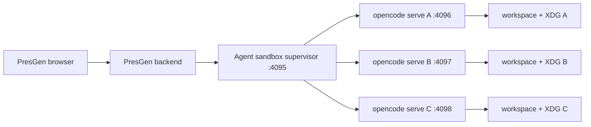
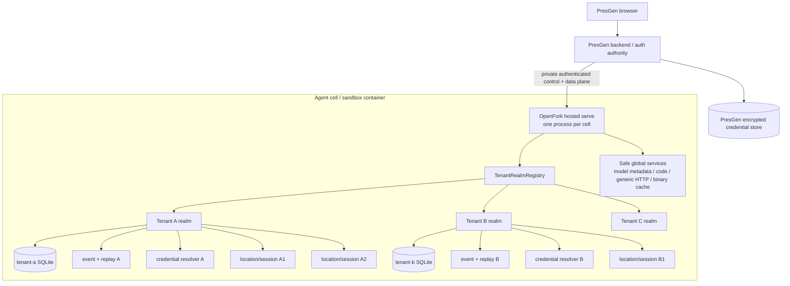
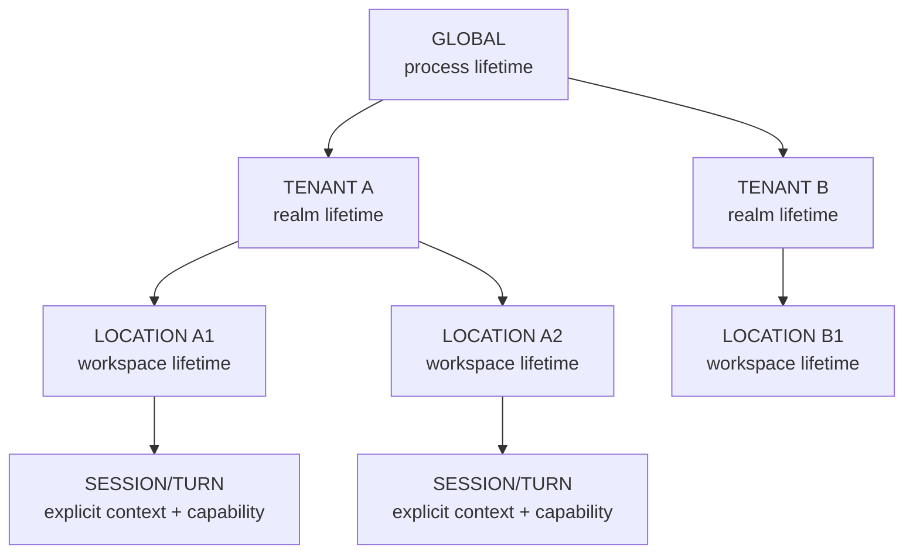
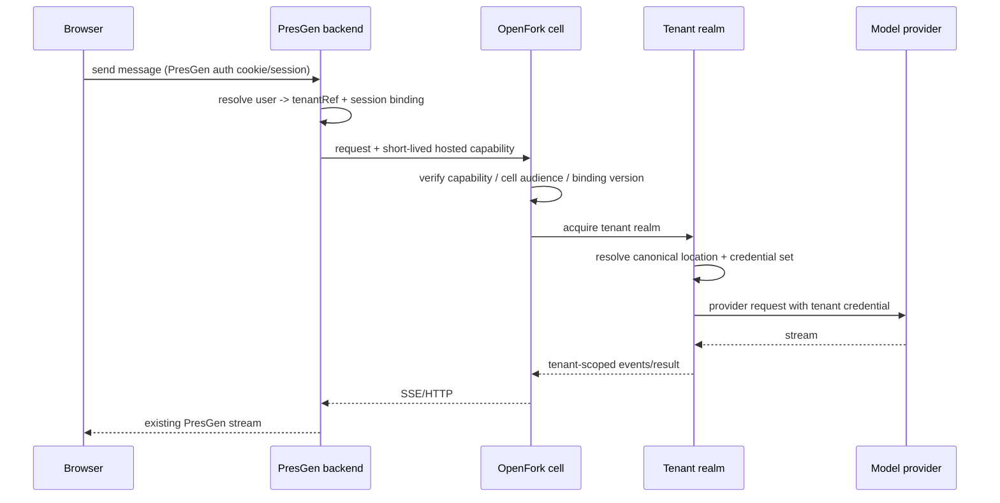
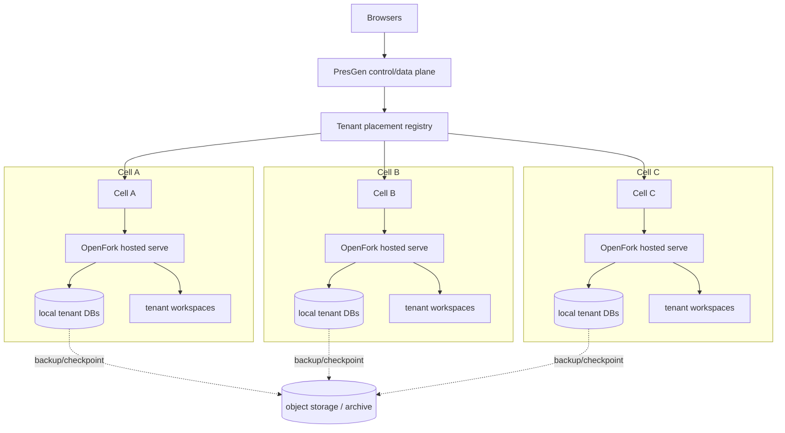

# OpenFork Hosted Multi-Tenant Serve Architecture

> Status: architecture draft, implementation not started  
> Scope: OpenFork server runtime + PresGen hosted integration  
> Initial deployment target: one shared OpenFork process inside one PresGen agent sandbox  
> Long-term target: bounded multi-tenant cells with deterministic tenant placement  
> Last audited: 2026-09-14
> Implementation task graph: [`tasks/00-INDEX.md`](tasks/00-INDEX.md)  
> Swarm execution contract: [`tasks/AGENTS.md`](tasks/AGENTS.md)

## Navigation

This is intentionally a full architecture record rather than a short proposal. The fastest reading paths are:

- **Decision / why:** §§0-4
- **Repository audit:** §5
- **Threat model / security contract:** §§6-7.1
- **Runtime design:** §§8-13
- **Hosted feature policy:** §§14-16
- **Bulk inference / streaming:** §§17-18
- **PresGen integration:** §§19-23
- **Service-scope migration:** §24
- **Horizontal scale / recovery / operations:** §§25-27
- **Verification / performance:** §§28-29
- **Execution plan:** §§30-34
- **Research sources:** §36

Key implementation gates are summarized in §34. A later implementation agent should not treat an earlier phase as authorization to skip those final gates.

## 0. Executive decision

PresGen should move from **one `opencode serve` process per agent session** to **one long-lived OpenFork hosted server process per cell**, but it must not do so by pointing many users at the current `serve` implementation unchanged.

The current OpenFork runtime still contains process-global credential, database, event, path, plugin-account, and configuration state. A naive shared process would create real cross-tenant data and credential leakage risks. The correct architecture is an explicit, opt-in hosted mode that adds a first-class tenant isolation scope inside OpenFork while preserving normal standalone OpenFork behavior.

The target is a **bridge isolation model**:

- Pool the expensive, safe-to-share compute and immutable runtime state.
- Isolate tenant databases, credentials, event/replay state, mutable account state, quotas, caches, and workspace roots.
- Keep location/workspace state below the tenant boundary.
- Keep session/turn capabilities below the location boundary.
- Run untrusted tool subprocesses under tenant-scoped OS identities and resource limits.
- Keep PresGen as the external authentication, tenant membership, billing, and durable secret authority.
- Keep the browser talking only to PresGen. It never talks directly to hosted OpenFork.
- Start with one cell and one OpenFork process, but introduce cell identity and tenant placement from day one so horizontal scale does not require redesigning the protocol.

The design goal is not merely "multiple API keys in one process." The goal is:

> **One process, many cryptographically established tenant realms, zero ambient tenant authority, isolated persistence, isolated credentials, bounded shared resources, and a migration path back to a dedicated cell when a tenant requires stronger isolation.**

### 0.1 The most important release gate

Application-level tenant scoping is necessary but insufficient because agents execute tools and shell subprocesses.

PresGen's current supervisor calls `apply_proc_isolation(...)` with `demote_uid_gid=False` and `uid=0`, so current agent serve processes still run as root inside the shared sandbox container. The repository already contains a stronger Tier-A process isolation implementation (`proc_isolation.py`) that supports distinct UID/GID demotion, `umask=077`, `PR_SET_DUMPABLE(0)`, and `PR_SET_NO_NEW_PRIVS(1)`, but the live supervisor has not enabled UID/GID demotion.

**Hosted multi-tenant mode must not be declared production-safe until tenant-scoped child-process identity and filesystem permissions are actually wired and adversarially tested.**

The shared OpenFork process itself is trusted infrastructure and must be able to broker all tenant realms. Arbitrary agent commands, LSPs, MCP processes, and other child processes are not trusted infrastructure and must not inherit that privilege.

---

## 1. Why this exists

PresGen currently gets most of its OpenCode isolation by creating a per-session workspace and then spawning a dedicated `opencode serve` process for that session. This has useful security properties around environment variables and XDG roots, but it scales poorly.

Current topology:



Every live session duplicates a substantial amount of runtime machinery:

- JavaScript/Bun runtime state
- module graph
- HTTP listener and sockets
- Effect service graph
- database handles
- model/provider initialization
- event/replay machinery
- plugin state
- caches
- process bookkeeping
- port allocation

The current supervisor also has an explicit 100-port session range (`4096..4195`), making process/port allocation itself a scaling ceiling.

The desired topology removes the duplicated server process while retaining security boundaries:



This design turns process isolation into a **runtime realm boundary** for state that does not require an OS process, while retaining OS isolation for executable child workloads.

---

## 2. Terminology

### Tenant

An opaque security principal representing the owner of agent runtime state.

For PresGen v1, a tenant can map 1:1 to the current user/account that owns provider credentials. The OpenFork contract must not assume that forever. A future PresGen organization/team can become the tenant while individual people become actors inside that tenant.

OpenFork receives an opaque `tenantRef`; it does not need PresGen user IDs, emails, or other identity details.

### Actor

The authenticated human/service initiating an operation. Actor identity is useful for audit but is not the storage isolation key.

### Tenant realm

A scoped OpenFork runtime containing tenant-owned mutable state: database, credentials, event stream/replay state, quotas, account pools, and other tenant-sensitive services.

### Location

OpenFork's existing directory/workspace scope. A tenant can have many locations. PresGen normally creates one isolated location per agent session.

### Session

An OpenFork conversation/session inside a location. Session IDs remain opaque identifiers, not authorization credentials.

### Cell

A bounded deployment unit containing one hosted OpenFork process plus local tenant data/workspaces for a subset of tenants. Phase 1 has exactly one cell. Later scale-out adds cells rather than turning one process into an unbounded global singleton.

### Control plane

Trusted PresGen-to-OpenFork operations that provision, bind, rotate, revoke, drain, or inspect tenant runtime resources.

### Data plane

The normal session/message/event/question/permission/tool-facing OpenFork API after a tenant/session binding exists.

---

## 3. Non-goals

The first implementation is deliberately not all things to all deployments.

1. **No active-active writes to one tenant SQLite database across hosts.**
2. **No shared database with a `tenant_id` retrofit across every OpenFork table in v1.**
3. **No direct browser-to-OpenFork hosted API.** PresGen remains the public boundary.
4. **No arbitrary tenant-installed plugins in hosted mode.** Hosted code is operator-pinned.
5. **No promise that in-process tenant isolation survives arbitrary code execution inside the trusted OpenFork process.** Full process RCE is a cell compromise; cells bound blast radius.
6. **No requirement that every OpenFork provider/plugin works in shared hosted mode on day one.** Unsafe providers remain on a compatibility lane until tenantized.
7. **No requirement to horizontally scale in phase 1.** The protocol and persistence layout must merely avoid making scale-out impossible.
8. **No redesign of standalone OpenFork around PresGen.** Hosted mode is an additive product capability.

---

## 4. Research basis

This plan intentionally follows established multi-tenant design guidance rather than inventing a proprietary isolation vocabulary.

### 4.1 AWS: isolation is separate from authentication

AWS's SaaS architecture guidance explicitly distinguishes tenant isolation from ordinary authentication/authorization. A user being authenticated does not establish that one tenant cannot access another tenant's resources.

Implication for OpenFork: PresGen login alone is not the isolation boundary. Hosted OpenFork must establish and propagate verified tenant context independently of resource IDs and directory selectors.

### 4.2 AWS: pool, silo, and bridge

AWS uses three useful categories:

- **Pool**: tenants share resources.
- **Silo**: tenants receive dedicated resources.
- **Bridge**: a system intentionally combines both at different layers.

OpenFork hosted mode should be a bridge model:

| Layer | Target model |
| --- | --- |
| Process/runtime code | pooled |
| Immutable model metadata | pooled |
| Generic outbound HTTP engine | pooled |
| NPM/binary artifact cache | pooled and integrity-controlled |
| Tenant database | siloed per tenant |
| Tenant credentials/account pools | siloed per tenant |
| Tenant event/replay state | siloed per tenant |
| Workspace | siloed per session/tenant |
| Tool child process identity | siloed per tenant/session |
| Cell | pooled for a bounded tenant set; dedicated cells remain possible |

This gives most of the process-sharing efficiency without making every security-sensitive object depend on a correctly remembered `tenant_id` predicate.

### 4.3 OWASP: tenant context must be established once and propagated

OWASP's Multi-Tenant Security guidance recommends establishing tenant context early in a universal request boundary, deriving it from server-verified identity rather than trusting a caller-provided tenant header, and propagating that verified context through storage, caches, queues, and asynchronous work.

Implication for OpenFork: `x-opencode-directory`, session IDs, question IDs, or a raw `X-Tenant-ID` are selectors at most. They cannot become authority.

### 4.4 Azure: shared app tier + dedicated database is a standard shape

Azure's multitenant storage guidance explicitly describes a shared application tier with a dedicated database per tenant. It raises operational cost relative to a shared database, but provides stronger data isolation while preserving shared compute density.

This maps unusually well to OpenFork because SQLite databases are cheap to provision and OpenFork already expects a local SQLite database.

### 4.5 SQLite: keep WAL local to a host

SQLite's own guidance states that WAL-mode databases must be used by processes on the same host as the database file; network filesystems are not an appropriate route to multi-host concurrent writers.

Implication: scale-out should pin each tenant database to one cell/host and move the tenant between cells through a controlled drain/checkpoint/copy/restore operation. Do not put active tenant SQLite WAL files on NFS/SMB and let multiple OpenFork nodes write them.

### 4.6 SaaS noisy-neighbor guidance

AWS emphasizes that pooled tenants create unpredictable load and require tenant-aware throttling, consumption metrics, and reliability testing. Shared OpenFork compute therefore requires a scheduler and bounded queues, not merely a bigger `Promise.all`.

### 4.7 Kubernetes: control-plane and data-plane isolation are separate requirements

Kubernetes' official multi-tenancy guidance distinguishes control-plane isolation from data-plane isolation and notes that mutually untrusted tenants require particular attention to the much larger data-plane attack surface.

The analogy is useful even though OpenFork is not Kubernetes:

- OpenFork tenant realms, request authorization, DB/event boundaries and control APIs are the **control/state-plane isolation** problem.
- Shells, LSPs, MCP processes, workspace permissions, process identity and resource exhaustion are the **execution/data-plane isolation** problem.

Passing one half does not prove the other. This is why hosted production gates require both tenant runtime tests and hostile child-process tests.

### 4.8 Cells/deployment stamps are the intended horizontal-scale unit

AWS cell-based architecture guidance and Azure's Deployment Stamps pattern both use independent copies of a service to host bounded subsets of customers/tenants. The point is not only capacity: cells/stamps limit overload and deployment failure blast radius and give large/high-isolation tenants a path to dedicated infrastructure.

Implication for OpenFork: one shared process is **phase 1's scale unit**, not a future global singleton. PresGen should persist tenant placement (`tenantRef -> cellID + placementEpoch`) so another cell can be added without changing tenant identity, capability or persistence semantics.

---

## 5. Current-state audit

This section records the actual repository seams as of 2026-09-14. It is the baseline against which implementation work should be reviewed.

### 5.1 OpenFork already has a useful two-level runtime model

`packages/core/src/effect/app-node.ts` currently defines:

```ts
export const tags = LayerNode.tags({
  location: ["global"],
  global: [],
})
```

The existing model is therefore:

```text
global
  └── location
```

`InstanceState` then provides per-directory mutable state using a `ScopedCache` keyed by directory.

This is a very strong substrate for hosted mode. We do not need to invent a second dependency framework beside Effect.

### 5.2 Proposed OpenFork-native scope lattice

Add a middle tenant scope:

```ts
export const tags = LayerNode.tags({
  location: ["tenant", "global"],
  tenant: ["global"],
  global: [],
})
```

Target hierarchy:



This should be implemented as a real scope in the service graph, not a convention that developers must remember manually.

### 5.3 Location services already prove the dynamic-scope pattern

`packages/core/src/location-services.ts` builds a `LayerMap` of location service graphs and already uses:

- `LayerNode.hoist(...)`
- shared global dependencies
- `Layer.fresh`
- an idle TTL (`60 minutes` today)

The tenant realm registry should use the same architectural idea one level up:

- hoist process-safe globals once
- build a fresh tenant graph per `TenantRef`
- build locations beneath that realm
- close/evict the tenant scope after an idle TTL

Do not create a parallel bespoke IoC/runtime system.

### 5.3.1 Important feasibility finding: the shared Effect memo map is itself an isolation boundary

`packages/core/src/effect/memo-map.ts` exports one process-global `Layer.makeMemoMapUnsafe()`, and the current `AppRuntime` uses that memo map when constructing its `ManagedRuntime`.

This means a naive implementation like "create one `ManagedRuntime` per tenant" is **not automatically isolated** if every runtime is constructed with the existing shared memo map. Equal layer identities may be memoized back to one service instance.

Hosted implementation rule:

> A tenant realm must use fresh realm-local layer memoization for every tenant-sensitive service. Cross-realm sharing occurs only through explicitly hoisted/injected process-safe services.

This gives us a safe incremental implementation path:

1. **Safety prototype:** create a fresh tenant runtime/memoization boundary, even if this duplicates more Effect service instances than the final design.
2. Prove DB/auth/event/credential isolation and measure the memory win from eliminating duplicate OS/Bun processes.
3. Add the formal `tenant` node tag and deliberately hoist audited process-safe services out of tenant runtimes.
4. Re-benchmark after each hoist. A service is promoted to process-global only when its state is demonstrably tenant-invariant.

This is preferable to optimizing service sharing before the security boundary is proven.

### 5.4 Global database is incompatible with strong pooled isolation

`packages/core/src/database/database.ts` currently exposes `Database.node` as a global node and resolves the DB filename from process-global paths/flags.

Many resource APIs then query by opaque ID alone. Example: V1 `Session.get` fetches `SessionTable.id == id` without proving the row belongs to the current directory/project/tenant.

This is safe enough in a process whose database itself is per-session/per-user, but unsafe if many unrelated tenants share that database.

**Decision:** hosted v1 gets one SQLite database per tenant realm.

This changes the failure mode of a guessed foreign `ses_...` ID from "application code must remember a tenant predicate" to "that row physically does not exist in this tenant's database."

### 5.4.1 Reclassifying the database has a deliberate dependency cascade

A repository audit found more than one hundred source/test references to `Database.node`. Production global services that currently depend on it include event persistence/projectors, credentials, usage, saved permissions, goals/automation, project directories, session stores, and other durable services.

That is not an argument against a tenant database. It is evidence that database ownership is currently one of the roots of the global service graph.

The formal tenant-tag migration should use the type system as a guardrail:

```text
global process service
    cannot depend on
tenant service

tenant service
    may depend on
global process service

location service
    may depend on
tenant + global services
```

When `Database.node` becomes tenant-scoped for the hosted graph, anything that truly stores tenant data should be forced to move with it. Anything that is genuinely process-global but currently piggybacks on the same database, such as standalone pairing/device infrastructure, must either:

- use a separate process/control-plane database, or
- stay out of the hosted tenant runtime entirely.

This compile-time cascade is desirable. Silently leaving a data-dependent "global" service above the tenant boundary would be much more dangerous.

### 5.5 Auth is process-global today

`packages/opencode/src/auth/index.ts` currently binds auth to:

```text
Global.Path.data/auth.json
```

and can also read `OPENCODE_AUTH_CONTENT` from `process.env`.

This cannot be the hosted credential source. A single hosted process must never select PresGen tenant credentials through process-global auth state.

### 5.6 `Global.Path` is a broad ambient-state seam

A repository text audit found 103 direct `Global.Path` references under `packages/opencode/src`.

Tenant-sensitive examples include:

- auth file
- config directory
- MCP auth
- model preferences
- quota cache
- storage
- snapshot/checkpoint state
- plan files
- worktree state

Some `Global.Path` uses are legitimately process-global, such as operator-managed binary caches. Others are tenant data.

**Required migration rule:** every direct path dependency must be classified as `global`, `tenant`, or `location`; tenant-sensitive code in hosted mode must consume an injectable path service rather than module-level `Global.Path` constants.

### 5.7 `process.env` is also ambient authority

A repository text audit found 112 direct `process.env` references under `packages/opencode/src`.

Not all are dangerous. Process startup flags are legitimately global. Provider credentials are not.

Particularly unsafe hosted examples include provider code that writes credential material back into `process.env`, such as AWS bearer-token and AI Core credential paths.

Hosted mode must establish a rule:

> **No tenant-varying secret or authorization decision may be sourced from or written to process-global environment state.**

### 5.8 Provider caches are already closer to correct

`packages/opencode/src/provider/provider.ts` stores provider/model/SDK/language-model state inside `InstanceState`, meaning it is currently keyed by directory rather than being one module-global provider client.

That is a useful safety property. Initial hosted mode should keep credential-bearing provider SDK objects location-scoped. We can optimize further later only after proving that a given client contains no tenant-varying closure state.

Do not prematurely pool SDK instances merely because their constructor arguments hash to the same value.

### 5.9 OpenFork Zen/Go account pooling is currently module-global

`packages/opencode/src/plugin/zen.ts` currently contains module-global mutable state including:

- `ZenAccountPool`
- vault runtime
- vault-sync timestamp
- in-flight vault-sync promise

The fork credential store in `packages/opencode/src/fork/credentials.ts` is also backed by the shared OpenFork database and models one active credential.

Per-tenant databases solve the fork credential table boundary, but the module-global Zen pool itself must still become tenant-scoped before Zen/Go is enabled in hosted shared mode.

### 5.9.1 Mutable-singleton sweep found additional hosted-mode blockers

A broad source scan found 258 `new Map(...)` constructions under `packages/opencode/src`. Most are ordinary function-local collections and are harmless. The important result is that **the Effect service graph is not the only place mutable lifetime exists**: several modules own process-level registries, callbacks or caches directly.

Specific seams that require explicit hosted classification include:

- `mcp/oauth-callback.ts` owns a module-global callback server plus `pendingAuths` and `mcpNameToState`. Interactive MCP OAuth is therefore **disabled in hosted v1** until callback state and ownership are tenant-aware or moved behind PresGen.
- `server/routes/instance/httpapi/handlers/experimental.ts` owns process-global OpenRouter free-usage trackers. Hosted experimental usage routes must be disabled or tenantize this registry.
- `control-plane/adapters/index.ts` owns a module-global project-to-adapter registry. Built-in immutable adapters are safe; tenant/plugin-installed custom adapters are not allowed to register process-wide in hosted mode.
- `genspark/catalog.ts` caches catalogs using `${apiKey}::${host}` as the in-memory key and also has a disk-cache path. A raw secret must not become a long-lived JavaScript `Map` key in hosted mode. Genspark remains uncertified until its cache identity uses a non-secret credential handle/fingerprint and its disk cache is assigned a safe scope.
- `plugin/openai/ws-pool.ts` keys persistent response WebSockets by `sessionID`. That can be safe only if the entire WebSocket-pool instance is constructed below the tenant/location boundary. A process-global pool keyed by session ID alone is not acceptable.
- `plugin/azure.ts` caches Azure CLI access tokens inside the plugin-hook instance and also reads the machine's process-global Azure CLI/environment identity. Azure CLI OAuth is therefore a standalone feature, not a hosted tenant credential path, until it has an explicitly tenant-scoped auth implementation.

Other account/provider caches (`WorkBuddy`, Verdent, quota registries, usage caches, MCP pending transports and similar modules) must be covered by the state-boundary inventory before their hosted feature flag can be enabled.

This produces an additional hosted invariant:

> **No tenant secret may be used directly as a process-lifetime cache key.** Use an opaque credential-handle ID plus version or a one-way, purpose-specific fingerprint when secret-dependent cache partitioning is unavoidable.

The implementation campaign should make this auditable rather than depending on memory. A lightweight static inventory/lint should flag module-scope mutable containers and direct tenant-sensitive environment/path access in hosted-sensitive packages, with explicit reviewed allowlist entries for intentional process-global state.

### 5.10 Event state is shared more broadly than hosted mode should tolerate

Core `EventV2.node` is currently global and database-backed. `EventV2Bridge` owns a process-level replay ring and still bridges into a module-global `GlobalBus` compatibility emitter.

The existing SSE route filters events by directory/workspace, which is useful but is not the strongest possible tenant isolation. A malformed producer that omits or mis-tags location metadata could broaden exposure.

**Decision:** tenant-owned events/replay should live in the tenant realm. Global infrastructure events must use a deliberately separate process-global channel.

### 5.11 Question, permission, session-status, and legacy job state are mostly location-scoped

Good existing boundaries:

- `Question` pending requests use `InstanceState`.
- `Permission` pending/approved state uses `InstanceState`.
- `SessionStatus` uses `InstanceState`.
- the legacy `BackgroundJob` wrapper gives the core registry an `InstanceState` boundary.

These can stay location-scoped after the tenant boundary is established, but direct lookup/reply endpoints still need the tenant/location middleware. A request ID is never permission to access a request.

### 5.12 Browser host state is global

`BrowserHostBroker.node` is a global service owning host registrations, tab ownership, and in-flight request state.

That design is appropriate for one standalone desktop app but is not automatically safe for hosted multi-tenancy. PresGen hosted mode should initially disable this route/tool family unless the broker is explicitly keyed by tenant and the callback host itself is authenticated as belonging to that tenant.

### 5.13 PresGen already has most of the external identity primitives we need

PresGen's `supervisor_contract.py` already defines:

- a keyed, opaque `user_ref`
- provider/auth-mode registry
- deny-by-default child environment construction
- bridge token
- workspace binding
- planned exact owner-root path containment
- credential shape validation
- resource limits

This should evolve into the hosted tenant/session registration contract instead of being discarded.

### 5.14 PresGen currently downloads upstream OpenCode, not OpenFork

`backend/agent-sandbox.Dockerfile` pins `OPENCODE_VERSION=1.17.11` and `backend/scripts/prepare_opencode.py` downloads the upstream `opencode-linux-x64` npm artifact.

The first migration phase must change PresGen to a pinned OpenFork build artifact while keeping today's per-session process topology. This decouples "switch product binary" from "switch isolation architecture" and gives us a clean rollback point.

---

## 6. Threat model

### 6.1 Assets

- provider API keys and OAuth tokens
- OpenFork session/message history
- PresGen project/slide data reachable through bridge tools
- tenant workspace files
- downloads/scratch artifacts
- tool outputs and logs
- question/permission requests
- background-agent state
- quota/usage/account metadata
- browser/MCP/LSP/process handles
- audit/event history

### 6.2 Adversaries and failures we design for

1. A normal tenant intentionally guesses another tenant's session/request IDs.
2. A compromised browser attempts to forge tenant or directory headers.
3. An agent hallucination constructs a path outside its assigned root.
4. A malicious file/instruction causes an agent to execute shell commands that try to enumerate sibling workspaces.
5. One provider/plugin accidentally reads global auth or environment state.
6. A cache omits tenant context and returns another tenant's object.
7. An async/background task loses tenant context after enqueue.
8. An SSE/event producer omits location metadata and leaks an event.
9. A tenant floods turns/subagents/tools until other tenants starve.
10. A provider key rotates while cached clients are still alive.
11. OpenFork crashes while many tenants have active streams.
12. A tenant realm is evicted while delayed async work still exists.
13. A stale PresGen backend sends requests to the wrong OpenFork cell after migration.
14. A bug exposes a control-plane endpoint to a data-plane capability.
15. Logs/errors accidentally serialize secrets.

### 6.3 Adversaries outside the in-process isolation promise

If an attacker gains arbitrary native-code execution or arbitrary JavaScript execution inside the trusted shared OpenFork process, every active tenant in that cell may be exposed. JavaScript process memory is not a hard security boundary.

Mitigations are blast-radius controls, not magical in-process secrecy:

- operator-controlled hosted plugin allowlist
- no tenant arbitrary plugin installation
- restrictive container profile
- cells with bounded tenant count
- dedicated cell/process tier for tenants that require stronger isolation
- fast credential revocation
- minimal plaintext secret residence

This limitation must be explicit in security documentation.

---

## 7. Security invariants

These are implementation assertions, not aspirations. A change that violates one is an architecture regression.

### Identity and authority

1. The browser cannot authoritatively choose `tenantRef`.
2. A raw tenant header is never trusted as identity.
3. Tenant context is established at one universal hosted middleware boundary from a PresGen-verifiable capability.
4. Tenant context is immutable for the lifetime of that request/fiber/task.
5. Opaque IDs reduce enumeration but never replace authorization.
6. Cross-tenant resource guesses return an indistinguishable not-found/unauthorized result without confirming existence.

### Storage

7. A hosted tenant request can access only that tenant's database service.
8. Active SQLite WAL files are never concurrently mounted/written by multiple cells.
9. Tenant database filename/root is resolved server-side from verified `tenantRef`, never from a caller-provided arbitrary path.
10. Backups and archives retain tenant ownership metadata outside the archive payload itself.

### Credentials

11. Hosted tenant credentials never fall back to standalone `auth.json` or process environment.
12. Missing tenant credentials fail closed.
13. Credential cache keys include tenant scope and credential version.
14. Rotation/revocation invalidates only the affected tenant/provider/credential clients.
15. Secret values never appear in OpenFork API responses, telemetry labels, normal logs, exception serialization, or crash metadata by design.

### Cache and events

16. Every cache entry is explicitly classified global, tenant, location, or session.
17. Tenant-varying values cannot use a process-global key.
18. Hosted event and replay state is tenant-owned.
19. SSE subscriptions are created only after tenant+location authorization.

### Async execution

20. Tenant context is captured from the verified server context at enqueue, not accepted from job payload data.
21. Background work re-enters the owning tenant realm at execution time.
22. Realm eviction cancels or drains realm-owned fibers before disposing credentials/database state.
23. Late work from an evicted generation cannot mutate a newly rehydrated realm with the same tenant ID.

### Filesystem and processes

24. Session workspace paths are canonicalized and contained under the server-derived tenant root.
25. Tenant tool subprocesses run under a tenant-scoped unprivileged OS UID/GID or a stronger isolation primitive.
26. Child process environments are constructed from an allowlist, never inherited wholesale from the hosted OpenFork process.
27. Tenant-controlled code cannot install/load arbitrary in-process OpenFork plugins in hosted mode.
28. Subprocesses cannot read sibling tenant workspace files by ordinary filesystem permissions.

### Availability

29. Every shared bottleneck has both a global safety bound and tenant-aware fairness/limits.
30. Subagents inherit the parent's tenant budget instead of creating new unaccounted capacity.
31. One tenant cannot fill an unbounded global queue.

---

## 7.1 Rejected shortcuts and anti-patterns

These approaches look cheaper than tenant realms but are explicitly rejected.

### Mutating `XDG_*` or `process.env` around each request

Rejected.

Environment variables are process-global mutable state. Concurrent requests would race. OpenFork also computes important `Global.Path` values from XDG locations at module initialization, so changing environment variables after startup would not reliably redirect all consumers anyway.

Tenant paths and credentials must be explicit scoped services, not ambient process mutations.

### Passing a tenant API key in one request header and otherwise sharing provider state

Rejected as the architecture.

A request header does not automatically scope provider SDK objects, retry/backoff state, OAuth refresh state, custom fetch closures, account pools, usage attribution, or background work that survives the request. Credential selection belongs to the tenant/location runtime context and versioned cache identity.

### Treating random session IDs as isolation

Rejected.

Opaque IDs are useful enumeration resistance, not authorization. The current session store has direct ID lookups. Hosted authorization must be established before resource access, and per-tenant databases provide structural defense in depth.

### One shared SQLite DB plus application predicates everywhere in v1

Rejected for the first hosted implementation.

It is possible, but it creates an enormous authorization surface across existing and future tables and direct-ID helpers. The operational savings are not worth the initial tenant-escape risk.

### One SQLite tenant DB mounted from network storage and written by several OpenFork nodes

Rejected.

SQLite/WAL is designed around local host coordination. Scale with cell ownership and controlled migration, or move to a client/server database if active multi-host writing becomes a requirement.

### One unbounded shared OpenFork process for the entire future service

Rejected.

Phase 1 has one instance because that is the simplest useful deployment, not because the architecture assumes infinite vertical scaling. Cell identity, capacity and tenant placement exist from the beginning so adding another cell is an operational expansion rather than a protocol rewrite.

### Running the shared OpenFork server as root so it can demote tools

Rejected as the preferred production end state.

Prefer a restricted shared server identity plus a narrowly scoped spawn broker/supervisor for UID/GID, namespace and cgroup setup. The trusted server process should not retain broad root privileges merely for process creation convenience.

### Arbitrary tenant-supplied in-process plugins

Rejected.

An in-process plugin has the authority of the shared server and therefore the authority to inspect other active tenant memory. Hosted mode uses operator-pinned plugins/tools only. Extensible tenant code must run out of process under tenant confinement.

---

## 8. Target runtime architecture

### 8.1 Global process scope

The global scope contains only resources proven safe to share across tenants.

Candidate global services:

- static model metadata/catalog snapshots that contain no tenant availability/auth decisions
- generic HTTP transport/pool without attached tenant headers
- immutable application code
- integrity-controlled package/binary cache
- filesystem/path primitives
- observability exporter infrastructure
- process/cell health
- tenant realm registry itself
- scheduler infrastructure, with tenant identity on every admitted unit
- cell-wide resource accounting

Anything that contains credentials, tenant-specific configuration, tenant data, or tenant-specific authorization state is not global.

### 8.2 Tenant scope

Proposed new `makeTenantNode` services include:

- tenant database
- tenant runtime paths
- hosted credential resolver
- tenant EventV2/event replay
- tenant credential/account pools
- tenant quota/usage aggregation
- tenant-level scheduler/accounting state
- tenant-scoped global config overlay where applicable
- tenant archive/backup state
- tenant audit context

The tenant graph should be a scoped resource. Closing it must:

1. stop accepting new work
2. drain or cancel active work according to policy
3. close streams/listeners
4. stop child processes owned by the realm
5. checkpoint/close SQLite handles
6. release provider clients
7. remove plaintext credential references from application-owned maps
8. close the Effect scope

### 8.3 Location scope

The existing location concept stays useful beneath a tenant:

- directory/workspace config
- provider SDK/language model client state initially
- tool registry
- agent definitions
- skill discovery
- question/permission state
- LSP
- MCP
- PTY/shell job handles
- background jobs
- file index/watchers
- snapshots/checkpoints scoped to location

The location cache key should become structurally tenant-aware. Even if canonical tenant roots make directory collisions practically impossible, the key should be conceptually:

```text
tenantRef + canonicalDirectory + workspaceID
```

rather than assuming directory uniqueness is a security primitive.

### 8.4 Session/turn context

Session and turn state does not necessarily need a fourth app-node tag. It can remain explicit immutable context carried through the request/fiber:

```text
TenantRef
CellEpoch
PresGenSessionRef
OpenForkSessionID
LocationRef
ActorRef (audit only)
CredentialSetRef
CredentialVersion
BridgeCapabilityRef
PriorityClass
Cancellation generation
```

Session/turn context must not be recovered from ambient globals.

---

## 9. Tenant realm registry

### 9.1 Interface sketch

Conceptually:

```ts
interface TenantRealmRegistry {
  acquire(ref: TenantRef): Effect<TenantRealmLease>
  drain(ref: TenantRef, reason: DrainReason): Effect<void>
  evict(ref: TenantRef): Effect<void>
  invalidateCredentials(ref: TenantRef, version: number): Effect<void>
  stats(): Effect<RealmStats[]>
}
```

`acquire` returns a lease bound to a realm generation. A generation prevents stale async work from mutating a new realm after eviction/recreation.

### 9.2 Lazy creation

A registered tenant does not imply a resident tenant realm.

On first data-plane use:

1. verify capability
2. resolve cell/tenant binding
3. single-flight tenant creation
4. open tenant SQLite
5. load only minimum required tenant services
6. create requested location lazily

### 9.3 Idle eviction

Tenant realms need an idle TTL to prevent thousands of registered tenants from creating thousands of open SQLite pairs/provider caches forever.

Eviction should consider:

- active turns
- SSE subscribers
- pending questions/permissions
- active child processes
- background jobs
- recent request timestamp
- dirty/checkpoint state

Start with a configurable conservative TTL. Measure before choosing the production value.

### 9.4 Hot-realm cap

TTL alone does not protect against a burst that activates every tenant once. The registry needs a maximum number of hot realms or an equivalent memory budget.

When over budget:

- evict least-recently-used idle realms first
- never evict a busy realm just to admit another request
- if no idle victim exists, queue/reject new realm activation with explicit backpressure

### 9.5 Realm lifecycle must be an explicit state machine

Avoid encoding lifecycle as a handful of booleans such as `loaded`, `draining`, and `healthy`. Concurrent acquire/evict/credential-rotation/crash paths become much easier to reason about with one authoritative state plus a monotonically increasing generation.

Recommended in-process realm states:

```text
COLD
  -> STARTING
  -> HOT
  -> DRAINING
  -> EVICTING
  -> COLD

STARTING  -> FAULTED
HOT       -> FAULTED
DRAINING  -> FAULTED
FAULTED   -> EVICTING -> COLD
```

Rules:

- `COLD`: no open tenant DB/client/service scope and no plaintext credential bundle resident.
- `STARTING`: exactly one single-flight constructor owns activation. Other acquires wait on it; they do not create a second realm.
- `HOT`: accepts admissions subject to scheduler/capability policy.
- `DRAINING`: rejects new turn admissions but permits cancellation, terminal replies, state reads and bounded completion of already-admitted work.
- `EVICTING`: no new leases; child work is terminated/drained, DB is checkpointed/closed, scope finalizers run.
- `FAULTED`: never silently reused. The current generation is poisoned until teardown completes.

Every transition that creates a new runtime instance increments `realmGeneration`. Long-lived work captures `(tenantRef, realmGeneration)` when admitted. A completion from generation `n` cannot mutate generation `n+1` after an eviction/restart race.

Credential rotation normally does **not** require a realm-generation change. It increments `credentialVersion`, invalidates the affected provider clients, and lets unrelated tenant state stay hot. Use realm replacement only when an auth mechanism cannot be safely refreshed in place.

### 9.6 Realm lease semantics

`acquire()` should return a scoped lease rather than the raw realm object. A lease:

- increments an active-user counter
- contains the immutable tenantRef/generation
- is released automatically with request/fiber scope
- prevents ordinary idle eviction while active
- does not itself grant resource authorization; the hosted capability/session binding still does that

This keeps memory lifecycle and authorization as separate concerns.

---

## 10. Hosted request identity and capability design

### 10.1 Separate standalone server auth from hosted tenant auth

Current OpenFork Basic server auth is process-wide. Keep it for standalone/server administration.

Hosted data-plane authorization needs a separate construct.

Recommended model:

- PresGen authenticates the public user.
- PresGen resolves the authoritative tenant and session binding.
- PresGen mints a short-lived OpenFork capability.
- OpenFork validates it before loading a tenant realm.
- The capability identifies the tenant and session binding but contains no provider secret.

### 10.2 Prefer asymmetric capability signatures

For production hosted mode, prefer Ed25519 or another modern asymmetric signature:

- PresGen holds the private signing key.
- OpenFork cell holds only the public verification key.
- Compromise of an OpenFork cell cannot mint new PresGen-authorized tenant capabilities.

HMAC can remain a development/transition option but creates a larger signing blast radius.

### 10.3 Suggested claims

Illustrative, not frozen:

```json
{
  "iss": "presgen",
  "aud": "openfork-cell:<cell-id>",
  "sub": "tenant:<opaque-ref>",
  "actor": "<opaque-actor-ref>",
  "session": "<presgen-session-ref>",
  "bindingVersion": 12,
  "credentialSet": "credset_...",
  "credentialVersion": 7,
  "scopes": ["session:read", "session:write", "events:read"],
  "iat": 0,
  "exp": 0,
  "jti": "..."
}
```

Do not place a caller-controlled filesystem path in the capability and then trust it directly. The session binding registry resolves the canonical path server-side.

### 10.4 Cell binding

The `aud` claim binds the capability to a cell ID/generation. After tenant migration, stale tokens for the old cell fail rather than accidentally writing both copies.

### 10.5 Universal middleware order

Hosted instance routes should execute in this order:

```text
request
  -> process/control auth where required
  -> hosted capability verification
  -> TenantRef provision
  -> TenantRealm lease
  -> session/workspace binding resolution
  -> canonical path containment
  -> Location/Instance context
  -> route handler
```

No tenant-owned route should be reachable around this stack.

---

## 11. Hosted session binding registry

Do not allow `x-opencode-directory` to act as authority in hosted mode.

PresGen should register an opaque session binding:

```text
HostedSessionBinding
  tenantRef
  presgenSessionRef
  canonicalWorkspaceRoot
  openForkSessionID?       // populated after create
  projectRef
  credentialSetRef
  credentialVersion
  bridgeURL / bridge capability reference
  policyProfile
  createdAt
  expiresAt / lastActiveAt
  bindingVersion
```

Data-plane requests identify the session binding. OpenFork resolves its location from trusted state.

For compatibility with the normal SDK, hosted middleware can still internally provide the same `InstanceRef`/`WorkspaceRef` expected by existing handlers after validation.

---

## 12. Database strategy

### 12.1 Decision: one SQLite database per tenant realm for hosted v1

Recommended path shape:

```text
/sandbox/tenants/<tenantRef>/data/openfork.db
```

or a PresGen-compatible equivalent derived from the existing opaque user/tenant root.

### 12.2 Why not one DB per process

A single pooled DB would require tenant ownership to be added and correctly enforced across:

- sessions
- messages/parts
- events
- credentials
- groups
- goals
- memory
- todos
- saved permissions
- usage
- fork credential mappings
- future tables added by upstream

Direct resource queries by ID already exist. Missing one predicate becomes a tenant escape.

### 12.3 Why not one DB per session

Per-session DBs preserve even stronger isolation but multiply handles/migrations/checkpoints and make tenant-wide services awkward. The tenant is the natural security principal for credentials, usage, session listing, and lifecycle.

Per-tenant DB is the best initial balance.

### 12.4 SQLite concurrency caveat

One tenant with many simultaneous sessions shares SQLite's writer. WAL gives excellent reader/writer behavior, but SQLite still serializes writers.

Benchmark explicitly:

- 1/4/8/16/32 simultaneous active sessions for one tenant
- message/event projection write contention
- p50/p95/p99 write latency
- WAL growth/checkpoint latency
- event-loop blocking

If a single giant tenant becomes a bottleneck, options are:

1. dedicated cell
2. tenant DB sharding by workspace/session family
3. eventual migration of hosted persistence to a client/server database

Do not solve a hypothetical future outlier by sacrificing v1 isolation simplicity.

### 12.5 Schema lifecycle

At scale, per-tenant DB means migrations must be automated.

Requirements:

- schema version recorded per DB
- lazy migration on realm activation plus proactive fleet migration tooling
- backward-compatible application rollout across at least one schema version where practical
- failed migration quarantines that tenant realm, not the whole cell
- migration telemetry tagged by opaque tenantRef

---

## 13. Credential architecture

### 13.1 PresGen remains the durable secret authority

PresGen already stores user provider credentials encrypted and does not expose them to the frontend. Keep this authority.

Hosted OpenFork should not create a second durable general-purpose PresGen secret database unless a concrete use case requires it.

### 13.2 Recommended v1 delivery: versioned in-memory credential bundle

PresGen supplies the tenant realm only the credentials needed by that tenant and supported hosted providers.

Properties:

- transferred only over authenticated private control-plane transport
- never returned by a read endpoint
- stored in tenant-realm memory
- tagged with monotonically increasing `credentialVersion`
- provider clients built from that version
- rotation invalidates affected clients
- realm eviction drops application-owned references
- OpenFork restart starts with no PresGen tenant secrets and rehydrates on demand

This avoids writing tenant keys to shared `auth.json` and avoids one credential lookup round trip on every model request.

Do not claim secure zeroization of provider secrets from the live Bun/JavaScript heap. Most provider libraries accept immutable strings, copies can exist inside SDK/client internals, and garbage collection does not provide cryptographic erasure guarantees. The realistic controls are to minimize plaintext lifetime and fan-out, avoid disk/log/telemetry persistence, drop application-owned references on rotation/eviction, restart cells when stronger purge semantics are required, and keep each cell's tenant population bounded so process compromise has a bounded blast radius.

### 13.3 Alternative: callback resolver

OpenFork could call PresGen whenever it needs a secret.

Advantages:

- shortest secret lifetime in OpenFork
- central audit/revocation point

Costs:

- PresGen becomes synchronous dependency of every cold provider call
- additional failure/latency path
- more secret traffic
- harder provider SDK construction

Recommendation: use versioned in-memory bundles in v1, with a callback resolver retained as a future option for high-security/dynamic-secret providers.

### 13.4 Credential sets, not just `provider -> key`

Do not freeze the design around one API key per provider.

Model:

```text
CredentialSet
  id
  version
  providers
    providerID -> [CredentialHandle]

CredentialHandle
  id
  type: api | oauth | auth-context
  secret/value
  metadata
  version
```

This supports:

- rotations
- OpenFork Zen/Go multi-key pools
- provider account selection
- OAuth metadata
- future organization-managed keys

### 13.5 Provider client cache safety

Initial rule:

```text
credential-bearing SDK/client <= location scope
```

Cache identity must include at least:

```text
tenantRef
credentialSetRef
credentialVersion
providerID
provider options that affect auth/endpoint
```

Later measurements can promote proven immutable/provider-factory state to global scope.

### 13.6 Never fall back

The most important credential rule in hosted mode:

```text
tenant credential missing
    != try process.env
    != try standalone auth.json
    != try another account pool

tenant credential missing
    == typed hosted credential error
```

---

## 14. Provider compatibility matrix

Hosted mode should have an explicit certification state per provider path.

| Provider class | Hosted v1 posture | Required work |
| --- | --- | --- |
| Pure API-key AI SDK provider | likely first wave | consume scoped credential resolver; eliminate process-env fallback |
| OpenAI/Anthropic/OpenRouter API keys | first-wave candidates | focused auth/cache isolation tests |
| OpenAI persistent WebSocket transport | allowed only below tenant/location scope | pool instance must not be process-global or keyed only by unscoped session ID |
| Zen / OpenCode Go multi-key | blocked until tenantized | replace module-global pool/vault sync with tenant service |
| Genspark | blocked initially | remove raw-secret cache identity; classify disk cache; certify scoped catalog/provider state |
| OAuth provider | gated | tenant token persistence/refresh + versioning |
| Azure CLI OAuth | standalone/compatibility lane | machine CLI login and token cache are not a hosted tenant identity source |
| Claude subscription CLI | compatibility lane initially | tenant auth-context projection + child identity + process lifecycle |
| Codex subscription CLI | compatibility lane initially | same as above |
| AWS/Bedrock paths touching `process.env` | blocked initially | remove process-global secret mutation |
| AI Core paths touching `process.env` | blocked initially | remove process-global secret mutation |
| Arbitrary tenant plugin | disabled | no in-process untrusted plugin execution |
| Operator-pinned PresGen plugin/tool | allowed after audit | no ambient tenant state |

PresGen can route unsupported providers through the existing per-session-process compatibility path during migration.

This hybrid rollout is safer than forcing every provider into the shared process before its state model is ready.

---

## 15. Config and plugin policy

Standalone OpenFork allows a flexible developer environment. Hosted OpenFork executes on behalf of mutually untrusted tenants and needs a different policy profile.

### Hosted profile requirements

- operator-pinned config baseline
- tenant cannot change process-global config
- tenant cannot install arbitrary NPM plugins into the shared process
- tenant cannot add an arbitrary in-process provider implementation
- MCP servers require allowlisting and run out-of-process under tenant identity
- LSP processes run out-of-process under tenant identity
- shell always runs out-of-process under tenant identity
- global package/binary cache is writable only through trusted installer paths, not arbitrary tenant commands
- config routes that mutate standalone global state are disabled or control-plane-only
- provider-auth mutation routes are disabled or mapped to PresGen's credential authority
- pairing/device/embedded UI routes are disabled unless explicitly required and tenant-safe

Hosted mode should be treated as a security profile, not just a boolean that changes the database filename.

---

## 16. Filesystem and OS isolation

### 16.1 Target root layout

Align with the existing PresGen opaque owner model, for example:

```text
/sandbox/<tenantRef>/
  home/
  data/
    openfork.db
  config/
  workspace/
    <sessionRef>/
      workspace/
      downloads/
      scratch/
```

The exact layout can differ, but tenant root ownership must be server-derived.

### 16.2 Path resolution rule

For every filesystem operation:

1. obtain tenant/session location from trusted binding
2. resolve/canonicalize requested path
3. reject traversal/symlink escape according to operation semantics
4. verify containment under allowed roots
5. apply tool permission policy
6. perform operation

Do not trust string prefix checks without canonicalization.

### 16.3 Wire the existing UID/GID isolation

The repository already has `derive_user_ref` and an unfinished process-isolation lane. Hosted production should derive a stable unprivileged UID/GID from tenantRef, create/chown tenant roots appropriately, and spawn tenant child processes under that identity.

At minimum:

- distinct UID/GID per tenant, where feasible
- `umask=077`
- `PR_SET_DUMPABLE(0)`
- `PR_SET_NO_NEW_PRIVS(1)`
- `close_fds=True`
- new process session/process group for cancellation
- no inherited provider secrets beyond the exact child requirement

### 16.4 Same-tenant concurrent sessions

Same tenant may intentionally share a UID. `PR_SET_DUMPABLE(0)` remains valuable so sibling processes cannot casually read each other's `/proc/<pid>/environ`.

### 16.5 Stronger future isolation

Evaluate progressively:

- per-session PID namespace
- user namespace
- mount namespace
- cgroup v2 per tenant/session
- seccomp/AppArmor profile
- dedicated container/cell for premium isolation tier

Do not block phase 1 on every strongest primitive, but do block production shared mode on basic UID/filesystem confinement.

---

## 17. Shared scheduler and "bulk inference"

The shared serve process only improves scalability if it has intentional admission control.

In this document, **bulk inference** means efficiently multiplexing many independent tenant turns through one orchestration server and its shared transport/runtime resources. It does **not** mean concatenating or batching unrelated tenants' prompts into one upstream model-provider request. Provider requests remain independently authenticated, cancellable, metered, retryable, and attributable unless a future provider-specific batching API can preserve those properties by construction.

### 17.1 What we are scheduling

Separate resource classes have different bottlenecks:

- active agent turns
- outbound model streams
- provider/API-key quotas
- CPU-heavy tools
- shell/LSP/MCP child processes
- browser/CDP operations
- background/subagent work
- SQLite write activity
- SSE output/backlog

One semaphore cannot model all of them.

### 17.2 Hierarchical admission

Every admitted unit should be checked against:

```text
cell global budget
  -> tenant budget/tier
     -> provider + credential budget
        -> session/operation budget
```

Examples:

- global active-turn cap protects process memory/sockets
- per-tenant active-turn cap prevents one tenant monopolizing all streams
- per-credential cap tracks upstream provider rate/concurrency limits
- per-session mutating-turn cap prevents conflicting concurrent mutation unless explicitly supported
- child-process cap protects PID/FD/memory pressure

### 17.3 Fair queue

Do not use one unbounded FIFO. A tenant can fill it before everyone else arrives.

Phase-1 scheduler can be simple:

- bounded queue per tenant
- round-robin dispatch across non-empty tenant queues
- configurable weight/tier
- interactive work before background work within a tenant
- hard global queue bound

Later, use deficit round-robin or weighted fair queuing if tiered throughput requires it.

### 17.4 Priority classes

Suggested ordering:

1. control/liveness/cancellation
2. interactive user turns
3. permission/question responses needed to unblock an interactive turn
4. explicit user background work
5. subagents
6. maintenance/indexing/compaction

Control-plane and heartbeat work must never queue behind model generation.

### 17.5 Provider backoff isolation

A `429 Retry-After` for tenant A's API key must not globally throttle tenant B's unrelated key.

Backoff state is keyed by:

```text
tenantRef + providerID + credentialHandle
```

unless the provider explicitly documents a broader account/global limit.

### 17.6 Cancellation

Cancellation is first-class capacity recovery:

- queued turn cancellation removes it immediately
- running provider stream abort releases its slot promptly
- tool process cancellation kills the process group
- tenant drain prevents new admissions and waits/cancels according to deadline

---

## 18. Event and streaming isolation

### 18.1 Tenant-owned event service

Tenant events, replay rings, and durable projectors should be bound to the tenant realm.

Benefits:

- impossible for tenant B's SSE route to enumerate tenant A's replay ring
- lower per-subscription filtering cost
- realm eviction naturally closes tenant listeners
- event sequence/replay epoch can be tenant-specific

### 18.2 Location filtering still matters

Within one tenant, SSE remains filtered by location/workspace/session as appropriate. Tenant isolation is an outer boundary, not a replacement for project/session routing.

### 18.3 Global events

Process health, cell capacity, and similar infrastructure events need a separate explicit global channel.

Do not encode "global" by publishing a tenant event with missing location metadata.

### 18.4 Backpressure

SSE subscribers need:

- bounded per-subscriber byte queues
- replay caps
- coalescing where semantics permit
- disconnect cleanup
- per-tenant aggregate stream limits

The current OpenFork event implementation already contains valuable replay/backpressure machinery. Hosted mode should preserve it inside the tenant boundary rather than reimplementing a simpler unsafe stream.

### 18.5 Current PresGen event topology cannot be reused unchanged

PresGen's current `/sessions/<session_id>/events` proxy opens an upstream OpenCode `/event` stream for that PresGen session and deliberately reads **all** events from it. The route's own comment explains why: one PresGen session owns one `opencode serve`, so every event emitted by that process belongs to the same PresGen security boundary, including subagent sessions.

That assumption becomes false the moment many tenants share one OpenFork process.

Hosted mode must therefore replace "all events from this process belong to me" with an explicitly authorized event subscription.

At minimum, a hosted event subscription is bound to:

```text
tenantRef
session binding / allowed location
primary OpenFork session
allowed child/subagent session lineage
```

An event lacking enough trusted ownership metadata to prove it belongs to the subscription is dropped/fails closed, not broadcast.

### 18.6 Connection scaling requires multiplexing or a deliberate higher-capacity transport

OpenFork's current Node HTTP server sets `MAX_CONNECTIONS = 256`. A long-lived SSE consumes a connection. Replacing 100 separate server processes with one process but then opening one or more SSE connections per session simply moves the scaling ceiling to sockets.

Recommended hosted transport:

- one small bounded set of long-lived **cell event links** between OpenFork and PresGen, not one upstream event connection per browser/session
- service-authenticated, internal only
- multiplexed event envelopes carrying trusted `tenantRef`, binding/session identity, event type/data, and transport sequence
- PresGen demultiplexes those envelopes into its existing user-authenticated browser SSE endpoints
- bounded per-tenant/per-session queues before the cell link so one pathological event source cannot monopolize the transport
- reconnect/gap protocol that causes affected subscriptions to rehydrate snapshots rather than silently losing state

A WebSocket is a reasonable fit because it supports an explicit subscribe/resume control protocol over one connection. A dedicated multiplexed SSE feed can also work, but replay semantics become more awkward because tenant realms own independent replay epochs. Do not overload the existing user-facing `/event` cursor into a fake cell-global cursor without designing its recovery semantics.

Phase 1 may use more than one cell event link, sharded by stable tenant hash, to limit head-of-line/failure blast radius without creating one link per session.

### 18.7 Keep tenant replay and cell transport replay conceptually separate

Two different recovery problems exist:

1. **Tenant/domain replay**: reconstruct the correct OpenFork state/events for one authorized tenant/location.
2. **Cell transport replay**: repair a transient PresGen-to-cell multiplex link without reopening hundreds of individual streams.

Do not merge these into one authorization model. The cell transport is a trusted internal carrier; the tenant realm remains the source of truth for tenant event ownership.

---

## 19. Session and resource authorization

### 19.1 Separate DB is defense in depth, not an excuse to skip ownership checks

Even with one DB per tenant:

- session must belong to the current location/project where route semantics require it
- question/permission request must belong to the authorized session
- message/part must belong to the requested session
- background job must belong to the authorized location/session
- browser/MCP/PTTY handles must be tenant/location-owned

### 19.2 Resource lookup helpers

Avoid hand-written authorization at dozens of route handlers.

Introduce reusable require helpers such as:

```text
requireTenantSession(sessionID)
requireLocationSession(sessionID, location)
requireQuestion(requestID, sessionID?)
requirePermission(requestID, sessionID?)
requireJob(jobID, location/session)
```

These helpers should fail identically for absent and foreign resources.

### 19.3 No cross-realm IDs in caches

If a service caches by `sessionID` only, the cache itself must live inside the tenant realm. Process-global caches must include tenantRef explicitly.

---

## 20. PresGen control-plane API

Exact HTTP shape is not frozen, but conceptually the shared OpenFork process needs a small authenticated hosted control API.

Possible surface:

```text
PUT    /hosted/v1/tenants/:tenantRef/credentials
DELETE /hosted/v1/tenants/:tenantRef/credentials/:version
PUT    /hosted/v1/sessions/:sessionRef
DELETE /hosted/v1/sessions/:sessionRef
POST   /hosted/v1/tenants/:tenantRef/drain
POST   /hosted/v1/tenants/:tenantRef/evict
GET    /hosted/v1/cell/health
GET    /hosted/v1/cell/capacity
```

### Control API rules

- private network only
- separate auth from tenant data-plane capability
- strict body size limits
- secret fields write-only
- no endpoint returns raw credential material
- idempotent session/credential registration
- optimistic version checks for updates
- auditable rotation/revocation
- rate limited independently from data plane

PresGen's current supervisor RPC secret can bootstrap development, but production should move to mutually authenticated transport and/or asymmetric service identity.

---

## 21. PresGen data plane

PresGen continues to proxy OpenFork.



The browser never receives OpenFork tenant-control credentials or provider secrets.

### 21.1 PresGen should use a pooled client per cell

`OpencodeClient` currently creates a fresh `httpx.AsyncClient` for ordinary requests and another client for each SSE stream. The source documents this as a reliability workaround for concurrent requests to the existing per-session OpenCode HTTP/1.1 servers.

That tradeoff should be re-benchmarked for one hardened OpenFork cell. Hosted mode should prefer:

- one bounded pooled `httpx.AsyncClient` per OpenFork cell for ordinary data-plane requests
- keep-alive reuse
- explicit connection/time-out budgets
- capability supplied per request, never as a mutable client-global tenant header
- separate dedicated connection(s) for the hosted multiplex event transport

Benefits:

- fewer TCP handshakes/TIME_WAIT sockets
- lower request latency
- smaller connection footprint
- one place for cell health/circuit-breaker metrics

Do not flip to pooling merely because it is theoretically faster. Add a concurrency regression harness first, because the existing per-request design was introduced to solve a real transport failure mode.

---

## 22. Supervisor/container evolution

### Today

The singleton `presgen-agent-sandbox` container runs a Python supervisor. `/start` allocates a port and spawns another `opencode serve`; `/stop` kills that PID.

### Hosted target

The container should run one OpenFork hosted serve process. The supervisor becomes a runtime watchdog/control shim rather than a per-session process factory.

Responsibilities:

- start/restart the one hosted OpenFork process
- expose process health/identity
- refuse duplicate conflicting runtime starts
- provide cell ID/generation
- coordinate graceful drain before restart when possible
- enforce container-level resource envelope
- retain tenant child-process isolation helpers if OpenFork delegates privileged spawn to the supervisor

It should no longer allocate one listening port per session.

### Important architectural choice

Tenant shell/LSP/MCP subprocesses may be safest when spawned through a privileged broker/supervisor that can perform UID/GID demotion, cgroup placement, and namespace setup, while the OpenFork server itself runs as a less-privileged service identity.

That is preferable to keeping the OpenFork server root merely so it can call `setuid` for children.

---

## 23. Standalone OpenFork compatibility

Hosted mode must be additive.

### Standalone

```text
openfork serve
```

Behavior remains familiar:

- normal global paths
- existing auth.json behavior
- local config/provider auth
- desktop pairing/device behavior
- no hosted control API unless explicitly enabled
- effectively one `StandaloneRealm`

### Hosted

Illustrative invocation:

```text
openfork serve --hosted
```

or an explicit environment/config mode.

Hosted mode:

- requires hosted capability verifier
- requires tenant root
- disables unsafe standalone routes/features
- uses tenant realm registry
- forbids credential fallback to standalone global state
- exposes hosted control API on a private interface

### Naming rule

Core OpenFork abstractions should use generic names such as `TenantRef`, `HostedRuntime`, `TenantRealm`, `HostedCredentialResolver`.

Do not hardcode `PresGen` throughout OpenFork core. PresGen is the first host, not the only conceivable host.

---

## 24. OpenFork service-scope classification

Initial audit classification. Each row requires verification during implementation.

| Subsystem | Current shape | Hosted target | Notes |
| --- | --- | --- | --- |
| FS/path primitives | global | global | no tenant data by themselves |
| Generic HTTP client | global | global | no attached tenant auth defaults |
| Model metadata | global-ish | global immutable | auth-driven availability computed below |
| NPM/binary artifacts | global | global controlled cache | no tenant arbitrary plugin install |
| `Global.Path` data/config/state | module global | split global vs tenant | broad migration seam |
| `Database` | global | tenant | one SQLite DB per tenant |
| V2 `Credential` | global DB | tenant | naturally follows tenant DB |
| V1 `Auth` | global file/env | standalone adapter or tenant resolver | hosted forbids fallback |
| ForkCredentials | global DB | tenant | follows tenant DB |
| Zen account pool | module global | tenant | mandatory before hosted Zen |
| Config global files | process/global paths | operator global + tenant/location overlay | tenant mutation restricted |
| Env | location snapshot of process env | safe-global env + tenant/location overlay | no tenant secrets in process env |
| Provider SDK/model cache | location | location initially | credential-bearing clients not pooled |
| EventV2 | global DB/state | tenant | strongest event boundary |
| EventV2Bridge replay | shared service | tenant | per-tenant replay epoch/ring |
| GlobalBus | module global | infrastructure-only or tenantized compatibility | remove tenant data reliance |
| Session persistence | global DB | tenant DB | direct ID lookups become realm-local |
| Question | location | location | route still auths session/request |
| Permission | location | location | same |
| SessionStatus | location | location | same |
| BackgroundJob V1 | location | location | scheduler/accounting tenant-aware |
| Core background registry | global primitive | instantiated under location/tenant owner | no shared unscoped registry |
| BrowserHostBroker | global | disabled initially or tenant | must not share hosts/tabs cross tenant |
| LSP | location | location + OS tenant identity | process budget |
| MCP | location | location + allowlist + OS identity | no arbitrary in-process code |
| MCP interactive OAuth callback | module global | disabled initially | callback server/pending-state registry must be tenantized or moved behind host auth |
| OpenRouter experimental free-usage trackers | module global | disabled or tenant | process-global account tracker registry today |
| Workspace adapter custom registry | module global by project ID | built-ins only initially | custom registration needs tenant ownership; project ID is not authority |
| OpenAI response WebSocket pool | provider-client closure | location initially | safe only while pool construction is below tenant/location boundary |
| Genspark catalog cache | service cache + disk cache | tenant/location or safe immutable split | raw API key is currently part of cache key; forbidden hosted pattern |
| PTY/shell | location | location + OS identity | strict process sandbox |
| Snapshot/checkpoint | global-path-derived location | tenant/location path | audit direct `Global.Path` |
| Quota/usage caches | global-path/global DB in places | tenant | tenant metrics can roll up globally |
| Pair/device/UI | standalone-oriented | disabled/admin in hosted | audit individually before enabling |

---

## 25. Scale-out architecture

Phase 1 intentionally runs one cell, but the routing model starts with cells.



### 25.1 Tenant placement

PresGen owns durable placement:

```text
tenantRef -> cellID + placementEpoch
```

New tenant placement can be capacity-aware. Once placed, persist the mapping instead of recomputing it on every request from a hash, because the tenant's live SQLite/workspace state is local to that cell.

### 25.2 Cell capacity

Each cell advertises:

- memory pressure
- CPU pressure
- active turns
- queued turns
- hot tenant realms
- child-process count
- open files/sockets
- tenant storage
- DB/WAL latency
- event-loop delay

PresGen assigns new tenants only to cells below admission thresholds.

### 25.3 Why cells instead of one infinitely large shared server

Cells provide:

- bounded failure blast radius
- bounded in-memory secret exposure after process compromise
- independent deploy/canary rings
- natural capacity unit
- region placement later
- dedicated premium/enterprise cell option
- operationally tractable SQLite locality

### 25.4 Tenant migration between cells

Migration is a controlled single-writer handoff:

1. mark tenant `draining` in placement registry
2. stop new admissions
3. finish/cancel active work
4. close SSE or send reconnect control event
5. checkpoint WAL
6. close tenant realm/database
7. copy/restore tenant DB + workspace/archive to target cell
8. increment placement epoch
9. activate target realm
10. issue capabilities for new cell/epoch
11. reject stale old-cell capabilities

Never allow both cells to believe they are writable owners simultaneously.

### 25.5 Cell lifecycle and placement fencing

Cell health should also be an explicit control-plane state, for example:

```text
STARTING -> READY -> DRAINING -> OFFLINE
              \-> DEGRADED -> DRAINING/OFFLINE
```

- `STARTING`: health probes may pass locally, but PresGen does not place tenants until cell identity, hosted capability verifier, storage root and event link are ready.
- `READY`: eligible for existing traffic and new tenant placement while capacity thresholds permit.
- `DEGRADED`: existing work may continue according to failure type, but no new tenants are placed and aggressive new admissions can be reduced.
- `DRAINING`: no new placement and no new long-lived work; tenants are quiesced or migrated before shutdown/deploy.
- `OFFLINE`: not routable.

`cellEpoch` changes whenever a replacement process/runtime must invalidate old cell-bound capabilities or event links. It is distinct from `placementEpoch`: one represents incarnation of the cell runtime, the other ownership generation of a tenant's placement.

Data-plane acceptance should therefore fence on both:

```text
capability.cellID == localCellID
capability.cellEpoch == localCellEpoch
binding.placementEpoch == authoritativePlacementEpoch
```

The exact transport of placement authority can evolve, but stale owners must fail closed. This is the same safety property needed for migration even while phase 1 has only one cell.

---

## 26. High availability and recovery

### Phase 1

One cell is a deliberate single failure domain. The goals are:

- fast process restart
- durable tenant DB/workspace on local/direct-attached persistent storage
- periodic archive/backup
- PresGen reconnect/reconciliation
- explicit active-turn interruption semantics

### On OpenFork crash

1. supervisor detects process failure
2. cell generation changes
3. old data-plane capabilities become stale
4. OpenFork restarts empty of tenant credentials
5. PresGen reconnects on next use
6. tenant realm opens its persisted DB
7. PresGen re-registers credential/session binding state
8. previously `busy` turns reconcile to aborted/interrupted unless durable execution proves otherwise

Do not claim transparent continuation of an in-flight LLM HTTP stream after process death.

### Later

Warm standby/cell failover can restore tenant archives onto another cell. Active-active shared SQLite remains out of scope.

---

## 27. Observability and tenant-aware operations

Every operational signal should answer both:

1. Is the cell healthy?
2. Which tenant/workload is causing or experiencing the condition?

### Required dimensions

Use opaque identifiers only:

- cellID
- tenantRef
- tenant tier
- sessionRef/OpenFork session ID where appropriate
- provider ID
- credential handle ID, never secret
- operation/tool class
- priority class

### Core metrics

#### Scheduling

- queued turns per tenant
- global queue depth
- queue wait p50/p95/p99
- active turns per tenant/cell
- rejected/throttled admissions
- cancellations and cancellation latency

#### Inference

- provider request latency
- time to first token
- token throughput
- streaming duration
- upstream 429/5xx by tenant/provider/credential handle
- retry/backoff duration

#### Runtime

- process RSS/heap
- heap by rough realm ownership where measurable
- hot realm count
- realm cold-start latency
- realm eviction count/duration
- event-loop delay
- FD/socket count
- child-process count

#### Persistence

- DB open/migration latency
- query/write latency
- WAL size/checkpoint latency
- busy/locked retries
- tenant DB bytes

#### Streaming

- SSE subscribers by tenant
- replay frames/bytes
- stream gaps
- dropped/coalesced events
- reconnect frequency

#### Tools

- tool CPU/wall time
- subprocess lifetime
- stdout/stderr bytes
- workspace storage bytes
- denied path/permission operations

### Logging rule

TenantRef is useful in structured logs. Provider keys, OAuth tokens, full Authorization headers, capability tokens, and bridge tokens are never log fields.

---

## 28. Security and correctness test strategy

### 28.1 Cross-tenant matrix

Create tenant A and B with unique canary data and exercise every resource route:

- session get/update/delete
- message get/remove
- part get/remove
- child sessions
- question list/reply/reject
- permission list/reply
- todos
- status
- diff
- goals/groups/context APIs
- usage/quota
- background jobs
- browser routes if enabled
- MCP/PTTY handles
- SSE/replay

For every A resource, attempt access using B capability and vice versa.

Expected result: no existence oracle and zero data leakage.

### 28.2 Credential canaries

Use fake distinguishable provider keys per tenant. Assert they never appear in:

- another tenant's outbound mock provider request
- logs
- errors
- event payloads
- API responses
- child environments belonging to another tenant
- `/proc` reads from another tenant's child UID

### 28.3 Filesystem escape suite

Test:

- `../` traversal
- absolute sibling paths
- symlink escapes
- hard links where possible
- `/proc` environment reads
- `/tmp` collisions
- inherited file descriptors
- same-tenant sibling processes
- cross-tenant child processes

### 28.4 Context-loss adversarial tests

Force asynchronous boundaries:

- timers
- provider callbacks
- background jobs
- subagents
- event subscribers
- retry loops
- reconnects
- realm eviction/recreation

Assert the tenant realm/generation is preserved or the work fails closed.

### 28.5 Differential behavior tests

For supported providers, run the same user workflow through:

1. existing per-session process mode
2. hosted shared mode

Compare:

- messages/parts
- event ordering
- terminal status
- question/permission behavior
- tool results
- provider/model selection
- session restoration

Hosted mode must not silently change product semantics merely to gain density.

---

## 29. Performance benchmark campaign

We need measured evidence that the architecture actually earns its complexity.

### 29.1 Baseline current mode

Measure per-session process mode at:

```text
1, 5, 10, 25, 50, 100 live sessions
```

Record:

- total RSS
- incremental RSS per idle session
- process count
- FD/socket count
- server spawn latency
- first-message latency
- CPU idle overhead
- SSE overhead
- container slab/dentry growth
- DB bytes/handles

### 29.2 Hosted mode

Repeat identical workloads with one OpenFork process and equivalent session/tenant counts.

Separate:

- many sessions for one tenant
- many tenants with one session each
- mixed tenant/session distribution
- idle realms
- hot realms
- churn/eviction

### 29.3 Noisy-neighbor profiles

Test at least:

- flat load
- burst/spike load
- random load
- one abusive tenant + many normal tenants
- one tenant spawning many subagents
- provider 429 storm for one credential
- tool CPU/process storm
- slow SSE consumer

### 29.4 Initial engineering targets

These are targets to validate, not claims about current performance:

- one OpenFork serve process per cell, independent of session count
- >= 80% reduction in incremental RSS per additional idle session versus current per-process baseline
- >= 50% reduction in p95 session server/bootstrap overhead after workspace preparation
- no per-session listening port requirement
- under a configured noisy-neighbor stress profile, unaffected tenants' interactive p95 time-to-first-token degradation stays below 20% compared with equivalent uncongested load
- zero cross-tenant security failures in the adversarial matrix
- bounded memory/queue growth under overload

If measurements make a target unrealistic, revise the number with benchmark evidence rather than silently dropping the metric.

---

## 30. Rollout plan

### 30.0 Recommended first implementation tranche

Do **not** begin by rewriting PresGen's supervisor around one shared process. The first tranche should produce evidence and reversible infrastructure while leaving the current production topology intact.

Recommended order:

1. **Own the binary:** build/pin OpenFork in PresGen while still spawning one serve per PresGen session.
2. **Capture the baseline:** measure RSS, startup, sockets, processes, FDs, event latency and session churn in today's mode.
3. **Build an isolated two-tenant OpenFork harness:** no real PresGen users, fake provider, separate tenant DBs/credentials, fresh realm-local Effect memoization.
4. **Prove negative isolation:** A cannot read B's sessions/messages/events/credentials even with guessed IDs and intentionally malformed selectors.
5. **Introduce the formal tenant scope:** move Database/Event/Credential roots and let dependency-tag errors expose the required cascade.
6. **Wire hostile child-process isolation:** tenant UID/GID and filesystem canaries before real tools are enabled in the shared harness.
7. **Add a hosted event transport:** eliminate the current per-process "all upstream events belong to this session" assumption.
8. **Add fair admission:** only then benchmark many concurrent synthetic tenants through one serve.
9. **Expose `shared-openfork` in PresGen development:** dual-run/differential testing against the unchanged per-session path.

This tranche gives us multiple clean abort points. If the tenant Effect refactor proves too invasive, PresGen is already on OpenFork but still has the old isolation topology. If shared mode is slower or unsafe, nothing requires making it default.

### Phase 0: artifact ownership, no architecture change

**Goal:** PresGen runs a pinned OpenFork build instead of upstream OpenCode while preserving per-session process isolation.

Work:

1. use OpenFork's existing `packages/opencode/script/build.ts` pipeline to produce the Linux x64 binary (`dist/opencode-linux-x64/bin/opencode`) and release tarball shape already supported by the build tooling
2. define OpenFork release provenance in addition to the upstream-compatible semantic version: fork commit SHA, build channel, artifact SHA-256, and build timestamp/reproducibility metadata
3. publish/fetch the artifact from the OpenFork release namespace rather than `opencode-linux-x64` on upstream npm
4. update PresGen `prepare_opencode.py`/Docker build to consume the pinned OpenFork artifact
5. verify checksum/signature before copying the binary into the sandbox image
6. run binary smoke (`--version`) plus hosted-capability/build-manifest probe so a same-version upstream binary cannot be mistaken for OpenFork
7. preserve CLI/API compatibility in per-session mode
8. run the existing PresGen agent integration suite
9. retain a rollback pin to the known upstream binary until the OpenFork artifact lane and hosted mode both prove stable

Exit gate: PresGen behavior is unchanged except binary provenance.

### Phase 1: tenant-scope substrate in OpenFork

**Goal:** introduce tenant scope without changing default standalone semantics.

Work:

1. add `TenantRef` context/service
2. prototype an isolated tenant runtime with **fresh realm-local memoization**
3. prove DB/auth/event separation before sharing additional Effect layers
4. classify global nodes and direct `Global.Path`/`process.env` usage
5. extend app-node tag hierarchy with `tenant`
6. implement tenant realm `LayerMap`/registry with deliberate global hoisting
7. implement standalone default-realm adapter
8. tenantize Database/Event/Credential/Auth-facing paths and their dependency cascade
9. add realm generation and lifecycle
10. add unit tests for scope construction/hoisting/disposal and accidental cross-realm memoization

Exit gate: standalone tests remain green and synthetic two-tenant runtime tests prove separate DB/event/auth state.

### Phase 2: hosted identity + control plane

**Goal:** PresGen can provision and address tenant realms safely.

Work:

1. hosted mode flag/profile
2. asymmetric capability verifier
3. cell identity/generation
4. tenant credential registration API
5. session binding registry
6. hosted route middleware
7. disable unsafe standalone mutation surfaces in hosted profile
8. capability expiry/revocation/version semantics

Exit gate: arbitrary tenant/directory headers cannot escape the registered tenant binding.

### Phase 3: process/filesystem isolation

**Goal:** hosted tool execution cannot read sibling tenants by OS identity.

Work:

1. wire derived tenant UID/GID
2. tenant root ownership/modes
3. subprocess broker if required for privilege separation
4. no-new-privs/dumpable/process-group enforcement
5. child env reconstruction
6. `/proc` adversarial tests
7. symlink/path escape tests
8. cgroup/process budget spike

Exit gate: cross-tenant shell canary suite passes from hostile commands, not just application APIs.

### Phase 4: provider-safe shared inference

**Goal:** first supported API-key providers run through one process after the hosted runtime and child-execution boundaries exist.

Work:

1. remove hosted process-env credential fallback
2. scoped credential resolver
3. credential-version cache invalidation
4. provider certification harness
5. OpenAI/Anthropic/OpenRouter candidates
6. mock-provider canary tests
7. add compatibility routing for unsupported providers

Exit gate: concurrent tenants with distinct mock keys cannot cross-use credentials across randomized requests/races. Real tenant rollout is still blocked on Phase 5 admission/event transport gates.

### Phase 5: event transport, scheduler and backpressure

**Goal:** shared mode has an authorized, connection-scalable event path and one tenant cannot collapse cell availability.

Work:

1. tenant-owned event/replay state
2. hosted multiplex cell event link + reconnect/gap protocol
3. PresGen event demultiplexing with authenticated session ownership
4. per-tenant bounded queues
5. round-robin/fair dispatcher
6. global and tenant limits
7. provider credential budgets/backoff
8. subagent budget inheritance
9. process/tool budget
10. cancellation accounting
11. telemetry

Exit gate: noisy-neighbor benchmark meets agreed SLO.

### Phase 6: PresGen shared-runtime opt-in

**Goal:** real PresGen sessions use one hosted OpenFork server.

Add runtime switch:

```text
PRESGEN_AGENT_RUNTIME_MODE=per-session|shared-openfork
```

Rollout:

1. development only
2. synthetic tenants
3. internal accounts
4. low-percent canary
5. broader canary
6. default shared mode
7. retain per-session compatibility lane for uncertified providers/high-isolation tenants

### Phase 7: Zen/Go and subscription runtimes

Tenantize module-global account pools and subscription auth-context paths one by one. Do not merge this into the critical path for first shared API-key inference.

### Phase 8: multi-cell control plane

Only after one cell is stable:

1. placement registry
2. capacity advertisement
3. tenant drain/migration
4. cell-aware capability audience/epoch
5. backup/restore automation
6. canary/stamp deploy tooling
7. dedicated-cell tier

---

## 31. Proposed implementation work packages

These packages are intentionally separable so multiple agents can work without colliding across the entire runtime.

### WP-A: state-boundary inventory

Deliverable: machine-readable and human-readable classification of every OpenFork mutable singleton/global/path/env reference.

Audit:

- `makeGlobalNode`
- `LayerNode.make` services that are effectively app-global
- module-level `Map/Set/let`
- `Global.Path`
- `process.env`
- raw filesystem state
- timers/background fibers
- caches
- provider account pools
- module-scope callback servers and pending OAuth flows
- persistent socket/HTTP pools and their cache identities

The work package should also produce a small machine-enforced allowlist/static check for module-scope mutable state in hosted-sensitive packages. The point is not to ban every `Map`; it is to force a reviewed answer to "what lifetime and security scope owns this mutable container?" whenever a new process-lifetime registry is introduced.

### WP-B: tenant Effect scope

Deliverable: `TenantRef`, `makeTenantNode`, tenant service map/realm registry, disposal/generation tests.

### WP-C: tenant paths + database

Deliverable: tenant path resolver, tenant SQLite lifecycle, migration behavior, isolation tests.

### WP-D: hosted credentials

Deliverable: credential resolver interface, PresGen adapter, rotation/version invalidation, no-fallback tests.

### WP-E: hosted identity/middleware

Deliverable: capability schema/verifier, session binding, route fence, negative IDOR suite.

### WP-F: event/replay isolation

Deliverable: tenant EventV2/EventV2Bridge, global infrastructure event split, hosted multiplex cell link, PresGen demultiplexing contract, reconnect/gap behavior, and SSE isolation/race tests.

### WP-G: process/workspace isolation

Deliverable: UID/GID wiring, ownership, subprocess broker decision, hostile shell tests.

### WP-H: provider certification

Deliverable: provider-by-provider hosted safety harness and allowlist.

### WP-I: fair scheduler

Deliverable: admission controller, bounded per-tenant queues, metrics, noisy-neighbor benchmark.

### WP-J: PresGen binary/runtime migration

Deliverable: OpenFork artifact pin first, then shared-runtime mode and rollback switch.

### WP-K: cell routing

Deliverable: phase-later placement registry, drain/migrate, cell generation and failover tooling.

---

## 32. Open questions that need measured decisions

These should not block the architecture document, but implementation owners must close them with evidence.

1. What is the current incremental RSS of one idle OpenFork serve after first provider initialization?
2. How much of that RSS is actually shareable by one process versus retained per `Location` state?
3. What tenant-realm idle TTL gives the best cold-start/memory tradeoff?
4. How many tenant DB read/write handles fit comfortably under cell FD limits?
5. At what single-tenant session concurrency does one SQLite writer become material?
6. Which current `Global.Path` consumers are safe global caches versus tenant state?
7. Can core EventV2 be cleanly made tenant-scoped without duplicating expensive immutable projector code?
8. Should the hosted session binding registry be durable in PresGen only, or mirrored durably inside the tenant DB?
9. Should credential bundles be pushed to OpenFork or pulled just-in-time from PresGen for OAuth providers?
10. Is a privileged spawn broker necessary, or can the container start OpenFork under a service user with a narrow helper for UID/cgroup setup?
11. Which LSP/MCP/browser features are actually needed by PresGen's hosted agent profile?
12. What global/per-tenant inference concurrency maximizes throughput before event-loop/SSE latency degrades?
13. How should subagent concurrency count against interactive parent budgets?
14. Should a PresGen organization eventually be one tenant DB or several account DBs under an org routing layer?
15. What tenant-count/memory threshold should trigger adding cell 2?

---

## 33. Decision register

### D1 - OpenFork remains standalone-capable

**Decision:** hosted multi-tenancy is opt-in. Normal `serve` retains existing semantics.

### D2 - Use bridge isolation

**Decision:** pool compute; silo tenant persistence/credentials/state; isolate child execution.

### D3 - Tenant becomes a real Effect runtime scope

**Decision:** prefer `global -> tenant -> location` over scattering tenant maps through services.

### D4 - One SQLite DB per hosted tenant initially

**Decision:** stronger structural isolation beats a giant row-level tenant retrofit for v1.

### D5 - SQLite remains host-local

**Decision:** no multi-node access to one live WAL DB via network filesystem.

### D6 - PresGen remains durable credential authority

**Decision:** OpenFork hosted realm gets versioned runtime credentials, not a second shared auth.json.

### D7 - Hosted credentials never use ambient process env fallback

**Decision:** missing scoped credential is an error.

### D8 - Provider clients stay location-scoped initially

**Decision:** optimize sharing only after proving a client is tenant-invariant.

### D9 - Browser does not talk directly to hosted OpenFork

**Decision:** PresGen remains public auth/proxy boundary.

### D10 - Directory is not tenant authority

**Decision:** hosted session bindings resolve trusted canonical directories.

### D11 - Event/replay state belongs to tenant realm

**Decision:** avoid relying only on directory filters over a global tenant event stream.

### D12 - Arbitrary in-process tenant plugins are disabled

**Decision:** hosted runtime executes operator-pinned code only.

### D13 - Basic OS child isolation is a production gate

**Decision:** wire tenant UID/GID/filesystem confinement before shared hosted production.

### D14 - Fair scheduling is part of correctness

**Decision:** shared serve cannot launch without bounded queues and tenant-aware resource controls.

### D15 - Unsupported providers retain a compatibility lane

**Decision:** per-session process mode remains available during provider tenantization.

### D16 - Phase 1 is one cell but protocol is cell-aware

**Decision:** avoid singleton-only tokens/storage identifiers even before horizontal scaling exists.

### D17 - Scale out by cells/stamps

**Decision:** bound tenant count/blast radius per process; do not create an unbounded global OpenFork singleton.

---

## 34. Production readiness gates

Shared hosted mode cannot become the default until all are true:

### Security

- [ ] verified tenant context at every hosted tenant route
- [ ] separate tenant DBs proven by adversarial ID tests
- [ ] zero hosted credential fallback to global auth/env
- [ ] provider allowlist active
- [ ] module-global provider pools tenantized or disabled
- [ ] tenant root canonicalization/containment enforced
- [ ] child UID/GID isolation live
- [ ] `/proc` credential leak tests pass
- [ ] arbitrary hosted plugin mutation disabled
- [ ] secret redaction tests pass

### Correctness

- [ ] session lifecycle parity with per-session mode
- [ ] stop/abort/status parity
- [ ] question/permission parity
- [ ] SSE replay/reconnect parity
- [ ] key rotation does not affect other tenants
- [ ] realm eviction/recreation generation tests pass
- [ ] crash/restart reconciliation tested

### Availability

- [ ] bounded global queue
- [ ] bounded per-tenant queue
- [ ] global and per-tenant concurrency caps
- [ ] provider/credential backoff isolation
- [ ] child-process caps
- [ ] cancellation releases capacity promptly
- [ ] slow SSE consumer cannot unbound memory

### Performance

- [ ] current mode baseline recorded
- [ ] shared mode benchmark recorded
- [ ] memory/session target reviewed
- [ ] session bootstrap target reviewed
- [ ] noisy-neighbor SLO met
- [ ] DB contention profile acceptable

### Operations

- [ ] OpenFork artifact is reproducibly pinned in PresGen
- [ ] per-session rollback mode remains functional
- [ ] tenant-aware metrics/dashboard exists
- [ ] backup/restore tested
- [ ] tenant drain/evict admin operation tested
- [ ] cell identity/generation visible in health

---

## 35. Expected outcome

If implemented correctly, PresGen should reach a materially better operating point:

- one OpenFork server runtime rather than one per live agent session
- dramatically less duplicated memory/module/runtime overhead
- no per-session server port allocation
- faster warm session activation
- centralized fair scheduling
- better tenant-aware observability
- explicit credential rotation semantics
- stronger data isolation than a naive shared database design
- stronger shell/filesystem isolation than the current root-running session processes
- unchanged standalone OpenFork behavior
- incremental horizontal scale through cells rather than architectural replacement

The architecture intentionally avoids the false choice between "one process per user" and "everyone shares everything." We share only what is safe and economically useful to share.

---

## 36. Research references

Authoritative sources consulted for this plan:

1. AWS, **SaaS Architecture Fundamentals - Tenant isolation**  
   https://docs.aws.amazon.com/whitepapers/latest/saas-architecture-fundamentals/tenant-isolation.html

2. AWS Well-Architected SaaS Lens, **Silo, Pool, and Bridge Models**  
   https://docs.aws.amazon.com/wellarchitected/latest/saas-lens/silo-pool-and-bridge-models.html

3. AWS, **The bridge model - SaaS Tenant Isolation Strategies**  
   https://docs.aws.amazon.com/whitepapers/latest/saas-tenant-isolation-strategies/the-bridge-model.html

4. AWS, **Pool isolation - SaaS Tenant Isolation Strategies**  
   https://docs.aws.amazon.com/whitepapers/latest/saas-tenant-isolation-strategies/pool-isolation.html

5. AWS Well-Architected SaaS Lens, **Noisy Neighbor**  
   https://docs.aws.amazon.com/wellarchitected/latest/saas-lens/noisy-neighbor.html

6. AWS Well-Architected SaaS Lens, **Tenant Activity and Consumption**  
   https://docs.aws.amazon.com/wellarchitected/latest/saas-lens/tenant-activity-and-consumption.html

7. AWS Well-Architected SaaS Lens, **Foundations**  
   https://docs.aws.amazon.com/wellarchitected/latest/saas-lens/foundations.html

8. OWASP Cheat Sheet Series, **Multi-Tenant Security**  
   https://cheatsheetseries.owasp.org/cheatsheets/Multi_Tenant_Security_Cheat_Sheet.html

9. OWASP Cheat Sheet Series, **Secrets Management**  
   https://cheatsheetseries.owasp.org/cheatsheets/Secrets_Management_Cheat_Sheet.html

10. Microsoft Azure Architecture Center, **Architectural Approaches for Storage and Data in Multitenant Solutions**  
    https://learn.microsoft.com/en-us/azure/architecture/guide/multitenant/approaches/storage-data

11. Microsoft Azure Architecture Center, **Tenancy Models for a Multitenant Solution**  
    https://learn.microsoft.com/en-us/azure/architecture/guide/multitenant/considerations/tenancy-models

12. Microsoft Azure Architecture Center, **Deployment Stamps pattern**  
    https://learn.microsoft.com/en-us/azure/architecture/patterns/deployment-stamp

13. SQLite, **Write-Ahead Logging**  
    https://sqlite.org/wal.html

14. SQLite, **SQLite Over a Network, Caveats and Considerations**  
    https://www.sqlite.org/useovernet.html

15. Kubernetes, **Multi-tenancy**  
    https://kubernetes.io/docs/concepts/security/multi-tenancy/

16. AWS, **Guidance for Cell-Based Architecture on AWS**  
    https://docs.aws.amazon.com/solutions/cell-based-architecture-on-aws/

The external guidance is used as architecture input, not as a substitute for repository-specific threat analysis. OpenFork's service graph, plugin model, agent tools, session database, and PresGen's bridge/sandbox behavior determine the actual implementation.
