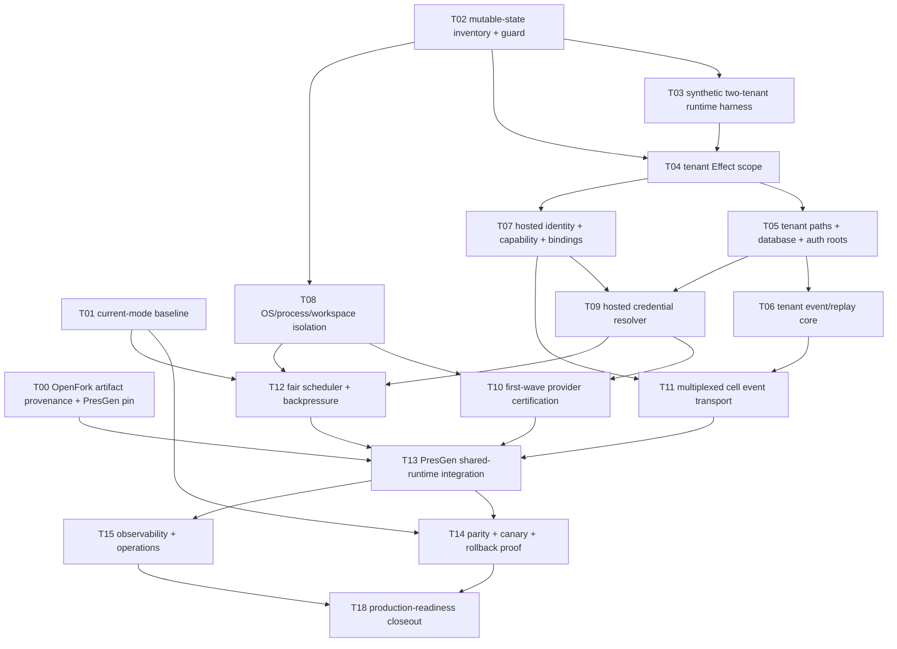

# OpenFork hosted multi-tenant serve implementation task graph

This folder decomposes `../README.md` into mergeable implementation tasks for
OpenFork (`/webstormprojects/opencode`) and PresGen
(`/webstormprojects/presGEN_v2`).

The task graph is deliberately more granular than the architecture's WP-A to
WP-K list. The goal is to let an agent swarm work in parallel while preserving
hard security and rollout gates.

## Campaign objective

Replace PresGen's current **one `opencode serve` process per PresGen agent
session** with an optional **one long-lived OpenFork hosted server per cell**
that can safely serve many tenants and credentials without cross-tenant state,
credential, event, filesystem, or scheduler leakage.

Standalone OpenFork remains fully usable. PresGen retains the per-session
runtime as a compatibility/rollback lane.

## Critical-path overview



Two post-v1 lanes are intentionally outside the initial critical path:

- `T16`: Zen/Go + subscription runtime tenantization.
- `T17`: multi-cell placement, migration, and failover.

They can begin only after the one-cell hosted runtime is stable enough to give
their tests meaningful semantics.

## Task matrix

| Task | Lane | Primary repo(s) | After | Production gate? |
| --- | --- | --- | --- | --- |
| T00 | artifact | OpenFork + PresGen | none | yes, operations |
| T01 | benchmark | PresGen + OpenFork | none | yes, performance baseline |
| T02 | audit/static guard | OpenFork | none | yes, security substrate |
| T03 | isolation harness | OpenFork | T02 | yes, proof before refactor |
| T04 | Effect scope | OpenFork core | T02, T03 | yes |
| T05 | persistence/paths | OpenFork core + app | T04 | yes |
| T06 | event core | OpenFork | T05 | yes |
| T07 | hosted identity | OpenFork | T04, T05 | yes |
| T08 | process/workspace | PresGen + OpenFork spawn seams | T02 | yes |
| T09 | credentials | OpenFork + PresGen contract | T05, T07 | yes |
| T10 | provider certification | OpenFork | T08, T09 | yes |
| T11 | event transport | OpenFork + PresGen | T06, T07 | yes |
| T12 | scheduler | OpenFork | T01, T07, T08, T09 | yes |
| T13 | shared runtime integration | PresGen + OpenFork | T00, T08, T10, T11, T12 | yes |
| T14 | parity/canary | both | T01, T13 | yes |
| T15 | operations | both | T13 | yes |
| T16 | subscription providers | OpenFork | T10, T13 | only if enabled providers require it |
| T17 | multi-cell | both | T14, T15 | no for one-cell v1 |
| T18 | closeout | both | T14, T15 | final gate |

## Parallel execution lanes

### Wave A: evidence and reversible ownership

Can run concurrently:

- T00 artifact provenance + PresGen OpenFork pin
- T01 baseline benchmark harness
- T02 mutable-state inventory + static guard

No shared-hosted behavior is enabled in this wave.

### Wave B: runtime isolation substrate

- T03 constructs the synthetic two-tenant harness.
- T04 introduces the formal tenant Effect scope.
- T08 can begin its OS/process isolation work after T02 and does not need to
  wait for hosted HTTP identity.

T03 and T08 should use separate worktrees because both may add security tests
or fixtures.

### Wave C: tenant-owned state and authority

After T04:

- T05 tenant paths/database/auth roots
- T07 hosted identity/capability/session binding

After T05, T06 event/replay core may proceed in parallel with the latter half
of T07 if ownership surfaces remain separate.

### Wave D: credentials, providers, event transport, scheduling

Once tenant persistence + hosted authority exist:

- T09 hosted credential resolver
- T11 multiplexed event transport (after T06 + T07)
- T12 scheduler/admission

T10 provider certification waits for T09 and the child-execution guarantees
from T08.

### Wave E: PresGen cutover path

T13 is the first task allowed to create a functional `shared-openfork` PresGen
runtime mode. It remains explicitly opt-in.

### Wave F: proof and operations

- T14 differential parity/canary/rollback campaign
- T15 observability/backup/drain/recovery operations
- T18 final readiness closeout

## Integration checkpoints

### Gate A: safe to begin formal tenant refactor

Requires T02 + T03 PASS.

Evidence:

- mutable-state inventory exists;
- synthetic A/B isolation harness exists;
- fresh memo-map behavior is proven;
- known unsafe singleton classes are enumerated.

### Gate B: safe to expose hosted APIs to synthetic callers

Requires T04 + T05 + T07 PASS.

Evidence:

- tenant scope exists structurally;
- tenant DB/path roots are separate;
- hosted capabilities cannot select arbitrary tenant roots;
- standalone OpenFork behavior is still green.

### Gate C: safe to execute tools in shared synthetic mode

Requires T08 PASS.

Evidence:

- distinct tenant UID/GID or equivalent production-approved OS boundary;
- workspace ownership/containment proven;
- `/proc`, symlink, absolute-path and FD leakage tests pass.

### Gate D: safe to run first-wave provider inference synthetically

Requires T09 + T10 PASS.

Evidence:

- hosted credential resolver has no ambient fallback;
- credential rotation/versioning is tested;
- provider allowlist exists;
- mock-provider canaries prove no cross-use.

### Gate E: safe to integrate PresGen shared mode

Requires T00 + T08 + T10 + T11 + T12 PASS.

This is the dependency gate for T13.

### Gate F: safe to canary real internal traffic

Requires T13 PASS and the internal/synthetic portions of T14 PASS.

### Gate G: safe to consider shared mode default

Requires T18 PASS. No earlier task may make shared mode the default.

## Status convention

Task status is recorded in `../results/Txx.md`, not by editing every taskfile.

Valid result states:

- `PASS`: every mandatory gate satisfied.
- `PARTIAL`: useful implementation landed, but one or more exit gates remain.
- `BLOCKED`: cannot proceed without upstream task/human/environment change.
- `FAIL`: evidence disproves the planned mechanism or introduces unacceptable
  regression/security risk.

## Merge strategy

The safest merge order follows the critical path even when tasks are developed
in parallel:

```text
T00 / T01 / T02
  -> T03
  -> T04
  -> T05 + T07 + T08
  -> T06 + T09
  -> T10 + T11 + T12
  -> T13
  -> T14 + T15
  -> T18
```

T16 and T17 merge later unless explicitly pulled into scope.

## Result directory

Create result records under:

`docs/plans/multitenant-serve/results/`

The directory can remain empty until implementation starts. Result files are
evidence artifacts and should be committed with their task's closing commit or
with the integration/closeout commit.
